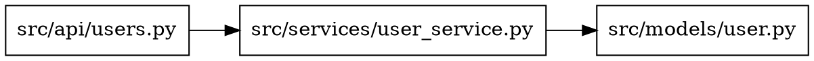

# Dependency Analysis and Mapping

**Reference Guide for dependency_mapper.py and coupling_detector.py**

## Overview

Dependency analysis examines how modules (files, classes, packages) depend on each other. Understanding these relationships is critical for:

- Detecting circular dependencies
- Identifying orphan modules (dead code)
- Measuring coupling between components
- Planning architectural refactoring
- Designing microservice boundaries

## Dependency Graph Construction

### Graph Theory Basics

A **dependency graph** is a directed graph where:
- **Nodes** = Modules (files)
- **Edges** = Import/require relationships (dependencies)
- **Direction** = "A imports B" means edge from A → B

### Building the Graph

**Step 1: Extract Import Statements**

For each file in the project:

**Python**:
```python
import module_a
from package.module_b import function
```

**JavaScript/TypeScript**:
```javascript
import { Component } from './module_a';
const service = require('./module_b');
```

**Step 2: Resolve Imports to File Paths**

Convert module names to actual file paths:

- Python: `module.submodule` → `module/submodule.py`
- JavaScript: `'./utils'` → `utils.js` (try `.js`, `.ts`, `.tsx`)

**Step 3: Build Adjacency List**

Store dependencies as graph structure:

```json
{
  "src/api/users.py": ["src/services/user_service.py", "src/models/user.py"],
  "src/services/user_service.py": ["src/repositories/user_repo.py", "src/models/user.py"]
}
```

### Import Resolution Strategies

#### Python Resolution

1. Check if module is standard library (skip)
2. Try `module_name.py` from project root
3. Try `module_name/__init__.py` as package
4. If not found, assume external dependency (skip)

#### JavaScript/TypeScript Resolution

1. Relative imports (`./`, `../`): Resolve relative to current file
2. Try extensions: `.js`, `.ts`, `.tsx`, `.jsx`
3. Try `index.js` in directory
4. Absolute imports (no `./`): Assume node_modules (skip)

## Circular Dependency Detection

### What is a Circular Dependency?

A circular dependency occurs when Module A depends on Module B, and Module B depends on Module A (directly or transitively).

**Direct Cycle**:
```
A → B → A
```

**Transitive Cycle**:
```
A → B → C → A
```

### Detection Algorithm: Depth-First Search (DFS)

**Concept**: Use DFS with a recursion stack to detect back edges (cycles).

**Algorithm**:

```python
def detect_cycles(graph):
    visited = set()
    rec_stack = set()
    cycles = []

    def dfs(node, path):
        visited.add(node)
        rec_stack.add(node)
        path.append(node)

        for neighbor in graph.get(node, []):
            if neighbor not in visited:
                dfs(neighbor, path[:])
            elif neighbor in rec_stack:
                # Back edge found - cycle detected
                cycle_start = path.index(neighbor)
                cycle = path[cycle_start:] + [neighbor]
                cycles.append(cycle)

        rec_stack.remove(node)

    for node in graph:
        if node not in visited:
            dfs(node, [])

    return cycles
```

**How it Works**:

1. **Visited Set**: Tracks all nodes seen (prevents re-processing)
2. **Recursion Stack**: Tracks current DFS path (detects back edges)
3. **Back Edge**: Edge to a node in current recursion stack = cycle

**Example**:

Graph:
```
A → B → C → A
D → E
```

DFS from A:
1. Visit A (rec_stack: [A])
2. Visit B (rec_stack: [A, B])
3. Visit C (rec_stack: [A, B, C])
4. Visit A (already in rec_stack) → **Cycle detected: [A, B, C, A]**

### Severity Classification

**High Severity** (2-3 nodes):
```
A ⇄ B  (direct cycle)
```
- Tight coupling
- Difficult to test in isolation
- Merge candidates

**Medium Severity** (4-5 nodes):
```
A → B → C → D → A
```
- Architectural issue
- Refactor to break cycle

**Low Severity** (6+ nodes):
```
A → B → ... → Z → A
```
- Design smell
- May indicate missing abstraction layer

## Orphan Module Detection

### What is an Orphan Module?

A module that is **never imported by any other module** in the project (excluding entry points).

### Detection Algorithm

```python
def find_orphans(graph):
    all_modules = set(graph.keys())
    imported_modules = set()

    # Collect all imported modules
    for imports in graph.values():
        imported_modules.update(imports)

    # Orphans = modules that exist but are never imported
    orphans = all_modules - imported_modules

    # Filter out entry points
    entry_points = ['main.py', 'app.py', 'index.js', 'server.js']
    return [o for o in orphans if not any(o.endswith(ep) for ep in entry_points)]
```

### Entry Point Exceptions

**Common entry points** (not counted as orphans):
- Python: `main.py`, `__main__.py`, `app.py`, `run.py`
- JavaScript: `index.js`, `main.js`, `app.js`, `server.js`
- TypeScript: `index.ts`, `main.ts`, `server.ts`

### Why Orphans Matter

**Potential Issues**:
- Dead code (unused modules)
- Incomplete refactoring (forgot to delete old file)
- Missing imports (should be used but isn't)

**Verification**:
1. Check git history: Recently added? (May be work-in-progress)
2. Grep for usage: Dynamically imported? (import strings not detected)
3. Run tests: Imported in test files only?

## Coupling Metrics

### Fan-In and Fan-Out

**Fan-Out** (Efferent Coupling):
- Number of modules this module depends on
- Outgoing edges in dependency graph
- High fan-out = depends on many others

**Fan-In** (Afferent Coupling):
- Number of modules that depend on this module
- Incoming edges in dependency graph
- High fan-in = many others depend on this

### Calculation

Given graph:
```json
{
  "A": ["B", "C"],
  "B": ["C"],
  "C": [],
  "D": ["A", "B"]
}
```

Build reverse graph (imported_by):
```json
{
  "A": ["D"],
  "B": ["A", "D"],
  "C": ["A", "B"]
}
```

Coupling metrics:

| Module | Fan-Out | Fan-In | Total Coupling |
|--------|---------|--------|----------------|
| A | 2 (→B, C) | 1 (D→) | 3 |
| B | 1 (→C) | 2 (A→, D→) | 3 |
| C | 0 | 3 (A→, B→) | 3 |
| D | 2 (→A, B) | 0 | 2 |

### Coupling Interpretation

**High Fan-Out** (many dependencies):
- **Problem**: Module knows about many others (high coupling)
- **Impact**: Changes in dependencies break this module
- **Refactoring**: Dependency injection, events, facades

**High Fan-In** (many dependents):
- **Not always bad**: Central modules should be stable
- **Problem**: Changes to this module affect many others
- **Mitigation**: Ensure stability, high test coverage, versioning

**Balanced High Coupling**:
- Both high fan-in and fan-out
- "God module" anti-pattern
- Split into smaller, focused modules

### Coupling Thresholds

| Total Coupling | Interpretation | Action |
|----------------|----------------|--------|
| 0-5 | **Low** - Well-isolated | Good |
| 6-10 | **Moderate** - Acceptable | Monitor |
| 11-15 | **High** - Refactor candidate | Plan decoupling |
| 16+ | **Very High** - Critical issue | Immediate refactoring |

## Dependency Analysis Workflows

### Workflow 1: Microservice Boundary Design

**Goal**: Split monolith into microservices with minimal inter-service dependencies.

**Steps**:
1. Build full dependency graph
2. Identify tightly coupled clusters (high internal coupling, low external)
3. Define service boundaries around clusters
4. Break circular dependencies between proposed services

**Example**:

Modules with high coupling:
```
user_service ↔ auth_service ↔ session_service
```

**Decision**: Keep all three in same microservice (User Service).

Modules with low coupling:
```
notification_service (only depends on event bus)
```

**Decision**: Extract as separate Notification Service.

### Workflow 2: Breaking Circular Dependencies

**Strategy 1: Dependency Injection**

Before (circular):
```python
# user_service.py
from auth_service import check_permissions

# auth_service.py
from user_service import get_user
```

After (injection):
```python
# user_service.py
class UserService:
    def __init__(self, permission_checker):
        self.permission_checker = permission_checker

# auth_service.py
class AuthService:
    def check_permissions(self, user):
        # No import of user_service
        pass
```

**Strategy 2: Introduce Interface/Protocol**

Before (circular):
```python
# A.py
from B import B_class

# B.py
from A import A_class
```

After (interface):
```python
# interface.py
class AInterface:
    pass

# A.py
from interface import AInterface

# B.py
from interface import AInterface
```

**Strategy 3: Extract Shared Code**

Before (circular):
```python
# service_a.py
from service_b import shared_logic

# service_b.py
from service_a import other_shared_logic
```

After (extraction):
```python
# shared.py
def shared_logic(): pass
def other_shared_logic(): pass

# service_a.py
from shared import shared_logic

# service_b.py
from shared import other_shared_logic
```

### Workflow 3: Identifying Dead Code

**Goal**: Find and remove orphan modules safely.

**Steps**:
1. Run dependency_mapper.py to find orphans
2. For each orphan:
   - Check git blame: Who created it, when?
   - Search for dynamic imports (grep for module name as string)
   - Check if imported in test files
   - Verify with team: Still needed?
3. Remove confirmed dead code

**Verification before deletion**:
```bash
# Search for module name in all files (dynamic imports)
grep -r "module_name" .

# Check git history
git log --all -- path/to/module.py

# Run tests to ensure no runtime imports
pytest
```

## Visualization

### DOT Format Output

The dependency_mapper.py script can output Graphviz DOT format:

```bash
python dependency_mapper.py --directory src/ --language python \
  --output-graph dot > dependencies.dot
```

**DOT Format**:


**Visualization**:
```bash
# Install Graphviz (if not installed)
# macOS: brew install graphviz
# Linux: apt-get install graphviz

# Generate PNG
dot -Tpng dependencies.dot -o dependencies.png

# Generate SVG (interactive)
dot -Tsvg dependencies.dot -o dependencies.svg
```

### Interpreting Dependency Graphs

**Healthy Graph Characteristics**:
- Mostly acyclic (few/no cycles)
- Clear layering (e.g., API → Services → Repositories → Models)
- Low cross-layer dependencies
- Few highly connected nodes

**Unhealthy Graph Characteristics**:
- Many cycles
- "Hairball" structure (everything connected to everything)
- Central "god module" with high fan-in and fan-out
- No clear layering

## Limitations and Edge Cases

### Import Resolution Limitations

**Dynamic Imports** (not detected):
```python
# Python
module_name = "utils"
importlib.import_module(module_name)

# JavaScript
const moduleName = './utils';
require(moduleName);
```

**Conditional Imports** (may be detected but not executed):
```python
if DEBUG:
    import debug_utils  # Only imported in debug mode
```

**Relative Imports** (may not resolve correctly):
```python
from ...parent.module import something  # Complex relative path
```

### External Dependencies

Scripts skip external dependencies (standard library, node_modules, pip packages) to focus on project structure. To include external:

1. Modify `resolve_import_to_file()` to track external imports
2. Separate internal vs. external in output JSON

### Monorepo Challenges

For monorepos with multiple projects:

1. Analyze each project separately
2. Set `--directory` to project subdirectory
3. Cross-project dependencies may not resolve

## Advanced Metrics

### Dependency Depth

**Definition**: Longest chain of dependencies from a module.

**Calculation**: BFS from module, track maximum depth reached.

**Use Case**: Deep dependency chains are fragile (change at bottom affects many).

### Instability Metric

**Formula**: `I = Fan-Out / (Fan-In + Fan-Out)`

- I = 0: Maximally stable (high fan-in, no fan-out)
- I = 1: Maximally unstable (no fan-in, high fan-out)

**Interpretation**: Unstable modules should be abstract/flexible.

### Abstractness Metric

Ratio of abstract classes/interfaces to total classes.

**Combined with Instability**: "Main Sequence" analysis (Martin's Stability-Abstractness chart).

## Summary

Dependency analysis provides critical insights into codebase structure:

- **Dependency Graph**: Nodes = modules, edges = imports
- **Circular Dependencies**: Detected via DFS with recursion stack
- **Orphan Modules**: Modules never imported (potential dead code)
- **Coupling**: Fan-in (incoming) + Fan-out (outgoing) dependencies
- **Thresholds**: Total coupling > 10 is high, > 15 is critical
- **Visualization**: Use Graphviz DOT format for visual analysis

Use dependency metrics to **guide refactoring**, **design services**, and **identify technical debt**, not as absolute rules. Clean architecture emerges from thoughtful dependency management.
