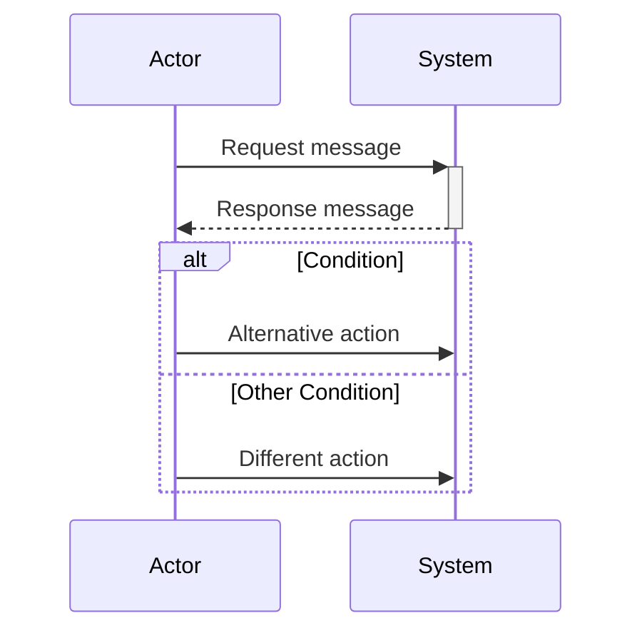
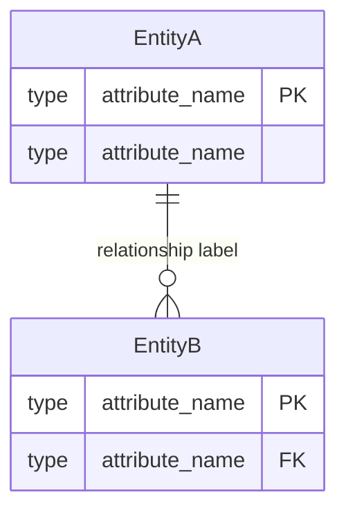
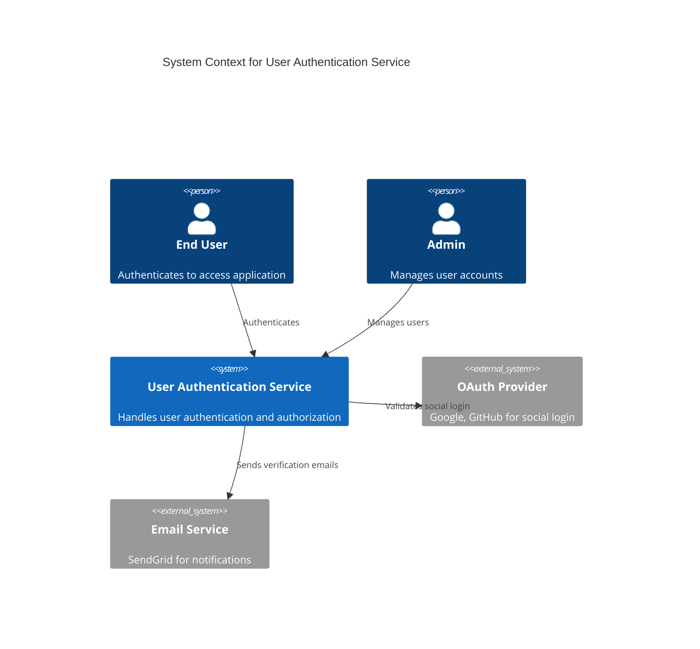

# Diagram Generator Reference

## Overview

This skill provides Mermaid diagram templates for transforming architectural specifications into visual diagrams. Unlike manual diagram authoring, this skill offers structured templates that guide consistent diagram generation.

**EXPERIMENTAL STATUS**: This skill is experimental. Generated diagrams may require manual syntax validation. Report issues for template improvements.

**Template-Based Approach**: This skill uses pre-validated Mermaid templates that you fill with architectural specification data. The workflow is: read architectural spec → select appropriate template → extract data → fill placeholders → validate syntax → embed in documentation.

## Quick Reference: Template Selection

**Need C4 diagrams?**
→ See `templates/c4-context-mermaid.md` (System context, external dependencies)
→ See `templates/c4-container-mermaid.md` (Containers, technology stack)

**Need API flow diagrams?**
→ See `templates/sequence-diagram-mermaid.md` (Request/response flows, authentication)

**Need database diagrams?**
→ See `templates/er-diagram-mermaid.md` (Entity relationships, schemas)

## Diagram Generation Workflow

1. **Read Architectural Spec**: Extract system components, relationships, data model
2. **Select Template**: Choose appropriate Mermaid template from `templates/` directory
3. **Fill Template**: Replace {PLACEHOLDERS} with data extracted from spec
4. **Validate Syntax**: Check generated Mermaid against syntax validation checklist
5. **Embed in Doc**: Include diagram in architecture markdown with fenced code block
6. **Test Rendering**: Verify diagram renders correctly in Mermaid Live Editor

## Mermaid Syntax Primer

### C4 Context Diagrams
```mermaid
C4Context
  title System Context for {System Name}

  Person(alias, "Name", "Description")
  System(alias, "Name", "Description")
  System_Ext(alias, "External Name", "Description")

  Rel(from_alias, to_alias, "Relationship Label")
```

**Key Elements**:
- `Person()`: Human actors interacting with system
- `System()`: Your system being documented
- `System_Ext()`: External systems/services
- `Rel()`: Relationships between elements

### C4 Container Diagrams
```mermaid
C4Container
  title Container Architecture for {System Name}

  Container(alias, "Name", "Technology", "Description")
  ContainerDb(alias, "Database Name", "Technology", "Description")

  Rel(from_alias, to_alias, "Relationship Label")
```

**Key Elements**:
- `Container()`: Deployable units (web app, API, worker)
- `ContainerDb()`: Data stores (database, cache, queue)
- Technology stack included in container definitions

### Sequence Diagrams


**Key Elements**:
- `participant`: Actors and systems in the flow
- `->>`: Synchronous request (solid arrow)
- `-->>`: Response (dashed arrow)
- `+`/`-`: Activation/deactivation boxes
- `alt`/`else`/`end`: Conditional flows

### ER Diagrams


**Key Elements**:
- Entity definitions with attributes
- Cardinality: `||--o{` (one-to-many), `}o--o{` (many-to-many)
- `PK`: Primary key, `FK`: Foreign key

## Validation Checklist

Before embedding generated diagram in architecture documentation:

- [ ] All {PLACEHOLDERS} replaced with actual values
- [ ] Mermaid syntax is valid (no unclosed blocks, matching braces)
- [ ] All referenced aliases/participants are defined before use
- [ ] Relationships point to valid entities (no undefined references)
- [ ] Labels are descriptive and match architecture spec
- [ ] Diagram tested in Mermaid Live Editor (https://mermaid.live)
- [ ] Diagram renders correctly in target environment (GitHub, GitLab, VSCode)

## Optional: Automated Validation

For users who prefer automated syntax validation, Mermaid CLI provides command-line validation.

**Installation**:
```bash
npm install -g @mermaid-js/mermaid-cli
```

**Validation Examples**:
```bash
# Validate a Mermaid file
mmdc -i diagram.mmd -o /dev/null

# Validate inline (pipe diagram content)
echo 'graph TD; A-->B' | mmdc -i - -o /dev/null

# Check exit code: 0 = valid, non-zero = syntax error
mmdc -i diagram.mmd -o /dev/null && echo "Valid" || echo "Syntax error"
```

**Integration with Agent Workflow**:
- After generating diagram, save to temporary `.mmd` file
- Run `mmdc` validation command
- Check exit code for syntax errors
- If validation fails, review error message and fix syntax
- Delete temporary file after validation

**Fallback if mmdc Not Installed**:
- Manual validation via Mermaid Live Editor (https://mermaid.live) still works
- Copy/paste diagram into editor, verify rendering
- No installation required, universally accessible

**Note**: This is optional tooling for users who want automated validation. The manual validation checklist above remains the primary validation method.

## When to Use This Skill

**Use this skill when**:
- Converting architectural specifications to visual diagrams
- Standardizing diagram format across documentation
- Generating consistent C4 diagrams from component lists
- Visualizing API flows from endpoint specifications
- Documenting database schemas from entity definitions
- Creating multiple similar diagrams (e.g., microservices C4 diagrams)

**Don't use this skill when**:
- Creating simple diagrams faster to author manually
- Diagram type not supported by available templates
- Architectural specification is incomplete (gather requirements first)
- Custom diagram needs don't match any template pattern

## Integration with PACT Workflow

### Input from Prepare Phase
- System requirements and scope
- External dependencies identified
- API specifications documented
- Database schema requirements
- Technology stack decisions

### Architect Phase Workflow

1. **pact-architect creates architecture specification** in `docs/architecture/`
2. **Identify diagrams needed** (C4 context, C4 container, sequence, ER)
3. **Invoke pact-diagram-generator skill**
4. **Read appropriate template** from `templates/` directory
5. **Extract data from architectural spec** (components, relationships, flows)
6. **Fill template placeholders** with extracted data
7. **Validate generated Mermaid syntax** using validation checklist
8. **Embed diagram in architecture document** with code fences
9. **Test rendering** in Mermaid Live Editor or GitHub preview

### Output for Code Phase
- Visual architecture diagrams embedded in markdown
- Validated Mermaid syntax ready for rendering
- Diagrams render in GitHub, GitLab, VSCode, and markdown viewers
- Clear visual representation of system design for implementation teams

## Fallback: ASCII Diagrams

If Mermaid generation fails or diagram type is not supported by templates:

→ Use ASCII art templates from `pact-architecture-patterns` skill
→ ASCII diagrams are always valid, no syntax errors possible
→ Trade-off: Less polished visually, but universally compatible

Example fallback decision:
- Mermaid syntax validation fails after 2 attempts → Use ASCII
- Diagram type not covered by templates → Use ASCII
- Target environment doesn't support Mermaid → Use ASCII

## Advanced: Custom Diagrams

For diagrams not covered by standard templates:

→ See `references/mermaid-syntax-guide.md` for complete Mermaid syntax
→ Consult Mermaid documentation: https://mermaid.js.org/
→ Create custom diagram following Mermaid syntax rules
→ Validate thoroughly in Mermaid Live Editor before embedding

**Custom Diagram Workflow**:
1. Review complete syntax guide in references
2. Draft diagram structure based on architectural needs
3. Test syntax in Mermaid Live Editor iteratively
4. Document any custom patterns for future reuse
5. Consider contributing pattern as new template if reusable

## Related Skills

- **pact-architecture-patterns**: ASCII diagram templates (fallback option), architectural anti-patterns
- **pact-api-design**: API specifications that feed into sequence diagrams
- **pact-database-patterns**: Schema specifications that feed into ER diagrams

**Integration Pattern**: Use related skills to gather input data, then use this skill to visualize that data as diagrams.

## Template Library Reference

| Template File | Diagram Type | Use Case | Complexity |
|--------------|--------------|----------|------------|
| `c4-context-mermaid.md` | C4 Level 1 | System boundary, external dependencies | Low |
| `c4-container-mermaid.md` | C4 Level 2 | Deployable units, technology stack | Medium |
| `sequence-diagram-mermaid.md` | Sequence | API flows, authentication sequences | Medium |
| `er-diagram-mermaid.md` | ER Diagram | Database schema, entity relationships | Medium |

## Common Issues and Troubleshooting

**Issue: Diagram won't render in Mermaid Live Editor**
→ See `references/troubleshooting.md` for common syntax errors
→ Check for unclosed blocks, undefined aliases, invalid characters

**Issue: Diagram renders in Live Editor but not GitHub**
→ Verify code fence syntax: ```mermaid (not ```mmd or other variations)
→ Check GitHub Mermaid version compatibility
→ See `references/validation-guide.md` for platform-specific notes

**Issue: Template doesn't match my architectural spec**
→ Review template customization guidance in template file
→ Consider using custom diagram approach (see Advanced section)
→ Provide feedback for template improvements

## Quick Start Example

**Scenario**: Generate C4 context diagram for authentication system

**Step 1: Read Architecture Spec**
```markdown
System: User Authentication Service
External Systems:
- OAuth Provider (Google, GitHub)
- Email Service (SendGrid)
Actors:
- End User (authenticates)
- Admin (manages users)
```

**Step 2: Read Template**
```bash
Read templates/c4-context-mermaid.md
```

**Step 3: Fill Template**


**Step 4: Validate**
- Copy to https://mermaid.live
- Verify rendering
- Check all elements defined
- Confirm relationships valid

**Step 5: Embed**
```markdown
## System Context

### Context Diagram

```mermaid
{paste validated diagram}
```

{add legend/explanation}
```

**Result**: Production-ready diagram in architecture documentation
