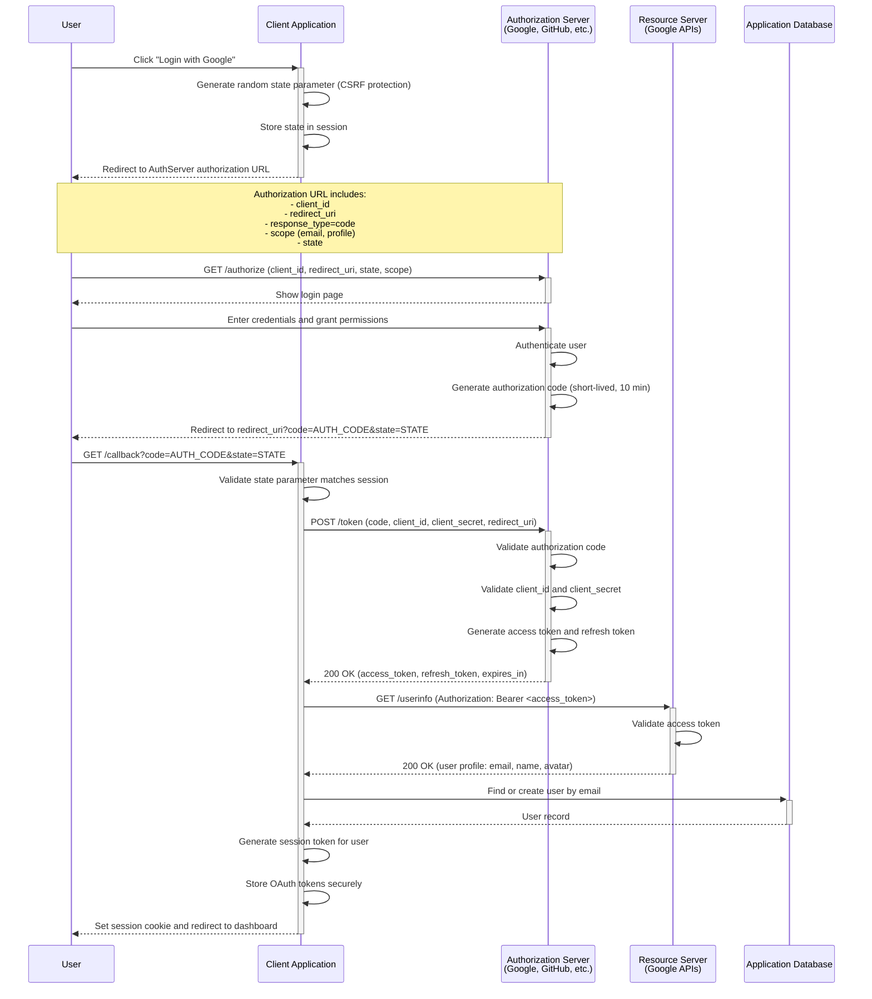
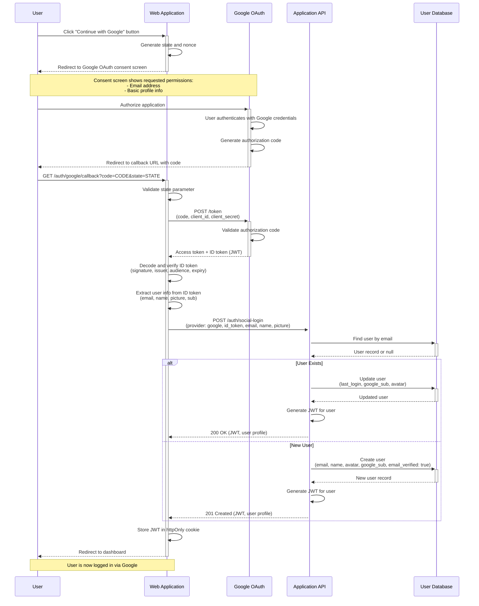

# Authentication and Authorization Flows

## Scenario

Modern web and mobile applications require secure authentication mechanisms. This document provides sequence diagrams for common authentication flows including OAuth 2.0, JWT tokens, social login, and multi-factor authentication.

**Security Requirements**:
- Secure credential transmission (HTTPS only)
- Token expiration and refresh
- Protection against CSRF and XSS attacks
- Audit logging for authentication events
- Multi-factor authentication for sensitive operations

**Use Cases**:
- User registration and login
- Social login (Google, GitHub, Facebook)
- API authentication
- Mobile app authentication
- Single Sign-On (SSO) across services

---

## Authentication Flows

### 1. JWT Token-Based Authentication

This is the most common pattern for modern web APIs. The user submits credentials, receives a JWT token, and includes it in subsequent API requests.

```mermaid
sequenceDiagram
  participant User
  participant Web as Web Application
  participant API as API Server
  participant DB as User Database
  participant Cache as Token Cache

  User->>+Web: Enter email and password
  Web->>+API: POST /auth/login (credentials)

  API->>API: Validate request format
  API->>+DB: Query user by email
  DB-->>-API: User record with password hash

  alt Valid Credentials
    API->>API: Verify password hash (bcrypt)
    API->>API: Generate JWT token (30 min expiry)
    API->>API: Generate refresh token (7 days expiry)

    API->>+Cache: Store refresh token
    Cache-->>-API: Stored

    API->>API: Log authentication event
    API-->>-Web: 200 OK (JWT token, refresh token)

    Web->>Web: Store tokens (httpOnly cookie or localStorage)
    Web-->>-User: Redirect to dashboard

    Note over User,API: Subsequent authenticated requests

    User->>+Web: Access protected resource
    Web->>+API: GET /api/profile (Authorization: Bearer <JWT>)
    API->>API: Validate JWT signature and expiry
    API->>+DB: Query user profile
    DB-->>-API: Profile data
    API-->>-Web: 200 OK (profile data)
    Web-->>-User: Display profile

  else Invalid Credentials
    API->>API: Log failed authentication attempt
    API-->>-Web: 401 Unauthorized (Invalid credentials)
    Web-->>-User: Show error message
  end
```

**Key Steps**:
1. User submits credentials to web app
2. Web app forwards to API server
3. API queries database for user record
4. API verifies password hash using bcrypt
5. On success, API generates JWT (short-lived) and refresh token (long-lived)
6. Web app stores tokens securely
7. Future requests include JWT in Authorization header

**Security Considerations**:
- **Password hashing**: Use bcrypt, argon2, or PBKDF2 (never store plaintext)
- **Token storage**:
  - Web: httpOnly cookies (prevents XSS) or sessionStorage (better than localStorage)
  - Mobile: Secure keychain/keystore
- **Token expiry**: Short-lived access tokens (15-30 min), longer refresh tokens (7 days)
- **HTTPS only**: Never transmit credentials over HTTP
- **Rate limiting**: Prevent brute force attacks (max 5 attempts per 15 min)

**Tips for Adaptation**:
- Add CAPTCHA after N failed login attempts
- Include device fingerprinting for fraud detection
- Add IP address logging for security audits
- Implement "Remember Me" with longer-lived refresh tokens

---

### 2. Token Refresh Flow

When the access token expires, the client uses the refresh token to obtain a new access token without requiring the user to log in again.

```mermaid
sequenceDiagram
  participant User
  participant Web as Web Application
  participant API as API Server
  participant Cache as Token Cache

  User->>+Web: Access protected resource
  Web->>+API: GET /api/data (Authorization: Bearer <expired JWT>)
  API->>API: Validate JWT
  API-->>-Web: 401 Unauthorized (Token expired)

  Note over Web: Detect token expiry, attempt refresh

  Web->>+API: POST /auth/refresh (refresh token)
  API->>+Cache: Validate refresh token
  Cache-->>-API: Token valid and not revoked

  alt Refresh Token Valid
    API->>API: Generate new JWT (30 min expiry)
    API->>API: Optionally rotate refresh token

    alt Refresh Token Rotation Enabled
      API->>API: Generate new refresh token
      API->>+Cache: Revoke old refresh token
      Cache-->>-API: Revoked
      API->>+Cache: Store new refresh token
      Cache-->>-API: Stored
      API-->>Web: 200 OK (new JWT, new refresh token)
    else No Rotation
      API-->>Web: 200 OK (new JWT)
    end

    Web->>Web: Update stored tokens
    Web->>+API: Retry original request GET /api/data (new JWT)
    API->>API: Validate new JWT
    API-->>-Web: 200 OK (data)
    Web-->>-User: Display data

  else Refresh Token Invalid/Expired
    API-->>-Web: 401 Unauthorized (Refresh token invalid)
    Web->>Web: Clear stored tokens
    Web-->>-User: Redirect to login page
  end
```

**Key Steps**:
1. Web app sends request with expired JWT
2. API returns 401 Unauthorized
3. Web app automatically sends refresh token to `/auth/refresh`
4. API validates refresh token against cache
5. API generates new JWT (and optionally rotates refresh token)
6. Web app retries original request with new JWT

**Security: Refresh Token Rotation**:
- Each refresh generates a new refresh token
- Old refresh token is immediately revoked
- Prevents replay attacks if refresh token is stolen
- If stolen token is used, legitimate user's next refresh fails → force re-login

**Tips for Adaptation**:
- Add sliding window expiry (refresh token extends if used within last 24 hours)
- Include user-agent validation (refresh token tied to device)
- Store refresh tokens with device metadata for audit trail
- Implement "logout all devices" by revoking all refresh tokens for user

---

### 3. OAuth 2.0 Authorization Code Flow

The most secure OAuth flow for web applications. Used for social login and third-party API access.



**Key Steps**:
1. **Authorization Request**: Client redirects user to OAuth provider
2. **User Authentication**: User logs in and grants permissions
3. **Authorization Grant**: OAuth provider redirects back with authorization code
4. **Token Exchange**: Client exchanges code for access token (server-side, includes client_secret)
5. **Resource Access**: Client uses access token to fetch user profile
6. **Local Session**: Client creates local user session

**Security: State Parameter**:
- Random string generated by client
- Stored in session before redirect
- Validated on callback to prevent CSRF attacks
- Attacker can't forge callback without knowing state value

**OAuth Scopes**:
- `email`: Access user's email address
- `profile`: Access user's basic profile (name, avatar)
- `openid`: Indicates OpenID Connect flow (returns ID token)
- Provider-specific: `repo` (GitHub), `calendar` (Google)

**Tips for Adaptation**:
- Replace Google with GitHub, Facebook, Microsoft, Auth0
- Add PKCE extension for mobile apps (no client_secret)
- Use OpenID Connect for standardized user info endpoint
- Store OAuth refresh token to access provider APIs long-term
- Implement "Link Account" to associate OAuth login with existing user

---

### 4. Social Login Integration (Google)

Simplified OAuth 2.0 flow specifically for Google Sign-In using the Authorization Code flow.



**Key Steps**:
1. User clicks "Continue with Google"
2. Web app redirects to Google consent screen
3. User authorizes, Google redirects back with authorization code
4. Web app exchanges code for access token and ID token
5. Web app verifies ID token signature and extracts user info
6. API finds or creates user account using email from Google
7. API generates local JWT session
8. User is logged in

**ID Token vs Access Token**:
- **ID Token**: JWT with user profile info (email, name, picture), signed by Google
- **Access Token**: Opaque token to access Google APIs (Gmail, Calendar, Drive)

**Email Verification**:
- Google-verified emails are trusted (no need to send verification email)
- Set `email_verified: true` when creating user from Google login

**Account Linking**:
- Match by email: If user exists with same email, link Google account
- If email already exists but wasn't from Google, require password confirmation before linking

**Tips for Adaptation**:
- Replace Google with GitHub (use `user` API endpoint for profile)
- Add GitHub integration: request `repo` scope to access user's repositories
- Implement Facebook Login: use Graph API `/me` endpoint
- Add "Disconnect Google" feature: remove `google_sub` from user record

---

### 5. Two-Factor Authentication (2FA) Flow

Add extra security layer by requiring time-based one-time password (TOTP) after successful credential verification.

```mermaid
sequenceDiagram
  participant User
  participant Web as Web Application
  participant API as API Server
  participant DB as User Database
  participant Cache as Redis Cache

  Note over User,API: Phase 1: Enable 2FA (one-time setup)

  User->>+Web: Click "Enable 2FA" in settings
  Web->>+API: POST /auth/2fa/enable
  API->>API: Generate TOTP secret (base32)
  API->>API: Generate QR code (otpauth://totp/...)
  API->>+Cache: Store secret temporarily with user ID
  Cache-->>-API: Stored
  API-->>-Web: QR code image + backup codes
  Web-->>User: Display QR code

  User->>User: Scan QR with authenticator app<br/>(Google Authenticator, Authy)

  User->>+Web: Enter TOTP code from app
  Web->>+API: POST /auth/2fa/verify (code)
  API->>+Cache: Retrieve TOTP secret
  Cache-->>-API: Secret
  API->>API: Verify TOTP code matches secret
  API->>+DB: Update user (totp_secret: encrypted, 2fa_enabled: true)
  DB-->>-API: Updated
  API->>-Cache: Delete temporary secret
  API-->>-Web: 200 OK (2FA enabled)
  Web-->>-User: Show success message

  Note over User,API: Phase 2: Login with 2FA (every login)

  User->>+Web: Enter email and password
  Web->>+API: POST /auth/login (credentials)
  API->>+DB: Query user by email
  DB-->>-API: User record
  API->>API: Verify password hash

  alt Valid Credentials + 2FA Enabled
    API->>API: Generate temporary auth token (5 min expiry)
    API->>+Cache: Store pending auth (user_id, requires_2fa: true)
    Cache-->>-API: Stored
    API-->>-Web: 200 OK (requires_2fa: true, temp_token)
    Web-->>-User: Show 2FA code input

    User->>User: Open authenticator app, copy TOTP code
    User->>+Web: Enter 6-digit TOTP code
    Web->>+API: POST /auth/2fa/login (temp_token, totp_code)

    API->>+Cache: Validate temp_token and retrieve user_id
    Cache-->>-API: User ID
    API->>+DB: Query user and TOTP secret
    DB-->>-API: User with encrypted TOTP secret
    API->>API: Decrypt TOTP secret
    API->>API: Verify TOTP code (allow 30s time window)

    alt TOTP Code Valid
      API->>API: Generate JWT and refresh token
      API->>+Cache: Revoke temp_token
      Cache-->>-API: Revoked
      API->>API: Log successful 2FA authentication
      API-->>-Web: 200 OK (JWT, refresh_token)
      Web->>Web: Store tokens
      Web-->>-User: Redirect to dashboard

    else TOTP Code Invalid
      API->>API: Log failed 2FA attempt
      API-->>-Web: 401 Unauthorized (Invalid code)
      Web-->>-User: Show error, allow retry (max 3 attempts)
    end

  else Valid Credentials + 2FA Disabled
    API->>API: Generate JWT (normal flow)
    API-->>-Web: 200 OK (JWT)
    Web-->>-User: Redirect to dashboard
  end
```

**Key Steps**:

**Setup Phase**:
1. User enables 2FA in account settings
2. API generates TOTP secret and QR code
3. User scans QR code with authenticator app
4. User verifies setup by entering TOTP code
5. API stores encrypted TOTP secret in database

**Login Phase**:
1. User enters credentials (password verified)
2. If 2FA enabled, API returns `requires_2fa: true` with temporary token
3. User enters 6-digit TOTP code from authenticator app
4. API validates TOTP code against stored secret
5. On success, API returns JWT session token

**TOTP Algorithm**:
- Time-based: Code changes every 30 seconds
- Algorithm: HMAC-SHA1 with shared secret
- Code length: 6 digits
- Time window: Allow ±1 time step (90 seconds total) to account for clock drift

**Backup Codes**:
- Generate 10 single-use recovery codes during setup
- Store hashed in database
- User downloads and stores securely
- Use if authenticator app is unavailable

**Security Considerations**:
- **Secret storage**: Encrypt TOTP secret at rest (use AES-256)
- **Rate limiting**: Max 3 TOTP attempts per temp_token
- **Temporary token**: 5-minute expiry, single-use
- **Audit logging**: Log all 2FA events (enable, disable, failed attempts)

**Tips for Adaptation**:
- Add SMS-based 2FA as alternative (send code via Twilio)
- Implement "Trust this device" for 30 days (store device fingerprint)
- Add recovery email as fallback 2FA method
- Support WebAuthn/FIDO2 for hardware security keys
- Add "require 2FA" option for organization-wide enforcement

---

### 6. Password Reset Flow

Secure password reset via email verification link.

```mermaid
sequenceDiagram
  participant User
  participant Web as Web Application
  participant API as API Server
  participant DB as User Database
  participant Cache as Redis Cache
  participant Email as Email Service

  User->>+Web: Click "Forgot Password" link
  Web-->>-User: Show password reset form

  User->>+Web: Enter email address
  Web->>+API: POST /auth/password-reset/request (email)

  API->>+DB: Query user by email
  DB-->>-API: User record or null

  alt User Exists
    API->>API: Generate secure random token (32 bytes)
    API->>+Cache: Store reset token with user_id (15 min expiry)
    Cache-->>-API: Stored

    API->>+Email: Send password reset email<br/>(reset link with token)
    Email-->>-API: Email sent

    API->>API: Log password reset request
    API-->>Web: 200 OK (Check your email)

  else User Not Found
    Note over API: Security: Return same response to prevent email enumeration
    API-->>Web: 200 OK (Check your email)
  end

  Web-->>-User: Check your email for reset link

  Note over User,Email: User receives email with reset link:<br/>https://app.com/reset-password?token=TOKEN

  User->>User: Click reset link in email
  User->>+Web: GET /reset-password?token=TOKEN
  Web->>+API: GET /auth/password-reset/validate (token)

  API->>+Cache: Validate token exists and not expired
  Cache-->>-API: Valid, user_id

  alt Token Valid
    API-->>-Web: 200 OK (token valid)
    Web-->>-User: Show new password form

    User->>+Web: Enter new password (confirmed)
    Web->>+API: POST /auth/password-reset/confirm<br/>(token, new_password)

    API->>+Cache: Validate token
    Cache-->>-API: Valid, user_id

    API->>API: Hash new password (bcrypt)
    API->>+DB: Update user password hash
    DB-->>-API: Updated

    API->>+Cache: Revoke reset token
    Cache-->>-API: Revoked

    API->>+DB: Revoke all refresh tokens for user<br/>(log out all devices)
    DB-->>-API: Tokens revoked

    API->>API: Log password reset success
    API-->>-Web: 200 OK (Password reset successful)
    Web-->>-User: Redirect to login page

  else Token Invalid/Expired
    API-->>-Web: 401 Unauthorized (Invalid or expired token)
    Web-->>-User: Show error, link to request new reset
  end
```

**Key Steps**:
1. User requests password reset with email
2. API generates secure random token
3. API stores token in cache with 15-minute expiry
4. API sends email with reset link containing token
5. User clicks link, web app validates token
6. User enters new password
7. API updates password hash and revokes all sessions

**Security Considerations**:
- **Token generation**: Use cryptographically secure random (not UUID)
- **Token expiry**: 15 minutes (balance usability and security)
- **Single-use token**: Revoke immediately after use
- **Email enumeration prevention**: Return same response whether user exists or not
- **Session invalidation**: Log out all devices after password change
- **Rate limiting**: Max 3 reset requests per email per hour

**Email Content**:
```
Subject: Reset your password

Hi [Name],

We received a request to reset your password. Click the link below to create a new password:

[Reset Password Button]

This link expires in 15 minutes.

If you didn't request this, ignore this email. Your password won't change.
```

**Tips for Adaptation**:
- Add security questions as additional verification
- Require old password if user is already logged in
- Send notification email after successful password change
- Add CAPTCHA to reset request form to prevent abuse
- Implement account lockout after N failed reset attempts

---

## Security Best Practices Summary

### Token Security
- **Storage**:
  - Web: httpOnly cookies (prevents XSS) or secure sessionStorage
  - Mobile: Keychain (iOS), Keystore (Android)
- **Transmission**: HTTPS only, never HTTP
- **Expiry**: Short-lived access tokens (15-30 min), refresh tokens (7 days)
- **Rotation**: Rotate refresh tokens on each use

### Password Security
- **Hashing**: bcrypt (cost factor 10+), argon2, PBKDF2 (never MD5/SHA1)
- **Salting**: Automatic with bcrypt (unique salt per password)
- **Minimum strength**: 8+ characters, mix of letters, numbers, symbols
- **Password reset**: Secure token, email verification, short expiry

### OAuth Security
- **State parameter**: CSRF protection, validate on callback
- **PKCE**: Use for mobile apps (prevents authorization code interception)
- **Redirect URI validation**: Exact match, no wildcards
- **Client secret**: Never expose in frontend code (server-side only)

### Rate Limiting
- **Login attempts**: Max 5 per 15 minutes per email
- **Password reset**: Max 3 requests per hour per email
- **2FA attempts**: Max 3 per temporary token
- **API requests**: 100 requests per minute per user

### Audit Logging
Log these events for security monitoring:
- Successful logins
- Failed login attempts (with IP, user agent)
- Password resets (requested, completed)
- 2FA events (enabled, disabled, failed attempts)
- Token refresh events
- Account lockouts

---

## Related Patterns

### Session Management
- Implement "Remember Me" with long-lived refresh tokens
- Add "Active Sessions" management (view and revoke devices)
- Store device metadata (IP, user-agent, last activity)

### Account Linking
- Link multiple OAuth providers to single account
- Verify email before linking new provider
- Show linked accounts in user settings

### Passwordless Authentication
- Magic link (email-based login, no password)
- WebAuthn/FIDO2 (biometric, hardware keys)
- SMS/Email OTP (one-time password)

---

## Summary

These authentication flows demonstrate:
- ✅ Secure credential handling (hashing, HTTPS)
- ✅ Token-based authentication (JWT with refresh)
- ✅ OAuth 2.0 integration (social login)
- ✅ Multi-factor authentication (TOTP)
- ✅ Password reset (email verification)
- ✅ Comprehensive security measures (rate limiting, audit logging)

**Use these as templates for**:
- Web application authentication
- Mobile app authentication
- API security
- SSO implementations
- Third-party integrations
