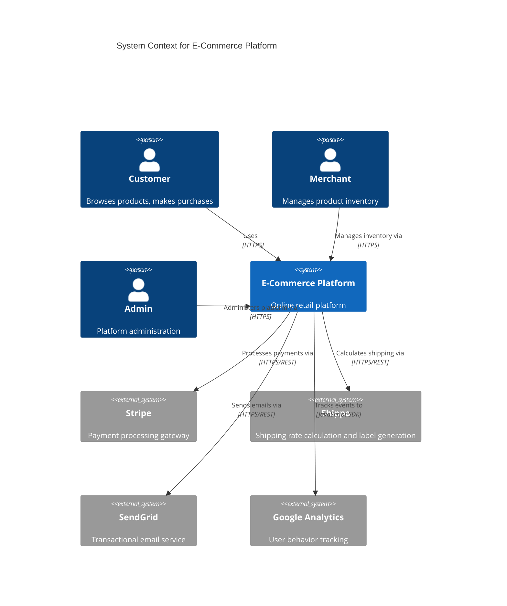
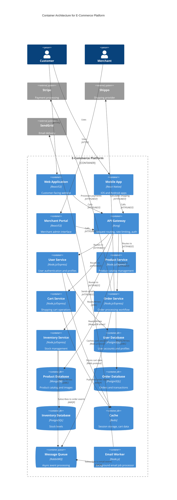
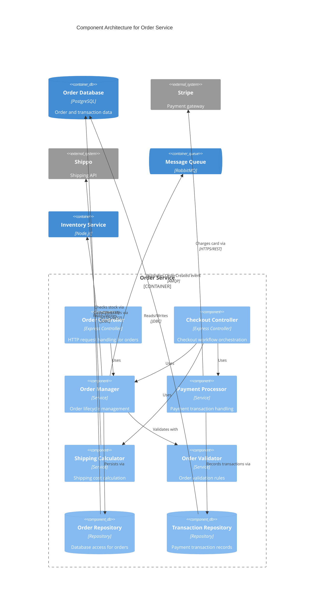
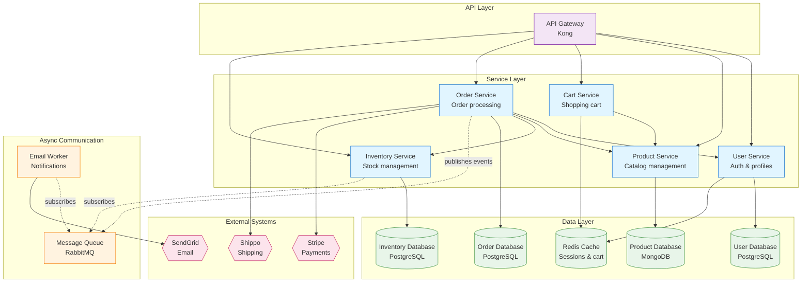

# E-Commerce Platform Architecture

## Scenario

A modern e-commerce platform that allows customers to browse products, manage shopping carts, and complete purchases. The system integrates with third-party payment processors, inventory management, and shipping providers.

**Business Context**:
- Customers: Browse catalog, add to cart, checkout, track orders
- Merchants: Manage products, view orders, update inventory
- Admin: Platform administration, analytics, customer support

**Non-Functional Requirements**:
- Scalability: Handle Black Friday traffic spikes
- Availability: 99.9% uptime SLA
- Security: PCI DSS compliance for payment data
- Performance: Page load < 2 seconds, checkout < 5 seconds

## Architecture Overview

**Architecture Style**: Microservices with event-driven communication

**Technology Stack**:
- Frontend: React (web), React Native (mobile)
- Backend: Node.js microservices
- Databases: PostgreSQL (transactional), MongoDB (catalog), Redis (cache/session)
- Messaging: RabbitMQ (async events)
- Infrastructure: AWS (ECS, RDS, ElastiCache)

**Key Design Decisions**:
- **Microservices**: Independent scaling and deployment
- **Database per service**: Autonomy and bounded contexts
- **Event-driven**: Decouple order processing from inventory/shipping
- **API Gateway**: Single entry point, rate limiting, authentication

---

## Diagrams

### 1. System Context Diagram (C4 Level 1)

This diagram shows the E-Commerce Platform in the context of its users and external dependencies.

**Key Elements**:
- **Customer**: Primary user persona, browses and purchases
- **Merchant**: Seller persona, manages products and inventory
- **Admin**: Platform operator, manages system configuration
- **External integrations**: Payment (Stripe), shipping (Shippo), email (SendGrid), analytics (Google Analytics)

**Tips for Adaptation**:
- Replace external systems with your chosen providers (e.g., PayPal instead of Stripe)
- Add additional personas (Supplier, Warehouse Manager, Customer Support)
- Include compliance systems (fraud detection, tax calculation)

---

### 2. Container Diagram (C4 Level 2)

This diagram zooms into the E-Commerce Platform, showing the deployable containers and their interactions.

**Key Elements**:
- **Frontend containers**: Web (React), Mobile (React Native), Merchant Portal
- **API Gateway**: Kong for routing, rate limiting, JWT validation
- **Microservices**: User, Product, Cart, Order, Inventory (each with bounded context)
- **Databases**: PostgreSQL for transactional data, MongoDB for product catalog
- **Cache**: Redis for sessions and shopping cart (ephemeral data)
- **Message Queue**: RabbitMQ for asynchronous order processing
- **Background worker**: Email worker processes async notification jobs

**Technology Choices**:
- **Node.js/Express**: Consistent runtime across services, non-blocking I/O
- **PostgreSQL**: ACID compliance for orders, inventory, users
- **MongoDB**: Flexible schema for product catalog with varying attributes
- **Redis**: In-memory cache for session data and cart (fast reads)
- **RabbitMQ**: Reliable message delivery for order events

**Tips for Adaptation**:
- Replace Kong with AWS API Gateway, NGINX, or Traefik
- Use AWS SQS/SNS instead of RabbitMQ for managed messaging
- Add CDN (CloudFront, Cloudflare) in front of web app
- Include search service (Elasticsearch) for product search

---

### 3. Component Diagram - Order Service (C4 Level 3)

This diagram zooms into the Order Service container, showing its internal components.

**Key Components**:
- **Controllers**: HTTP request handlers for order and checkout endpoints
- **Order Manager**: Core business logic for order lifecycle
- **Payment Processor**: Handles Stripe integration and payment state
- **Shipping Calculator**: Integrates with Shippo for shipping cost estimation
- **Order Validator**: Business rules (minimum order, address validation)
- **Repositories**: Data access layer with database abstraction

**Component Responsibilities**:
- **Order Controller**: `GET /orders`, `GET /orders/:id`, `PUT /orders/:id/cancel`
- **Checkout Controller**: `POST /checkout` (orchestrates validation, payment, order creation)
- **Order Manager**: Create order, update status, cancel order, emit events
- **Payment Processor**: Create charge, refund, handle payment webhooks
- **Shipping Calculator**: Calculate shipping cost based on weight, destination
- **Repositories**: CRUD operations, query by user, query by status

**Tips for Adaptation**:
- Add `OrderEventPublisher` component if complex event publishing logic
- Include `FraudDetector` component for fraud prevention
- Add `DiscountCalculator` for coupon/promo code support
- Separate `PaymentGatewayAdapter` interface with multiple implementations

---

### 4. Service Dependency Graph

This graph shows dependencies between microservices to identify coupling and potential circular dependencies.

**Dependency Analysis**:

**Order Service Dependencies (High Coupling)**:
- Synchronous: User Service, Product Service, Inventory Service, Stripe, Shippo
- Asynchronous: Message Queue
- **Impact**: Order Service is central orchestrator with most dependencies
- **Trade-off**: Acceptable for checkout workflow that needs real-time coordination

**Inventory Service**:
- Synchronous: Inventory Database only
- Asynchronous: Message Queue (subscribes to OrderCreated events)
- **Pattern**: Event-driven updates reduce coupling

**Cart Service**:
- Dependencies: Product Service (to validate products), Redis Cache
- **Pattern**: Stateless service, uses cache for cart storage

**No Circular Dependencies**: ✅ Clean dependency graph
- All dependencies flow in one direction (top to bottom)
- Async messaging prevents tight coupling
- Services don't depend on Order Service (one-way dependency)

**Recommendations**:
1. **Consider**: Circuit breaker for Order Service → External systems (Stripe, Shippo)
2. **Consider**: API composition layer to reduce frontend calls to multiple services
3. **Monitor**: Order Service latency (depends on 5 downstream systems)

**Tips for Adaptation**:
- Add more services (Review Service, Recommendation Service, Search Service)
- Show circular dependencies with dashed arrows: `A -.->|"circular"| B`
- Highlight high-coupling services with custom styling
- Include caching layers between services

---

## Key Architectural Patterns

### 1. Database Per Service

Each microservice owns its database schema, ensuring loose coupling and independent scaling.

**Benefits**:
- Service autonomy (deploy independently)
- Technology diversity (PostgreSQL for orders, MongoDB for products)
- Fault isolation (User DB failure doesn't affect Order Service)

**Trade-offs**:
- No distributed transactions (use Saga pattern for multi-service workflows)
- Data duplication (User email stored in Order records for denormalization)

### 2. API Gateway Pattern

Single entry point for all client requests, handles cross-cutting concerns.

**Responsibilities**:
- Request routing to appropriate service
- Authentication (JWT validation)
- Rate limiting (prevent abuse)
- Request/response transformation
- API versioning

**Benefits**:
- Simplified client logic (one endpoint instead of 5)
- Centralized security enforcement
- Protocol translation (REST to gRPC)

### 3. Event-Driven Architecture

Services communicate asynchronously via message queue for eventual consistency.

**Events**:
- `OrderCreated`: Published by Order Service, consumed by Inventory Service, Email Worker
- `InventoryReserved`: Published by Inventory Service
- `PaymentProcessed`: Published by Order Service

**Benefits**:
- Decoupling (Inventory Service doesn't know about Order Service implementation)
- Resilience (Message queue buffers during Inventory Service downtime)
- Scalability (Add more Email Worker instances for Black Friday)

**Trade-offs**:
- Eventual consistency (inventory not updated instantly)
- Debugging complexity (distributed tracing required)

### 4. CQRS (Command Query Responsibility Segregation)

Product Service uses separate read and write models.

**Write Model**: MongoDB (flexible schema for product attributes)
**Read Model**: Elasticsearch (optimized for search queries)

**Benefits**:
- Optimized queries (search across 1M+ products)
- Independent scaling (read-heavy workload needs more read replicas)

---

## Deployment Architecture

**Production Environment** (AWS):
- **API Gateway**: ECS Fargate (auto-scaling containers)
- **Microservices**: ECS Fargate (2 tasks per service minimum, scale to 10)
- **Databases**: RDS PostgreSQL Multi-AZ, DocumentDB (MongoDB-compatible)
- **Cache**: ElastiCache Redis cluster
- **Message Queue**: Amazon MQ (managed RabbitMQ)
- **Static Assets**: S3 + CloudFront CDN

**Regions**: Multi-region deployment (us-east-1 primary, us-west-2 failover)

**High Availability**:
- Load balancer across availability zones
- Database replication (RDS Multi-AZ)
- Autoscaling based on CPU and request count

---

## Related Diagrams

For complete architecture documentation, create these additional diagrams:

1. **Sequence Diagrams**:
   - Checkout flow (see `authentication-flow.md` for sequence pattern)
   - Payment processing sequence
   - Inventory reservation flow

2. **Additional Component Diagrams**:
   - Product Service components (search indexing, image processing)
   - User Service components (authentication, profile management)

3. **Deployment Diagram**:
   - AWS infrastructure (VPC, subnets, security groups)
   - CI/CD pipeline (build, test, deploy stages)

---

## Summary

This e-commerce architecture demonstrates:
- ✅ Microservices with clear bounded contexts
- ✅ Event-driven communication for decoupling
- ✅ Database per service for autonomy
- ✅ API Gateway for centralized cross-cutting concerns
- ✅ Scalable infrastructure with cloud-native services

**Use this as a template for**:
- E-commerce platforms
- Multi-service SaaS applications
- Event-driven architectures
- Payment processing integrations
