# C4 Model Mermaid Patterns

## Overview

The C4 model is a hierarchical approach to software architecture diagrams, created by Simon Brown. It provides a structured way to visualize system architecture at different levels of abstraction, similar to zooming in on a map.

**C4 stands for**: Context, Containers, Components, Code

This reference provides comprehensive guidance for creating C4 diagrams using Mermaid syntax, including patterns for common architectural styles and advanced techniques.

## C4 Model Hierarchy

### Abstraction Levels

The C4 model uses four hierarchical levels, each zooming in with more detail:

```
Level 1: System Context
  ↓ (zoom in on your system)
Level 2: Container
  ↓ (zoom in on a container)
Level 3: Component
  ↓ (zoom in on a component)
Level 4: Code
```

### Level 1: System Context

**Purpose**: Shows the system in the context of users and external dependencies

**Audience**: Technical and non-technical stakeholders, including executives

**Key Elements**:
- Your system (single box representing the entire system)
- People/actors who interact with the system
- External systems the system integrates with
- High-level relationships

**When to use**:
- Project kickoff documentation
- Executive presentations
- Onboarding new team members
- Defining system scope and boundaries

**Example**:
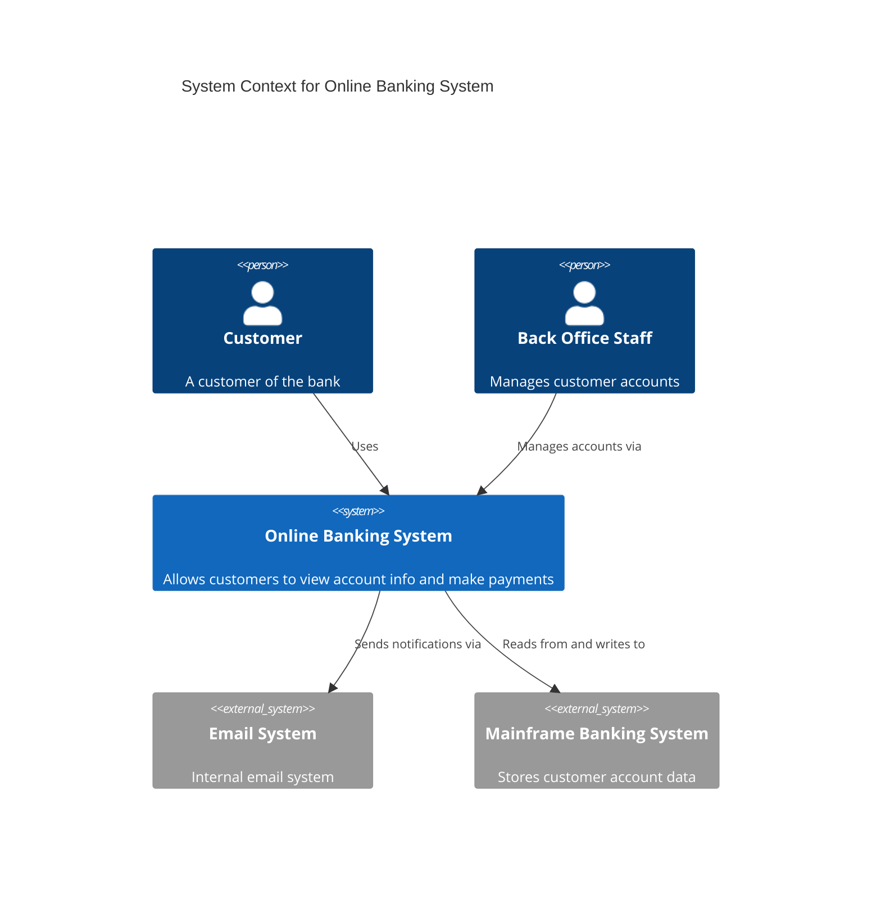
```mermaid
C4Context
  title System Context for Online Banking System

  Person(customer, "Customer", "A customer of the bank")
  Person(backOffice, "Back Office Staff", "Manages customer accounts")

  System(banking, "Online Banking System", "Allows customers to view account info and make payments")

  System_Ext(email, "Email System", "Internal email system")
  System_Ext(mainframe, "Mainframe Banking System", "Stores customer account data")

  Rel(customer, banking, "Uses")
  Rel(backOffice, banking, "Manages accounts via")
  Rel(banking, email, "Sends notifications via")
  Rel(banking, mainframe, "Reads from and writes to")
```

### Level 2: Container

**Purpose**: Shows the high-level technology choices and how containers communicate

**Audience**: Technical team members, architects, senior developers

**Key Elements**:
- Deployable/runnable units (web apps, mobile apps, databases, microservices)
- Technology stack for each container (React, Node.js, PostgreSQL)
- Relationships between containers (HTTP, JDBC, messaging)

**Container Definition**: A separately runnable/deployable unit (web server, application server, database, file system, mobile app, serverless function)

**When to use**:
- Deployment planning
- Technology stack documentation
- Infrastructure architecture
- DevOps and CI/CD pipeline design

**Example**:
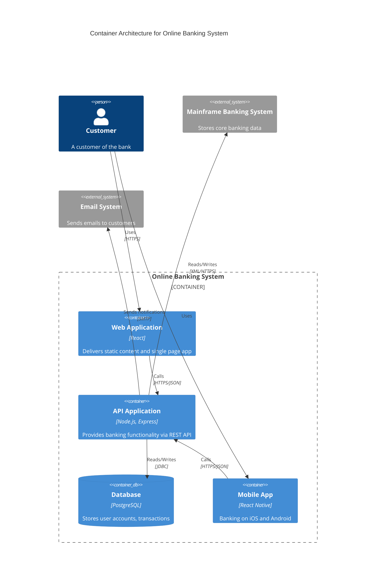
```mermaid
C4Container
  title Container Architecture for Online Banking System

  Person(customer, "Customer", "A customer of the bank")

  Container_Boundary(c1, "Online Banking System") {
    Container(web, "Web Application", "React", "Delivers static content and single page app")
    Container(api, "API Application", "Node.js, Express", "Provides banking functionality via REST API")
    ContainerDb(db, "Database", "PostgreSQL", "Stores user accounts, transactions")
    Container(mobileApp, "Mobile App", "React Native", "Banking on iOS and Android")
  }

  System_Ext(mainframe, "Mainframe Banking System", "Stores core banking data")
  System_Ext(email, "Email System", "Sends emails to customers")

  Rel(customer, web, "Uses", "HTTPS")
  Rel(customer, mobileApp, "Uses")
  Rel(web, api, "Calls", "HTTPS/JSON")
  Rel(mobileApp, api, "Calls", "HTTPS/JSON")
  Rel(api, db, "Reads/Writes", "JDBC")
  Rel(api, mainframe, "Reads/Writes", "XML/HTTPS")
  Rel(api, email, "Sends notifications", "SMTP")
```

### Level 3: Component

**Purpose**: Shows the components inside a container and their interactions

**Audience**: Software architects, developers working on the container

**Key Elements**:
- Components within a single container (controllers, services, repositories)
- Interfaces/responsibilities of each component
- Dependencies between components

**Component Definition**: A grouping of related functionality with a well-defined interface (service class, repository, controller, module)

**When to use**:
- Detailed design documentation
- Code organization planning
- Understanding internal structure
- Onboarding developers to a specific container

**Example**:
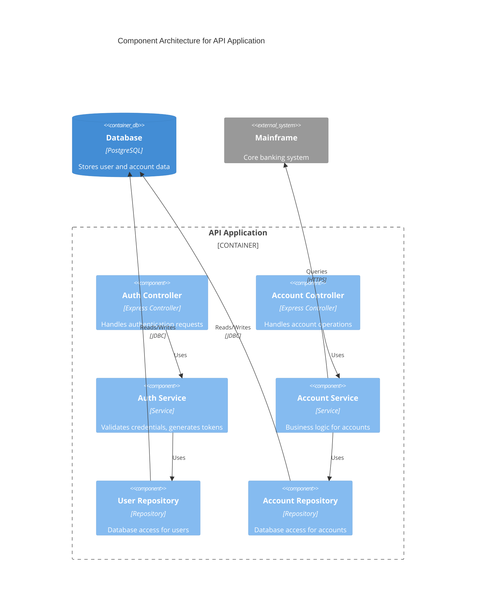
```mermaid
C4Component
  title Component Architecture for API Application

  Container_Boundary(api, "API Application") {
    Component(authController, "Auth Controller", "Express Controller", "Handles authentication requests")
    Component(accountController, "Account Controller", "Express Controller", "Handles account operations")

    Component(authService, "Auth Service", "Service", "Validates credentials, generates tokens")
    Component(accountService, "Account Service", "Service", "Business logic for accounts")

    Component(userRepo, "User Repository", "Repository", "Database access for users")
    Component(accountRepo, "Account Repository", "Repository", "Database access for accounts")
  }

  ContainerDb(db, "Database", "PostgreSQL", "Stores user and account data")
  System_Ext(mainframe, "Mainframe", "Core banking system")

  Rel(authController, authService, "Uses")
  Rel(accountController, accountService, "Uses")
  Rel(authService, userRepo, "Uses")
  Rel(accountService, accountRepo, "Uses")
  Rel(userRepo, db, "Reads/Writes", "JDBC")
  Rel(accountRepo, db, "Reads/Writes", "JDBC")
  Rel(accountService, mainframe, "Queries", "HTTPS")
```

### Level 4: Code

**Purpose**: Shows how a component is implemented using code constructs

**Audience**: Developers implementing the component

**Key Elements**:
- Classes, interfaces, functions
- Design patterns (Strategy, Factory, Observer)
- Implementation details

**When to use**:
- Detailed implementation documentation
- Explaining complex algorithms or patterns
- Code review preparation

**Note**: C4 Code diagrams are typically UML class diagrams or similar. Mermaid supports class diagrams but not C4-specific Code syntax. Use Mermaid class diagrams instead:

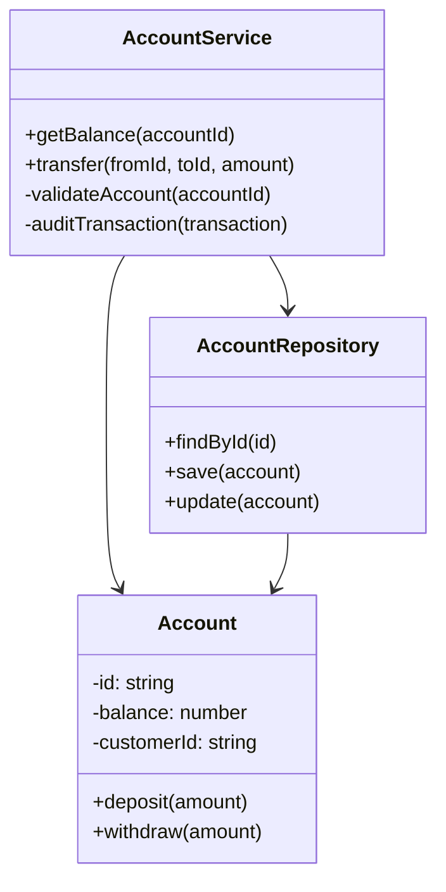
```mermaid
classDiagram
  class AccountService {
    +getBalance(accountId)
    +transfer(fromId, toId, amount)
    -validateAccount(accountId)
    -auditTransaction(transaction)
  }

  class AccountRepository {
    +findById(id)
    +save(account)
    +update(account)
  }

  class Account {
    -id: string
    -balance: number
    -customerId: string
    +deposit(amount)
    +withdraw(amount)
  }

  AccountService --> AccountRepository
  AccountService --> Account
  AccountRepository --> Account
```

## Mermaid C4 Syntax Deep Dive

### Element Types

#### People

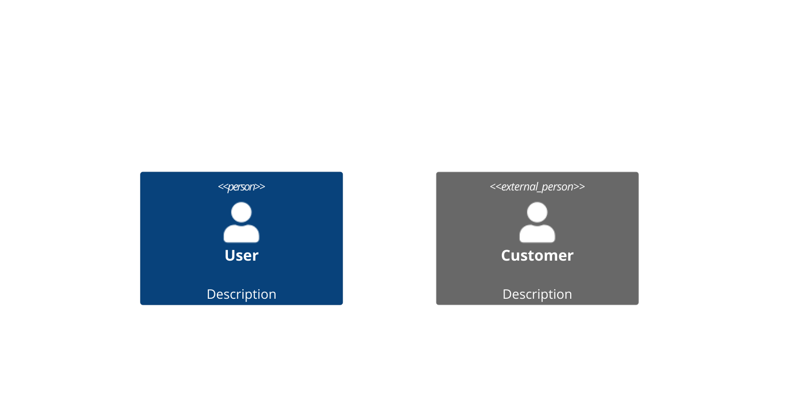
```mermaid
C4Context
  %% Internal person (part of the organization)
  Person(user, "User", "Description")

  %% External person (outside the organization)
  Person_Ext(customer, "Customer", "Description")
```

**When to use**:
- `Person()`: Employees, internal staff, administrators
- `Person_Ext()`: Customers, partners, external users

#### Systems

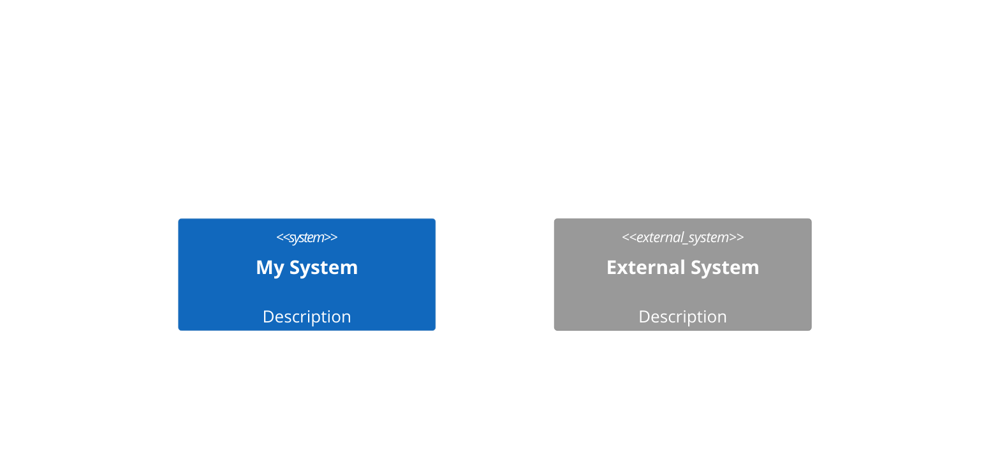
```mermaid
C4Context
  %% Your system being documented
  System(mySystem, "My System", "Description")

  %% External systems (third-party, legacy)
  System_Ext(external, "External System", "Description")
```

**When to use**:
- `System()`: The system you're building/documenting
- `System_Ext()`: Third-party APIs, legacy systems, partner systems

#### Containers

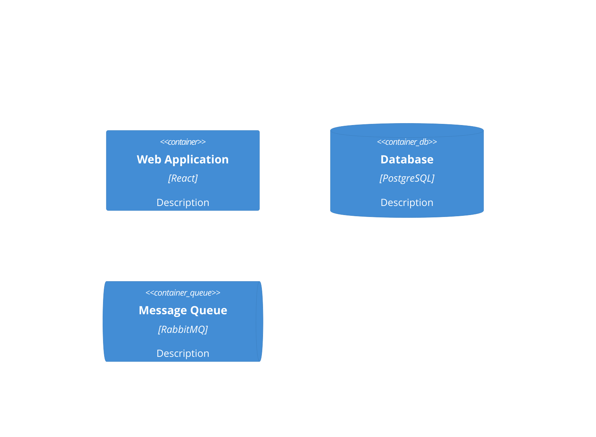
```mermaid
C4Container
  %% Standard container (web app, API, service)
  Container(web, "Web Application", "React", "Description")

  %% Database container
  ContainerDb(db, "Database", "PostgreSQL", "Description")

  %% Message queue container
  ContainerQueue(queue, "Message Queue", "RabbitMQ", "Description")
```

**When to use**:
- `Container()`: Web apps, APIs, mobile apps, background workers
- `ContainerDb()`: Relational databases, NoSQL databases, data warehouses
- `ContainerQueue()`: Message queues, event buses, streaming platforms

#### Components

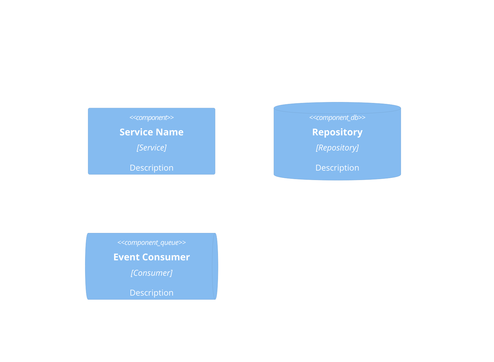
```mermaid
C4Component
  %% Standard component (class, module, service)
  Component(service, "Service Name", "Service", "Description")

  %% Database component (repository, DAO)
  ComponentDb(repo, "Repository", "Repository", "Description")

  %% Queue component (consumer, publisher)
  ComponentQueue(consumer, "Event Consumer", "Consumer", "Description")
```

**When to use**:
- `Component()`: Controllers, services, utilities, modules
- `ComponentDb()`: Repositories, DAOs, database access layers
- `ComponentQueue()`: Event handlers, message consumers, publishers

### Relationships

```mermaid
C4Context
  %% Basic relationship
  Rel(from, to, "Label")

  %% Relationship with technology detail
  Rel(from, to, "Label", "Technology/Protocol")

  %% Bidirectional relationship
  BiRel(a, b, "Label")
```

**Relationship Labels**: Use verb phrases describing the action
- "Uses"
- "Calls"
- "Reads from"
- "Writes to"
- "Sends notifications via"
- "Authenticates with"
- "Queries"

**Technology Details** (optional fourth parameter):
- "HTTPS"
- "HTTPS/JSON"
- "gRPC"
- "WebSocket"
- "JDBC"
- "AMQP"
- "Async/Event"

### Boundaries

Boundaries group related containers or components:

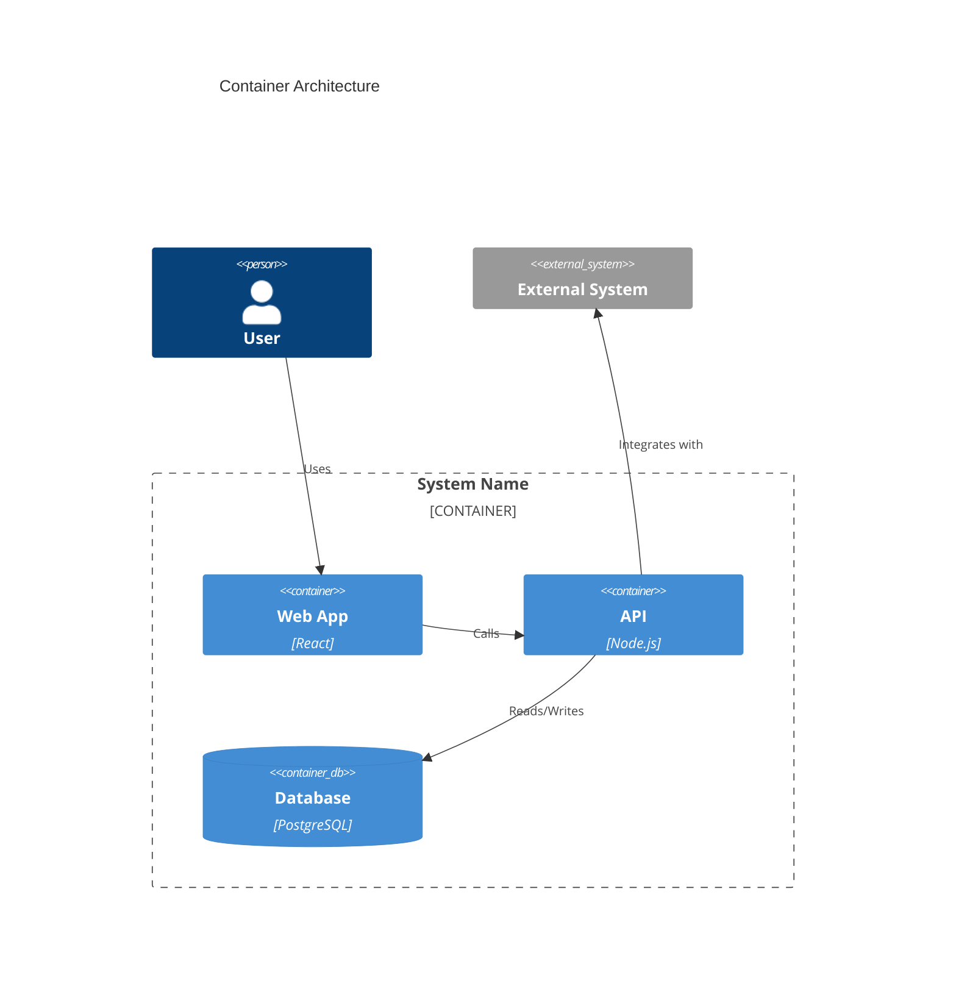
```mermaid
C4Container
  title Container Architecture

  Person(user, "User")

  Container_Boundary(b1, "System Name") {
    Container(web, "Web App", "React")
    Container(api, "API", "Node.js")
    ContainerDb(db, "Database", "PostgreSQL")
  }

  System_Ext(external, "External System")

  Rel(user, web, "Uses")
  Rel(web, api, "Calls")
  Rel(api, db, "Reads/Writes")
  Rel(api, external, "Integrates with")
```

**When to use boundaries**:
- Group containers that belong to the same system
- Show deployment boundaries (cloud regions, data centers)
- Indicate security boundaries (DMZ, internal network)
- Organize microservices by domain

## Patterns for Common Architectures

### Monolith Architecture

**Characteristics**: Single deployable unit, components share same process/memory

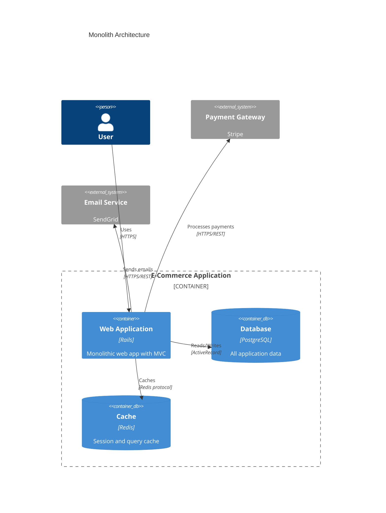
```mermaid
C4Container
  title Monolith Architecture

  Person(user, "User")

  Container_Boundary(monolith, "E-Commerce Application") {
    Container(web, "Web Application", "Rails", "Monolithic web app with MVC")
    ContainerDb(db, "Database", "PostgreSQL", "All application data")
    ContainerDb(cache, "Cache", "Redis", "Session and query cache")
  }

  System_Ext(payment, "Payment Gateway", "Stripe")
  System_Ext(email, "Email Service", "SendGrid")

  Rel(user, web, "Uses", "HTTPS")
  Rel(web, db, "Reads/Writes", "ActiveRecord")
  Rel(web, cache, "Caches", "Redis protocol")
  Rel(web, payment, "Processes payments", "HTTPS/REST")
  Rel(web, email, "Sends emails", "HTTPS/REST")
```

**Components within Monolith**:
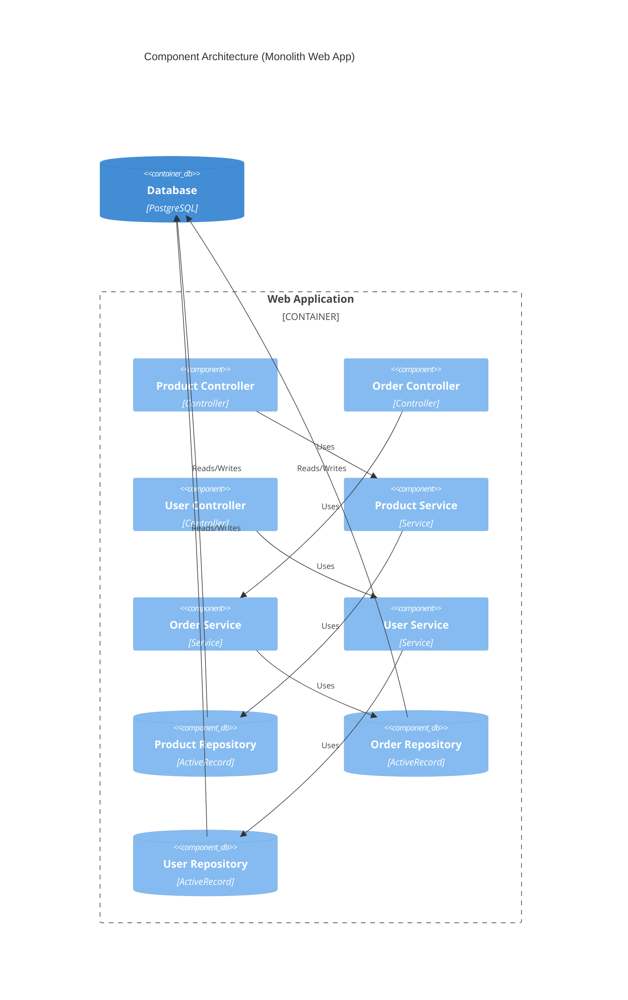
```mermaid
C4Component
  title Component Architecture (Monolith Web App)

  Container_Boundary(web, "Web Application") {
    Component(productCtrl, "Product Controller", "Controller")
    Component(orderCtrl, "Order Controller", "Controller")
    Component(userCtrl, "User Controller", "Controller")

    Component(productSvc, "Product Service", "Service")
    Component(orderSvc, "Order Service", "Service")
    Component(userSvc, "User Service", "Service")

    ComponentDb(productRepo, "Product Repository", "ActiveRecord")
    ComponentDb(orderRepo, "Order Repository", "ActiveRecord")
    ComponentDb(userRepo, "User Repository", "ActiveRecord")
  }

  ContainerDb(db, "Database", "PostgreSQL")

  Rel(productCtrl, productSvc, "Uses")
  Rel(orderCtrl, orderSvc, "Uses")
  Rel(userCtrl, userSvc, "Uses")

  Rel(productSvc, productRepo, "Uses")
  Rel(orderSvc, orderRepo, "Uses")
  Rel(userSvc, userRepo, "Uses")

  Rel(productRepo, db, "Reads/Writes")
  Rel(orderRepo, db, "Reads/Writes")
  Rel(userRepo, db, "Reads/Writes")
```

### Microservices Architecture

**Characteristics**: Multiple independent deployable units, each with own database

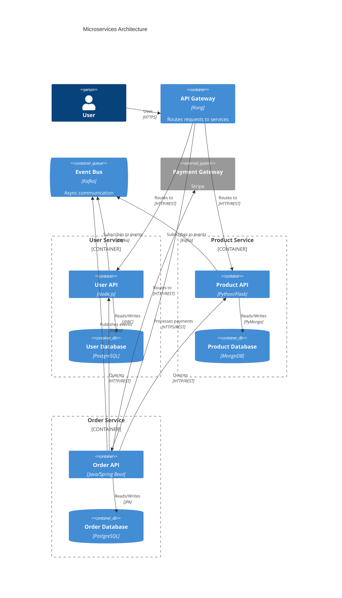
```mermaid
C4Container
  title Microservices Architecture

  Person(user, "User")

  Container(apiGateway, "API Gateway", "Kong", "Routes requests to services")

  Container_Boundary(userService, "User Service") {
    Container(userAPI, "User API", "Node.js")
    ContainerDb(userDB, "User Database", "PostgreSQL")
  }

  Container_Boundary(productService, "Product Service") {
    Container(productAPI, "Product API", "Python/Flask")
    ContainerDb(productDB, "Product Database", "MongoDB")
  }

  Container_Boundary(orderService, "Order Service") {
    Container(orderAPI, "Order API", "Java/Spring Boot")
    ContainerDb(orderDB, "Order Database", "PostgreSQL")
  }

  ContainerQueue(eventBus, "Event Bus", "Kafka", "Async communication")

  System_Ext(payment, "Payment Gateway", "Stripe")

  Rel(user, apiGateway, "Uses", "HTTPS")
  Rel(apiGateway, userAPI, "Routes to", "HTTP/REST")
  Rel(apiGateway, productAPI, "Routes to", "HTTP/REST")
  Rel(apiGateway, orderAPI, "Routes to", "HTTP/REST")

  Rel(userAPI, userDB, "Reads/Writes", "JDBC")
  Rel(productAPI, productDB, "Reads/Writes", "PyMongo")
  Rel(orderAPI, orderDB, "Reads/Writes", "JPA")

  Rel(orderAPI, userAPI, "Queries", "HTTP/REST")
  Rel(orderAPI, productAPI, "Queries", "HTTP/REST")
  Rel(orderAPI, payment, "Processes payments", "HTTPS/REST")

  Rel(orderAPI, eventBus, "Publishes events", "Kafka")
  Rel(userAPI, eventBus, "Subscribes to events", "Kafka")
  Rel(productAPI, eventBus, "Subscribes to events", "Kafka")
```

**Key Patterns**:
- Each service has its own database (database per service pattern)
- API Gateway routes external requests
- Event bus for asynchronous communication between services
- Services communicate via REST or messaging

### Event-Driven Architecture

**Characteristics**: Asynchronous communication via events and message queues

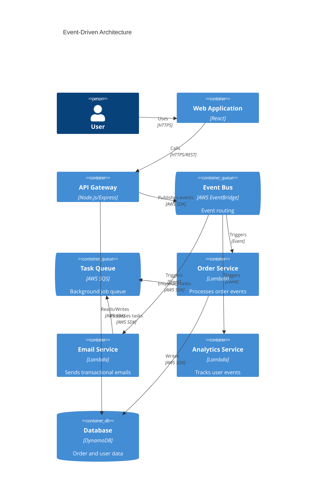
```mermaid
C4Container
  title Event-Driven Architecture

  Person(user, "User")

  Container(web, "Web Application", "React")
  Container(api, "API Gateway", "Node.js/Express")

  ContainerQueue(eventBus, "Event Bus", "AWS EventBridge", "Event routing")
  ContainerQueue(queue, "Task Queue", "AWS SQS", "Background job queue")

  Container(orderService, "Order Service", "Lambda", "Processes order events")
  Container(emailService, "Email Service", "Lambda", "Sends transactional emails")
  Container(analyticsService, "Analytics Service", "Lambda", "Tracks user events")

  ContainerDb(db, "Database", "DynamoDB", "Order and user data")

  Rel(user, web, "Uses", "HTTPS")
  Rel(web, api, "Calls", "HTTPS/REST")
  Rel(api, db, "Reads/Writes", "AWS SDK")
  Rel(api, eventBus, "Publishes events", "AWS SDK")

  Rel(eventBus, orderService, "Triggers", "Event")
  Rel(eventBus, emailService, "Triggers", "Event")
  Rel(eventBus, analyticsService, "Triggers", "Event")

  Rel(orderService, db, "Writes", "AWS SDK")
  Rel(orderService, queue, "Enqueues tasks", "AWS SDK")
  Rel(emailService, queue, "Processes tasks", "AWS SDK")
```

**Key Patterns**:
- Event bus for publish/subscribe communication
- Task queue for reliable background job processing
- Serverless functions triggered by events
- Eventual consistency across services

### Multi-Tenant SaaS Architecture

**Characteristics**: Single system serves multiple customers with data isolation

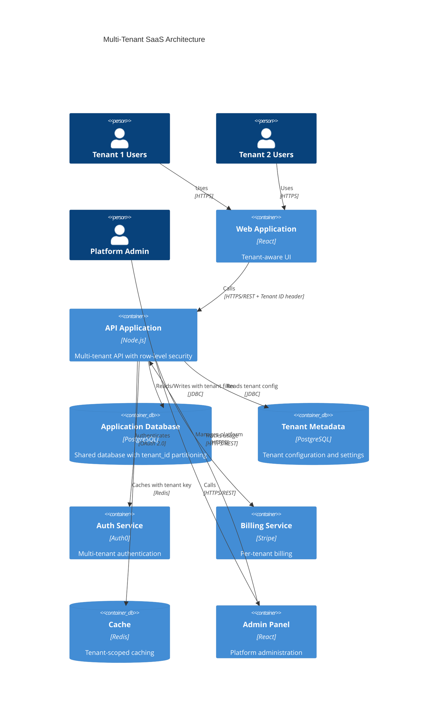
```mermaid
C4Container
  title Multi-Tenant SaaS Architecture

  Person(tenant1, "Tenant 1 Users")
  Person(tenant2, "Tenant 2 Users")
  Person(admin, "Platform Admin")

  Container(web, "Web Application", "React", "Tenant-aware UI")
  Container(api, "API Application", "Node.js", "Multi-tenant API with row-level security")

  ContainerDb(appDB, "Application Database", "PostgreSQL", "Shared database with tenant_id partitioning")
  ContainerDb(tenantDB, "Tenant Metadata", "PostgreSQL", "Tenant configuration and settings")

  Container(authService, "Auth Service", "Auth0", "Multi-tenant authentication")
  Container(billingService, "Billing Service", "Stripe", "Per-tenant billing")

  ContainerDb(cache, "Cache", "Redis", "Tenant-scoped caching")

  Container(adminPanel, "Admin Panel", "React", "Platform administration")

  Rel(tenant1, web, "Uses", "HTTPS")
  Rel(tenant2, web, "Uses", "HTTPS")
  Rel(admin, adminPanel, "Manages platform", "HTTPS")

  Rel(web, api, "Calls", "HTTPS/REST + Tenant ID header")
  Rel(adminPanel, api, "Calls", "HTTPS/REST")

  Rel(api, authService, "Authenticates", "OAuth 2.0")
  Rel(api, appDB, "Reads/Writes with tenant filter", "JDBC")
  Rel(api, tenantDB, "Reads tenant config", "JDBC")
  Rel(api, cache, "Caches with tenant key", "Redis")
  Rel(api, billingService, "Tracks usage", "HTTPS/REST")
```

**Key Patterns**:
- Tenant ID in every request (header, JWT claim, session)
- Row-level security with tenant_id column
- Tenant-scoped caching keys
- Separate tenant metadata store
- Per-tenant billing and usage tracking

### Serverless Architecture (AWS Lambda)

**Characteristics**: Functions-as-a-Service, event-driven, auto-scaling

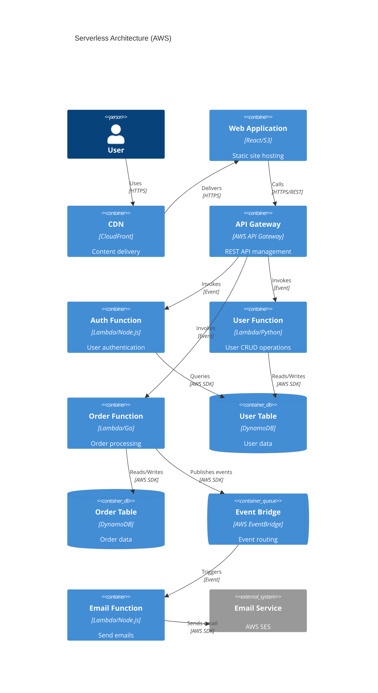
```mermaid
C4Container
  title Serverless Architecture (AWS)

  Person(user, "User")

  Container(web, "Web Application", "React/S3", "Static site hosting")
  Container(cdn, "CDN", "CloudFront", "Content delivery")

  Container(apiGateway, "API Gateway", "AWS API Gateway", "REST API management")

  Container(authFunc, "Auth Function", "Lambda/Node.js", "User authentication")
  Container(userFunc, "User Function", "Lambda/Python", "User CRUD operations")
  Container(orderFunc, "Order Function", "Lambda/Go", "Order processing")

  ContainerDb(userTable, "User Table", "DynamoDB", "User data")
  ContainerDb(orderTable, "Order Table", "DynamoDB", "Order data")

  ContainerQueue(eventBridge, "Event Bridge", "AWS EventBridge", "Event routing")
  Container(emailFunc, "Email Function", "Lambda/Node.js", "Send emails")

  System_Ext(ses, "Email Service", "AWS SES")

  Rel(user, cdn, "Uses", "HTTPS")
  Rel(cdn, web, "Delivers", "HTTPS")
  Rel(web, apiGateway, "Calls", "HTTPS/REST")

  Rel(apiGateway, authFunc, "Invokes", "Event")
  Rel(apiGateway, userFunc, "Invokes", "Event")
  Rel(apiGateway, orderFunc, "Invokes", "Event")

  Rel(authFunc, userTable, "Queries", "AWS SDK")
  Rel(userFunc, userTable, "Reads/Writes", "AWS SDK")
  Rel(orderFunc, orderTable, "Reads/Writes", "AWS SDK")

  Rel(orderFunc, eventBridge, "Publishes events", "AWS SDK")
  Rel(eventBridge, emailFunc, "Triggers", "Event")
  Rel(emailFunc, ses, "Sends email", "AWS SDK")
```

**Key Patterns**:
- Static frontend hosting (S3 + CloudFront)
- API Gateway for HTTP routing
- Lambda functions for compute
- DynamoDB for serverless database
- EventBridge for event routing
- Managed services for email, queues, etc.

## Advanced Techniques

### Dynamic System Boundaries

Show how systems interact across organizational boundaries:

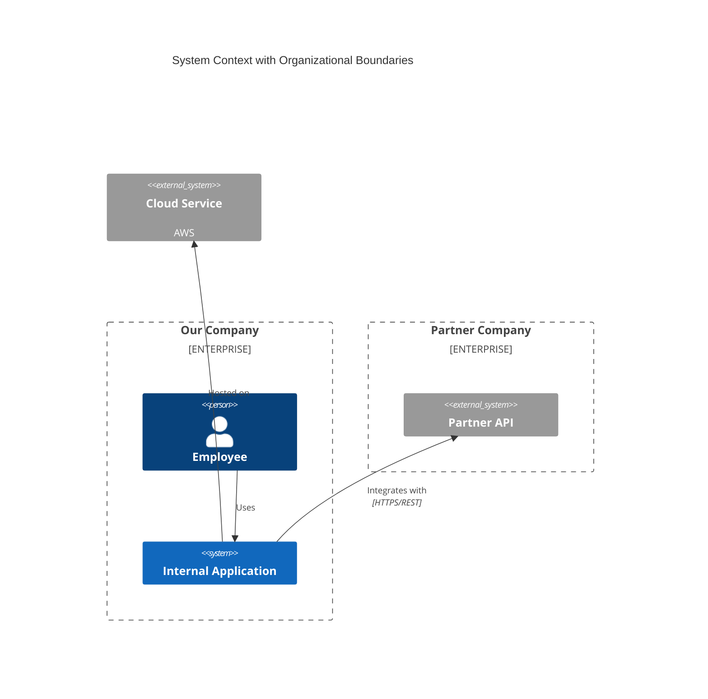
```mermaid
C4Context
  title System Context with Organizational Boundaries

  Enterprise_Boundary(company, "Our Company") {
    Person(employee, "Employee")
    System(internalApp, "Internal Application")
  }

  Enterprise_Boundary(partner, "Partner Company") {
    System_Ext(partnerAPI, "Partner API")
  }

  System_Ext(cloudService, "Cloud Service", "AWS")

  Rel(employee, internalApp, "Uses")
  Rel(internalApp, partnerAPI, "Integrates with", "HTTPS/REST")
  Rel(internalApp, cloudService, "Hosted on")
```

### Deployment View with Containers

Combine C4 with deployment information:

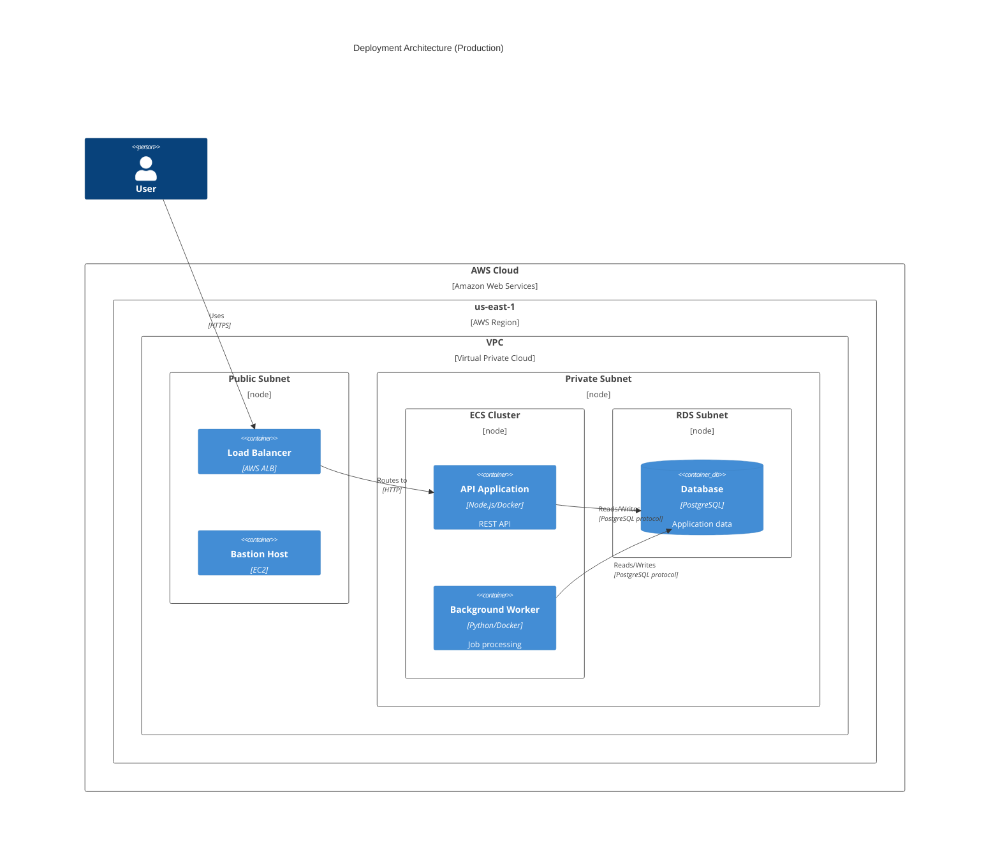
```mermaid
C4Container
  title Deployment Architecture (Production)

  Deployment_Node(aws, "AWS Cloud", "Amazon Web Services") {
    Deployment_Node(region, "us-east-1", "AWS Region") {
      Deployment_Node(vpc, "VPC", "Virtual Private Cloud") {

        Deployment_Node(publicSubnet, "Public Subnet") {
          Container(alb, "Load Balancer", "AWS ALB")
          Container(bastion, "Bastion Host", "EC2")
        }

        Deployment_Node(privateSubnet, "Private Subnet") {
          Deployment_Node(ecs, "ECS Cluster") {
            Container(api, "API Application", "Node.js/Docker", "REST API")
            Container(worker, "Background Worker", "Python/Docker", "Job processing")
          }

          Deployment_Node(rds, "RDS Subnet") {
            ContainerDb(db, "Database", "PostgreSQL", "Application data")
          }
        }
      }
    }
  }

  Person(user, "User")

  Rel(user, alb, "Uses", "HTTPS")
  Rel(alb, api, "Routes to", "HTTP")
  Rel(api, db, "Reads/Writes", "PostgreSQL protocol")
  Rel(worker, db, "Reads/Writes", "PostgreSQL protocol")
```

### Styling and Theming

Apply custom styles to elements:

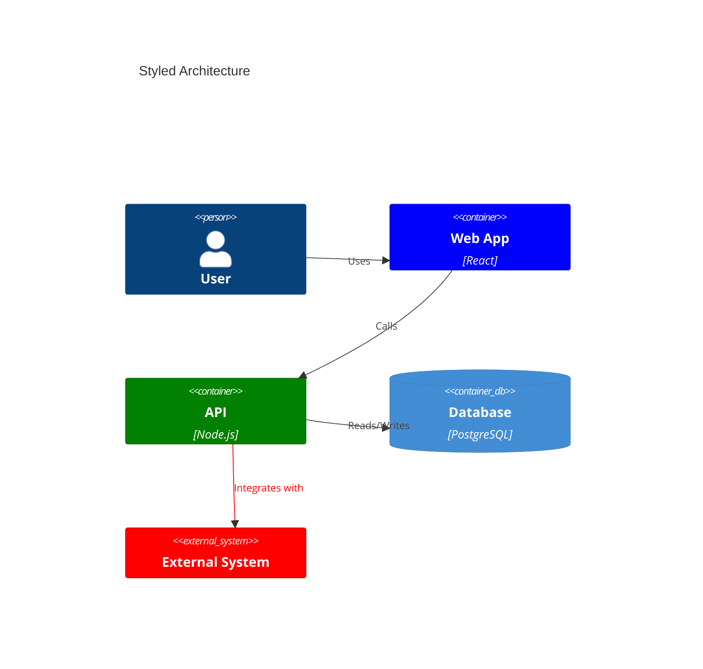
```mermaid
C4Container
  title Styled Architecture

  Person(user, "User")

  Container(web, "Web App", "React")
  Container(api, "API", "Node.js")
  ContainerDb(db, "Database", "PostgreSQL")

  System_Ext(external, "External System")

  Rel(user, web, "Uses")
  Rel(web, api, "Calls")
  Rel(api, db, "Reads/Writes")
  Rel(api, external, "Integrates with")

  UpdateElementStyle(web, $fontColor="white", $bgColor="blue", $borderColor="darkblue")
  UpdateElementStyle(api, $fontColor="white", $bgColor="green", $borderColor="darkgreen")
  UpdateElementStyle(external, $fontColor="white", $bgColor="red", $borderColor="darkred")

  UpdateRelStyle(api, external, $textColor="red", $lineColor="red")
```

**Style Properties**:
- `$fontColor`: Text color
- `$bgColor`: Background color
- `$borderColor`: Border color
- `$textColor`: Relationship label color (UpdateRelStyle only)
- `$lineColor`: Relationship line color (UpdateRelStyle only)

### Layout Direction

Control diagram flow direction:

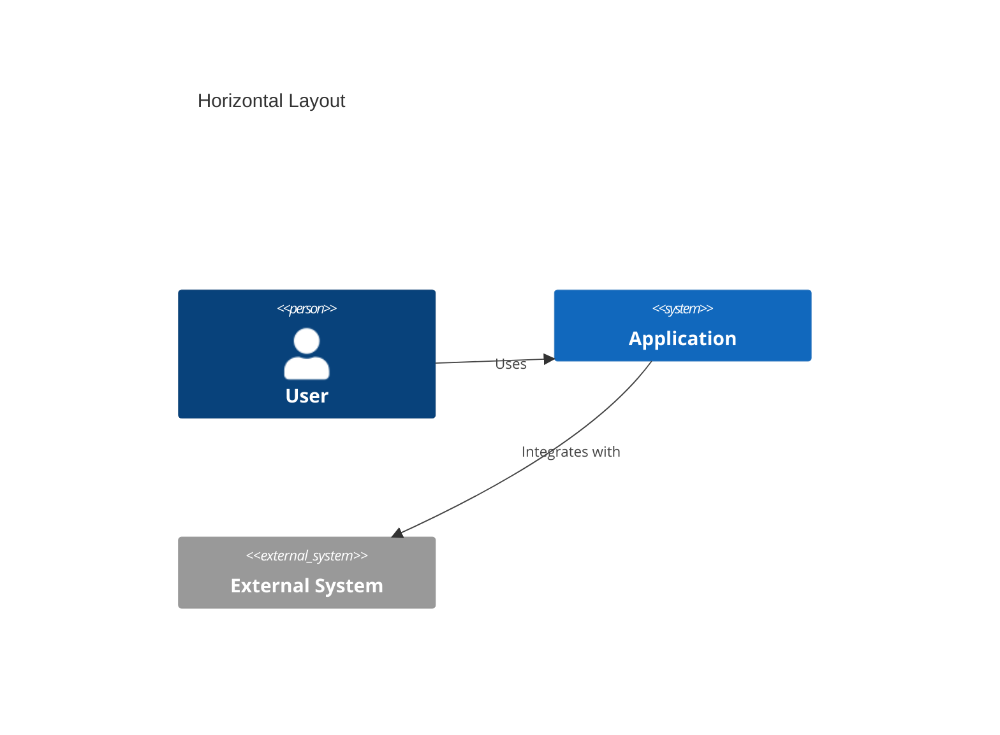
```mermaid
%%{init: {'theme':'base', 'themeVariables': { 'primaryColor':'#fff'}}}%%
C4Context
  title Horizontal Layout

  Person(user, "User")
  System(app, "Application")
  System_Ext(external, "External System")

  Rel(user, app, "Uses")
  Rel(app, external, "Integrates with")

  UpdateLayoutConfig($c4ShapeInRow="3", $c4BoundaryInRow="1")
```

**Layout Configuration**:
- `$c4ShapeInRow`: Number of shapes per row
- `$c4BoundaryInRow`: Number of boundaries per row

## Anti-Patterns to Avoid

### 1. Too Much Detail at Wrong Level

**Problem**: Context diagram with implementation details

```mermaid
%% ANTI-PATTERN: Context diagram with too much detail
C4Context
  title System Context (TOO DETAILED)

  Person(user, "User")
  System(app, "Application")

  %% These are container-level details, not context-level
  Container(web, "Web App", "React")
  Container(api, "API", "Node.js")
  ContainerDb(db, "Database", "PostgreSQL")
```

**Solution**: Keep context diagrams high-level, move details to container/component level

```mermaid
%% CORRECT: Context diagram at appropriate abstraction
C4Context
  title System Context

  Person(user, "User")
  System(app, "Application", "Web-based application for managing tasks")
  System_Ext(email, "Email System", "Sends notifications")

  Rel(user, app, "Uses")
  Rel(app, email, "Sends emails via")
```

### 2. Missing External Systems

**Problem**: Not showing external dependencies

```mermaid
%% ANTI-PATTERN: Missing external dependencies
C4Container
  title Container Architecture

  Container(api, "API", "Node.js")
  ContainerDb(db, "Database", "PostgreSQL")

  Rel(api, db, "Reads/Writes")

  %% PROBLEM: API calls Stripe, SendGrid, Auth0 but they're not shown
```

**Solution**: Show all external systems the container depends on

```mermaid
%% CORRECT: All external dependencies shown
C4Container
  title Container Architecture

  Container(api, "API", "Node.js")
  ContainerDb(db, "Database", "PostgreSQL")

  System_Ext(stripe, "Stripe", "Payment processing")
  System_Ext(sendgrid, "SendGrid", "Email delivery")
  System_Ext(auth0, "Auth0", "Authentication")

  Rel(api, db, "Reads/Writes")
  Rel(api, stripe, "Processes payments", "HTTPS/REST")
  Rel(api, sendgrid, "Sends emails", "HTTPS/REST")
  Rel(api, auth0, "Authenticates users", "OAuth 2.0")
```

### 3. Inconsistent Abstraction Levels

**Problem**: Mixing components and containers in same diagram

```mermaid
%% ANTI-PATTERN: Mixing abstraction levels
C4Container
  title Mixed Abstraction

  Container(web, "Web App", "React")
  Component(authService, "Auth Service", "Service")  %% WRONG: Component in Container diagram
  ContainerDb(db, "Database", "PostgreSQL")
```

**Solution**: Keep consistent abstraction - use separate diagrams

```mermaid
%% CORRECT: Container diagram (Level 2)
C4Container
  title Container Architecture

  Container(web, "Web App", "React")
  Container(api, "API", "Node.js")
  ContainerDb(db, "Database", "PostgreSQL")

%% Then create separate Component diagram for API container
C4Component
  title API Component Architecture

  Container_Boundary(api, "API Container") {
    Component(authController, "Auth Controller", "Controller")
    Component(authService, "Auth Service", "Service")
    ComponentDb(userRepo, "User Repository", "Repository")
  }
```

### 4. Overcrowded Diagrams

**Problem**: Too many elements, diagram is unreadable

**Solution**: Split into multiple focused diagrams

```mermaid
%% Instead of one diagram with 20+ microservices...
%% Create multiple diagrams:

%% Diagram 1: High-level service groups
C4Context
  title Microservices Overview

  System_Boundary(userDomain, "User Domain Services") {
    System(userServices, "User Services", "3 microservices")
  }

  System_Boundary(orderDomain, "Order Domain Services") {
    System(orderServices, "Order Services", "5 microservices")
  }

  System_Boundary(productDomain, "Product Domain Services") {
    System(productServices, "Product Services", "4 microservices")
  }

%% Diagram 2: Zoom into User Domain
C4Container
  title User Domain Services Detail

  Container(userAPI, "User API", "Node.js")
  Container(authAPI, "Auth API", "Node.js")
  Container(profileAPI, "Profile API", "Go")
  %% ... etc
```

### 5. Unclear Relationship Labels

**Problem**: Generic or missing labels

```mermaid
%% ANTI-PATTERN: Vague labels
Rel(user, app, "Interacts with")  %% Too vague
Rel(app, db, "Uses")              %% What operation?
Rel(api, external, "")            %% No label at all
```

**Solution**: Use specific, descriptive verb phrases

```mermaid
%% CORRECT: Specific labels
Rel(user, app, "Submits order via")
Rel(app, db, "Reads customer data from")
Rel(api, paymentGateway, "Processes payment via", "HTTPS/REST")
```

## Best Practices Summary

1. **Start high-level, zoom in progressively**: Context → Container → Component → Code
2. **One abstraction level per diagram**: Don't mix containers and components
3. **Show all external dependencies**: Make integrations visible
4. **Use descriptive labels**: "Reads customer data" not "Uses"
5. **Include technology stack**: Helps with deployment and ops planning
6. **Keep diagrams focused**: Split large systems into multiple diagrams
7. **Use boundaries for grouping**: Show deployment boundaries, security zones, domains
8. **Consistent naming**: Use same names across different diagram levels
9. **Target your audience**: Context for executives, Component for developers
10. **Validate rendering**: Test in Mermaid Live Editor before committing

## Quick Reference: When to Use Each Level

| Level | Audience | Purpose | Key Question Answered |
|-------|----------|---------|----------------------|
| **Context** | Everyone | System scope and boundaries | What does the system do and how does it fit in? |
| **Container** | Technical team | Deployment architecture | What are the moving parts and how are they deployed? |
| **Component** | Developers | Internal structure | How is each container organized internally? |
| **Code** | Implementers | Implementation details | How is each component implemented? |

## References

- C4 Model official site: https://c4model.com/
- Mermaid C4 diagram documentation: https://mermaid.js.org/syntax/c4.html
- C4 Model book: "The C4 model for visualising software architecture" by Simon Brown
- Related templates: See `templates/c4-context-mermaid.md` and `templates/c4-container-mermaid.md`
