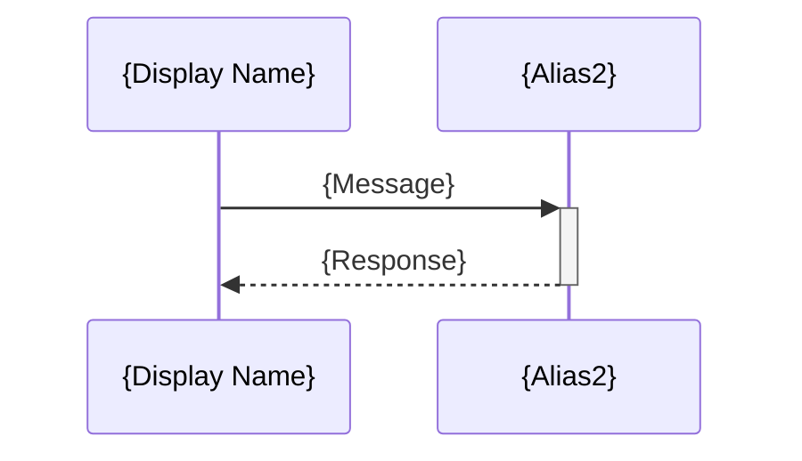
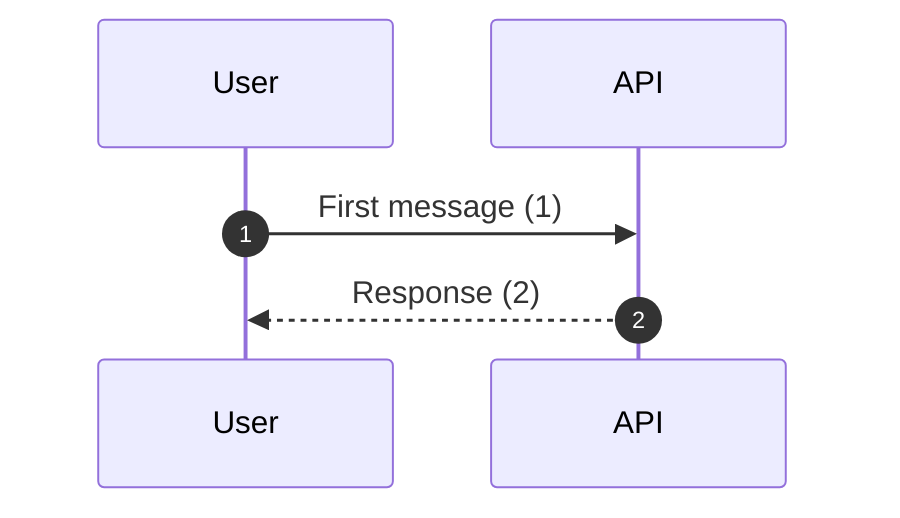

# Mermaid Syntax Guide

Complete reference for Mermaid diagram syntax supported by pact-diagram-generator skill.

## Overview

Mermaid is a JavaScript-based diagramming tool that renders text definitions into diagrams. It uses a markdown-like syntax and is natively supported by GitHub, GitLab, and many documentation platforms.

**Official Documentation**: https://mermaid.js.org/

**Supported Diagram Types** (in this skill):
- C4 Context and Container diagrams
- Sequence diagrams
- Entity-Relationship diagrams

## C4 Diagrams

### C4 Context Diagram Syntax

**Purpose**: System boundary and external dependencies

**Basic Structure**:
```mermaid
C4Context
  title {Diagram Title}

  Person({alias}, "{Name}", "{Description}")
  Person_Ext({alias}, "{Name}", "{Description}")
  System({alias}, "{Name}", "{Description}")
  System_Ext({alias}, "{Name}", "{Description}")
  SystemDb({alias}, "{Name}", "{Description}")
  SystemDb_Ext({alias}, "{Name}", "{Description}")

  Rel({from}, {to}, "{Label}")
  Rel({from}, {to}, "{Label}", "{Technology}")
  BiRel({from}, {to}, "{Label}")
```

**Element Types**:
| Element | Usage | Example |
|---------|-------|---------|
| `Person()` | Internal user/actor | `Person(user, "Customer", "Shops online")` |
| `Person_Ext()` | External user | `Person_Ext(admin, "Admin", "Manages system")` |
| `System()` | Your system | `System(app, "E-Commerce App", "Shopping platform")` |
| `System_Ext()` | External system | `System_Ext(stripe, "Stripe", "Payment gateway")` |
| `SystemDb()` | Your database | `SystemDb(db, "Database", "Stores data")` |
| `SystemDb_Ext()` | External database | `SystemDb_Ext(legacy, "Legacy DB", "Legacy data")` |

**Relationships**:
| Relationship | Usage | Example |
|--------------|-------|---------|
| `Rel(a, b, "label")` | Directed relationship | `Rel(user, system, "Uses")` |
| `BiRel(a, b, "label")` | Bidirectional | `BiRel(systemA, systemB, "Syncs with")` |
| `Rel_Back(a, b, "label")` | Reverse direction | `Rel_Back(system, user, "Notifies")` |

**Extended Syntax**:
```mermaid
Rel({from}, {to}, "{Label}", "{Technology/Protocol}")
```
Example: `Rel(app, api, "Makes API calls", "HTTPS/REST")`

### C4 Container Diagram Syntax

**Purpose**: Internal containers and technology stack

**Basic Structure**:
```mermaid
C4Container
  title {Diagram Title}

  Person({alias}, "{Name}", "{Description}")

  System_Boundary({boundary_alias}, "{System Name}") {
    Container({alias}, "{Name}", "{Technology}", "{Description}")
    ContainerDb({alias}, "{Name}", "{Database Technology}", "{Description}")
    ContainerQueue({alias}, "{Name}", "{Queue Technology}", "{Description}")
  }

  System_Ext({alias}, "{Name}", "{Description}")

  Rel({from}, {to}, "{Label}", "{Protocol}")
```

**Container Types**:
| Element | Usage | Example |
|---------|-------|---------|
| `Container()` | Application/service | `Container(api, "API", "Node.js", "Business logic")` |
| `ContainerDb()` | Database | `ContainerDb(db, "Database", "PostgreSQL", "Data store")` |
| `ContainerQueue()` | Message queue | `ContainerQueue(queue, "Queue", "RabbitMQ", "Event bus")` |

**System Boundary**:
```mermaid
System_Boundary({alias}, "{System Name}") {
  # All internal containers here
}
```

## Sequence Diagrams

### Basic Syntax



### Participants

**Declaration Methods**:
```mermaid
# Explicit declaration with alias
participant User as End User
participant API as API Gateway

# Implicit declaration (first use)
User->>API: Request
```

**Participant Types** (visual styling):
```mermaid
participant User
actor Admin
participant API
```

### Arrows and Messages

**Arrow Types**:
| Arrow | Syntax | Meaning | Example |
|-------|--------|---------|---------|
| Solid | `->>` | Synchronous request | `User->>API: Login` |
| Dashed | `-->>` | Response | `API-->>User: Token` |
| Solid with arrow | `->` | Async message | `User->Queue: Event` |
| Dashed with arrow | `-->` | Async response | `Queue-->User: Ack` |
| Cross | `-x` | Lost message | `User-xAPI: Timeout` |
| Open arrow | `-)` | Async | `API-)User: Notify` |

**Activation Boxes**:
```mermaid
# Activate participant (shows vertical bar)
User->>+API: Request

# Deactivate participant
API-->>-User: Response

# Manual activation/deactivation
activate API
API->>DB: Query
deactivate API
```

### Control Flow

**Alternative Paths (if/else)**:
```mermaid
alt {Condition}
  User->>API: Action A
else {Else Condition}
  User->>API: Action B
end
```

**Optional Flow**:
```mermaid
opt {Condition}
  API->>Cache: Check cache
end
```

**Loops**:
```mermaid
loop {Description}
  API->>DB: Query
end
```

**Parallel Execution**:
```mermaid
par {Description}
  API->>ServiceA: Request A
and {Description}
  API->>ServiceB: Request B
end
```

**Break/Early Exit**:
```mermaid
break {Condition}
  API-->>User: Error response
end
```

### Notes and Comments

**Notes**:
```mermaid
Note right of User: This is a note
Note left of API: Another note
Note over User,API: Note spanning participants
```

**Background Colors**:
```mermaid
rect rgb(200, 220, 240)
  Note over User,API: Important section
  User->>API: Critical operation
end
```

### Autonumber



## Entity-Relationship Diagrams

### Basic Syntax

```mermaid
erDiagram
  {ENTITY_A} {cardinality_left}--{cardinality_right} {ENTITY_B} : "{relationship label}"

  {ENTITY_A} {
    {type} {attribute} {key_designation} "{comment}"
  }
```

### Entities

**Entity Definition**:
```mermaid
User {
  int id PK
  string email
  datetime created_at
}
```

**Naming Conventions**:
- Use PascalCase for entity names
- Use singular form (User, not Users)
- Use snake_case for attributes

### Relationships and Cardinality

**Cardinality Notation**:
```
{ENTITY_A} {LEFT}{LINK}{RIGHT} {ENTITY_B} : "label"
```

**Cardinality Symbols**:
| Symbol | Meaning |
|--------|---------|
| `\|o` | Zero or one |
| `\|\|` | Exactly one |
| `}o` | Zero or more |
| `}\|` | One or more |

**Link Types**:
| Symbol | Meaning |
|--------|---------|
| `--` | Non-identifying |
| `==` | Identifying |

**Common Patterns**:
| Pattern | Syntax | Meaning |
|---------|--------|---------|
| One-to-one | `\|\|--\|\|` | Exactly one to exactly one |
| One-to-many | `\|\|--o{` | One to zero or more |
| Many-to-many | `}o--o{` | Zero or more to zero or more |
| Required one-to-many | `\|\|--\|{` | One to one or more |

**Examples**:
```mermaid
User ||--o{ Post : "creates"
# User creates zero or more Posts

Post ||--|{ Comment : "has"
# Post has one or more Comments

Student }o--o{ Course : "enrolls in"
# Many-to-many relationship
```

### Attributes

**Attribute Syntax**:
```mermaid
{type} {name} {key} "{comment}"
```

**Data Types** (generic):
- `int`, `string`, `text`, `boolean`
- `datetime`, `date`, `time`, `timestamp`
- `decimal`, `float`, `double`
- `uuid`, `json`, `blob`

**Key Designations**:
- `PK`: Primary key
- `FK`: Foreign key
- Can combine: `PK,FK` for composite keys

**Examples**:
```mermaid
User {
  int id PK "Auto-increment primary key"
  string email "Unique, not null"
  string password_hash
  datetime created_at "Default: NOW()"
}

Post {
  int id PK
  int user_id FK "References User.id"
  string title
  text content
}
```

### Complete ER Diagram Example

```mermaid
erDiagram
  Customer ||--o{ Order : "places"
  Order ||--|{ OrderLine : "contains"
  Product ||--o{ OrderLine : "appears in"
  Category ||--o{ Product : "categorizes"

  Customer {
    int id PK
    string name
    string email "UNIQUE"
    datetime registered_at
  }

  Category {
    int id PK
    string name
    int parent_id FK "Self-reference"
  }

  Product {
    int id PK
    int category_id FK
    string name
    decimal price
    int stock
  }

  Order {
    int id PK
    int customer_id FK
    datetime order_date
    string status
  }

  OrderLine {
    int id PK
    int order_id FK
    int product_id FK
    int quantity
    decimal unit_price
  }
```

## Advanced Features

### Styling (Limited Support)

**C4 Diagram Styling**:
```mermaid
%%{init: {'theme':'base', 'themeVariables': { 'primaryColor':'#ff0000'}}}%%
C4Context
  title Styled Diagram
```

**Sequence Diagram Themes**:
```mermaid
%%{init: {'theme':'forest'}}%%
sequenceDiagram
  User->>API: Request
```

**Available Themes**: `default`, `neutral`, `dark`, `forest`, `base`

### Comments

```mermaid
sequenceDiagram
  %% This is a comment
  User->>API: Request
```

### Direction (Some Diagram Types)

```mermaid
graph LR  %% Left-to-right
graph TB  %% Top-to-bottom
```

## Platform-Specific Notes

### GitHub Markdown

**Code Fence Syntax**:
````markdown
```mermaid
{diagram content}
```
````

**Supported Diagram Types** (GitHub):
- C4 diagrams (C4Context, C4Container)
- Sequence diagrams (sequenceDiagram)
- ER diagrams (erDiagram)
- Flowcharts (graph, flowchart)
- State diagrams (stateDiagram-v2)
- And more...

**Limitations**:
- Some advanced styling may not render
- Mermaid version may lag behind latest
- Complex diagrams may have rendering issues

### GitLab Markdown

**Similar to GitHub**:
- Native Mermaid support
- Use triple backticks with `mermaid` language identifier
- Most diagram types supported

### VSCode

**Mermaid Preview Extensions**:
- "Markdown Preview Mermaid Support"
- "Mermaid Editor"

**Live Editing**:
- Install extension
- Open markdown file
- Use preview pane to see rendered diagrams

### Mermaid Live Editor

**URL**: https://mermaid.live

**Features**:
- Real-time preview
- Syntax validation
- Export to PNG, SVG
- Share diagrams via URL
- Use for testing before embedding in docs

## Common Syntax Errors

**Error 1: Unclosed code block**
```markdown
```mermaid
sequenceDiagram
  User->>API: Request
# Missing closing ```
```
Fix: Always close code blocks

**Error 2: Undefined participant**
```mermaid
User->>API: Request  # ERROR if not declared
```
Fix: Declare participants first

**Error 3: Invalid cardinality syntax**
```mermaid
User ---> Post : "creates"  # Wrong arrow
```
Fix: Use valid ER cardinality notation

**Error 4: Missing relationship end**
```mermaid
Rel(user, , "Uses")  # Missing 'to' parameter
```
Fix: Specify both endpoints

**Error 5: Special characters in aliases**
```mermaid
participant User-Admin  # Hyphen may cause issues
```
Fix: Use alphanumeric aliases (underscores OK)

## Best Practices

**1. Use Meaningful Aliases**:
```mermaid
# Good
participant API as API Gateway
participant Auth as Auth Service

# Avoid
participant A
participant B
```

**2. Keep Diagrams Focused**:
- Limit to 10-15 elements per diagram
- Split complex systems into multiple diagrams
- Use appropriate abstraction level

**3. Consistent Naming**:
- PascalCase for entities: `User`, `OrderItem`
- camelCase for aliases: `apiGateway`, `userService`
- snake_case for attributes: `user_id`, `created_at`

**4. Add Descriptions**:
- Use comments for complex logic
- Add notes for important details
- Include protocol/technology in relationships

**5. Validate Before Committing**:
- Test in Mermaid Live Editor
- Verify rendering in target platform
- Check all references are defined

## Version Compatibility

**Mermaid Version Notes**:
- This guide covers Mermaid v10.x syntax
- Older versions may have limited features
- GitHub/GitLab may use slightly older versions
- Check platform documentation for version

**C4 Diagram Support**:
- Added in Mermaid v9.0.0
- May not be available in older platforms

**ER Diagram Support**:
- Added in Mermaid v8.6.0
- Widely supported across platforms

## External Resources

- **Official Mermaid Docs**: https://mermaid.js.org/
- **Mermaid Live Editor**: https://mermaid.live
- **GitHub Mermaid Support**: https://github.blog/2022-02-14-include-diagrams-markdown-files-mermaid/
- **C4 Model**: https://c4model.com/
- **Awesome Mermaid**: https://github.com/mermaid-js/awesome-mermaid

## Related Skill References

- Template examples: See `templates/` directory
- Validation guidance: See `validation-guide.md`
- Troubleshooting: See `troubleshooting.md`
