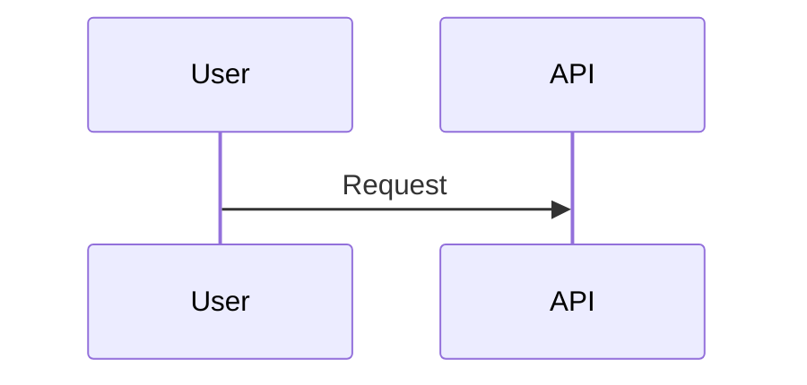

# Mermaid Diagram Troubleshooting

Common errors, issues, and solutions when generating Mermaid diagrams.

## Overview

This guide provides solutions to common problems encountered when:
- Generating diagrams from templates
- Validating Mermaid syntax
- Rendering diagrams in different platforms
- Debugging visual or semantic issues

**Quick Diagnosis**:
1. **Syntax errors**: Diagram won't render → Check syntax section
2. **Rendering issues**: Renders incorrectly → Check platform section
3. **Visual problems**: Renders but looks bad → Check visual section
4. **Semantic errors**: Renders but wrong content → Check semantic section

## Syntax Errors

### Error: "Parse error on line X"

**Symptom**: Mermaid parser fails, no diagram rendered

**Common Causes**:

**1. Unclosed blocks**
```mermaid
# WRONG
alt Success
  API-->>User: 200 OK
# Missing 'end'

# CORRECT
alt Success
  API-->>User: 200 OK
end
```

**2. Mismatched braces**
```mermaid
# WRONG
System_Boundary(c1, "System") {
  Container(api, "API", "Node.js", "...")
# Missing closing }

# CORRECT
System_Boundary(c1, "System") {
  Container(api, "API", "Node.js", "...")
}
```

**3. Invalid characters in identifiers**
```mermaid
# WRONG
participant User-Admin  # Hyphen not allowed

# CORRECT
participant UserAdmin
participant User_Admin  # Underscore OK
```

**4. Missing quotes around strings with spaces**
```mermaid
# WRONG
Person(user, Customer Name, Shops online)

# CORRECT
Person(user, "Customer Name", "Shops online")
```

**Fix Strategy**:
1. Copy diagram to Mermaid Live Editor
2. Note the line number in error message
3. Check for unclosed blocks, missing braces, invalid characters
4. Fix and validate again

### Error: "Participant X not defined"

**Symptom**: Reference to undefined participant in sequence diagram

**Example**:


**Fix**:


**Prevention**:
- Always declare participants at top of diagram
- Or use explicit `participant` statements before first use

### Error: "Expected end of line, got X"

**Symptom**: Extra characters or wrong syntax

**Common Causes**:

**1. Wrong arrow syntax**
```mermaid
# WRONG
User -> API: Request  # Missing second >

# CORRECT
User->>API: Request
```

**2. Extra parameters**
```mermaid
# WRONG
Rel(user, system, "Uses", "HTTPS", "extra")  # Too many params

# CORRECT
Rel(user, system, "Uses", "HTTPS")
```

**3. Missing commas**
```mermaid
# WRONG
Person(user "Customer" "...")  # Missing commas

# CORRECT
Person(user, "Customer", "...")
```

**Fix**:
- Check syntax against template examples
- Count parameters (should match template)
- Verify arrow syntax

### Error: "Invalid cardinality"

**Symptom**: ER diagram relationship won't parse

**Common Mistakes**:

**Wrong arrow types**:
```mermaid
# WRONG - These don't work in ER diagrams
User --> Post
User => Post
User -> Post

# CORRECT - Use ER cardinality notation
User ||--o{ Post : "creates"
```

**Invalid cardinality symbols**:
```mermaid
# WRONG
User ||**|| Post  # Invalid symbols

# CORRECT
User ||--|| Post
User ||--o{ Post
User }o--o{ Post
```

**Fix**:
- Use only valid ER cardinality patterns
- Reference cardinality table in syntax guide
- Test in Mermaid Live Editor

## Rendering Issues

### Diagram Not Rendering on GitHub

**Symptom**: Blank space where diagram should be, or error message

**Causes and Fixes**:

**1. Wrong code fence syntax**
```markdown
# WRONG
```mmd
...
```

# WRONG
```diagram
...
```

# CORRECT
```mermaid
...
```
```

**2. GitHub Mermaid version incompatibility**
- GitHub may use older Mermaid version
- Advanced features may not work
- **Fix**: Simplify diagram, avoid bleeding-edge syntax

**3. Diagram too complex**
- Very large diagrams may timeout
- **Fix**: Split into multiple smaller diagrams

**4. Invalid diagram type**
- Some diagram types may not be supported
- **Fix**: Check GitHub supported types, use fallback

**Test Strategy**:
1. Create minimal test diagram
2. If minimal works, gradually add elements
3. Identify what causes failure
4. Simplify or split diagram

### Diagram Renders Differently on Different Platforms

**Symptom**: Looks correct in Live Editor, wrong on GitHub/GitLab

**Common Differences**:

**Styling**:
- Some platforms strip custom styles
- Colors may differ
- **Fix**: Don't rely on custom styling

**Layout**:
- Element positioning may vary
- **Fix**: Don't rely on precise positioning

**Font sizes**:
- Text may be larger/smaller on different platforms
- **Fix**: Keep labels concise, test on target platform

**Fix Strategy**:
- Design for lowest common denominator
- Test on actual deployment platform
- Avoid platform-specific features

### Diagram Overlaps or Layout Issues

**Symptom**: Elements overlap, lines cross confusingly

**Causes**:

**Too many elements**:
```mermaid
# Problem: 20+ elements in one diagram
C4Context
  Person(user1, "User 1", "...")
  Person(user2, "User 2", "...")
  # ... 18 more elements
  # Diagram becomes cluttered
```

**Fix**: Split into multiple diagrams
```mermaid
# Diagram 1: User interactions
C4Context
  title User Interactions
  Person(user, "User", "...")
  System(app, "App", "...")
  ...

# Diagram 2: System integrations
C4Context
  title System Integrations
  System(app, "App", "...")
  System_Ext(stripe, "Stripe", "...")
  ...
```

**Long labels**:
```mermaid
# Problem: Very long description
Person(user, "Customer", "A retail customer who browses the extensive product catalog and makes purchases through the checkout flow")
```

**Fix**: Shorten labels, add details in prose
```mermaid
Person(user, "Customer", "Browses and purchases products")
```
Add details: "Customers interact with the platform to browse our extensive product catalog and complete purchases through the streamlined checkout flow."

**Complex relationships**:
- Too many crossing lines
- **Fix**: Reorganize element order, group related elements

## Visual Quality Issues

### Labels Too Small or Hard to Read

**Symptom**: Text is tiny, hard to read on screen

**Causes**:
- Very long labels compressed to fit
- Platform rendering at small size

**Fixes**:

**Shorten labels**:
```mermaid
# Instead of
Container(api, "User Authentication and Authorization Microservice API Gateway", "Node.js Express TypeScript", "...")

# Use
Container(api, "Auth API Gateway", "Node.js, Express, TypeScript", "Handles authentication")
```

**Break into multiple diagrams**:
- Fewer elements = more space per element
- Labels can be larger

**Use abbreviations with legend**:
```mermaid
Container(uaag, "UAAG", "Node.js", "User Auth API Gateway")
```
Add legend in prose: "UAAG = User Authentication API Gateway"

### Diagram Too Wide or Too Tall

**Symptom**: Diagram doesn't fit on screen, requires scrolling

**Fixes**:

**Split horizontally** (for wide diagrams):
- Create multiple diagrams focusing on different subsystems
- Link diagrams with prose: "See Container Diagram - Services" and "Container Diagram - Data Layer"

**Split by layers** (for tall diagrams):
- Diagram 1: External context
- Diagram 2: Application layer
- Diagram 3: Data layer

**Reduce elements**:
- Increase abstraction level
- Group related elements
- Use notes instead of separate elements

### Relationship Lines Cross Confusingly

**Symptom**: Hard to follow relationship arrows

**Fixes**:

**Reorder elements**:
```mermaid
# Group related elements together
System_Boundary(c1, "App") {
  Container(web, "Web", "React", "...")
  Container(api, "API", "Node.js", "...")  # Adjacent to web
  ContainerDb(db, "DB", "PostgreSQL", "...")  # Adjacent to api
}
```

**Use intermediate nodes**:
```mermaid
# Instead of direct relationships from many sources to one target
# Create intermediate "layer" concept
```

**Simplify diagram scope**:
- Focus on specific interaction
- Remove tangential relationships

## Semantic Issues

### Diagram Doesn't Match Specification

**Symptom**: Diagram renders fine but represents wrong architecture

**Common Mistakes**:

**Missing elements**:
- Spec mentions "Redis cache", not in diagram
- **Fix**: Add all elements from spec

**Wrong cardinality**:
- Spec says one-to-many, diagram shows one-to-one
- **Fix**: Correct relationship cardinality

**Wrong technology**:
- Diagram says MySQL, spec says PostgreSQL
- **Fix**: Update technology to match decisions

**Wrong sequence**:
- API flow steps out of order
- **Fix**: Reorder to match spec

**Prevention**:
- Checklist validation against spec
- Side-by-side comparison
- Peer review

### Inconsistent Naming Across Diagrams

**Symptom**: Same entity called different names in different diagrams

**Example**:
- C4 Context: "Payment Service"
- C4 Container: "PaymentAPI"
- Sequence: "Payment Gateway"

**Fix**: Establish naming conventions
```markdown
## Naming Standards

**Display Names**:
- C4 Diagrams: "Payment Service"
- Sequence Diagrams: "Payment Service"

**Aliases**:
- All diagrams: `paymentService`

**Consistency Check**:
- Always use same display name
- Always use same alias
- Document naming in architecture spec
```

### Missing Error Handling in Sequence Diagrams

**Symptom**: Only happy path shown, no error scenarios

**Fix**: Add alternative flows
```mermaid
sequenceDiagram
  User->>+API: Login request

  alt Valid Credentials
    API->>+DB: Verify credentials
    DB-->>-API: User found
    API-->>-User: 200 OK (token)

  else Invalid Credentials
    API-->>-User: 401 Unauthorized

  else Database Error
    API->>API: Log error
    API-->>User: 503 Service Unavailable
  end
```

**Best Practice**: Always document:
- Success path
- Primary error path (invalid input)
- System failure path (service down)

## Platform-Specific Issues

### GitHub-Specific Problems

**Issue: Diagram renders locally but not on GitHub**

**Possible Causes**:

**1. Mermaid version mismatch**
- Local editor uses latest, GitHub uses older version
- **Fix**: Test with GitHub's Mermaid version, simplify syntax

**2. GitHub rendering timeout**
- Very complex diagram
- **Fix**: Reduce complexity, split diagram

**3. Caching issue**
- GitHub serving old version
- **Fix**: Hard refresh (Cmd+Shift+R), wait a few minutes

**Issue: Diagram works in PR but not in README**
- Different rendering contexts
- **Fix**: Test in both locations, ensure consistency

### GitLab-Specific Problems

**Similar to GitHub** with minor differences:

**1. Plugin configuration**
- Some GitLab instances require Mermaid enabled
- **Fix**: Check with GitLab admin, verify Mermaid enabled

**2. Version differences**
- GitLab may use different Mermaid version than GitHub
- **Fix**: Test on actual GitLab instance

### Documentation Site Issues

**Docusaurus**:

**Issue: Mermaid diagrams not rendering**
- Missing plugin
- **Fix**: Install `@docusaurus/theme-mermaid`

**Configuration**:
```javascript
// docusaurus.config.js
module.exports = {
  themes: ['@docusaurus/theme-mermaid'],
  markdown: {
    mermaid: true,
  },
};
```

**MkDocs**:

**Issue: Mermaid not working**
- Missing extension
- **Fix**: Add `pymdownx.superfences` with Mermaid

**Configuration**:
```yaml
# mkdocs.yml
markdown_extensions:
  - pymdownx.superfences:
      custom_fences:
        - name: mermaid
          class: mermaid
          format: !!python/name:pymdownx.superfences.fence_code_format
```

## Debugging Strategies

### Minimal Reproduction

**Strategy**: Reduce diagram to smallest failing example

**Steps**:
1. Copy full diagram
2. Remove half the elements
3. Test if error persists
4. If persists, remove half of remaining elements
5. Repeat until minimal failing case found
6. Debug specific issue

**Example**:
```mermaid
# Start with full diagram (20 elements)
# Error persists with 10 elements
# Error persists with 5 elements
# Error gone with 2 elements
# Error returns when 3rd element added
# Debug that 3rd element specifically
```

### Incremental Building

**Strategy**: Build diagram piece by piece

**Steps**:
1. Start with diagram type declaration only
2. Validate (should render empty diagram)
3. Add one element
4. Validate
5. Add next element
6. Validate
7. Continue until error appears
8. Debug last added element

**Example**:
```mermaid
# Step 1: Basic structure
sequenceDiagram
# Validates successfully

# Step 2: Add participants
sequenceDiagram
  participant User
  participant API
# Validates successfully

# Step 3: Add first interaction
sequenceDiagram
  participant User
  participant API
  User->>API: Request
# Validates successfully

# Step 4: Add response
sequenceDiagram
  participant User
  participant API
  User->>API: Request
  API-->>User: Response
# Error appears - debug this step
```

### Comparison Testing

**Strategy**: Compare working vs broken diagrams

**Steps**:
1. Find similar working diagram (from template or docs)
2. Compare syntax line by line
3. Identify differences
4. Test if adopting working syntax fixes issue

**Example**:
```mermaid
# Working example (from template)
User ||--o{ Post : "creates"

# Your broken diagram
User ||-->{ Post : "creates"  # Extra dash

# Fix: Remove extra dash
User ||--o{ Post : "creates"
```

### Browser DevTools Inspection

**Strategy**: Inspect rendered diagram in browser

**Steps**:
1. Open diagram page in browser
2. Open DevTools (F12)
3. Find `<svg>` element with diagram
4. Inspect rendering errors in console
5. Check network tab for resource loading failures

**Useful for**:
- CSS conflicts
- JavaScript errors
- Resource loading issues
- Rendering performance problems

## Common Error Messages and Fixes

| Error Message | Cause | Fix |
|---------------|-------|-----|
| "Parse error on line X" | Syntax error at specific line | Check line X for unclosed blocks, missing commas, invalid characters |
| "Participant 'X' not defined" | Reference to undeclared participant | Add `participant X` declaration |
| "Expected end of line, got 'X'" | Extra characters or wrong syntax | Remove extra characters, check syntax |
| "Invalid cardinality" | Wrong ER relationship syntax | Use valid cardinality: `\|\|--o{`, `}o--o{`, etc. |
| "Diagram not supported" | Platform doesn't support diagram type | Use supported type or fallback to ASCII |
| "Timeout rendering diagram" | Diagram too complex | Simplify or split diagram |
| "Unexpected end of file" | Unclosed block | Add missing `end` statements |

## Fallback Strategies

### When Mermaid Won't Work

**Option 1: Use ASCII Art** (from pact-architecture-patterns skill)
```
┌─────────┐         ┌─────────┐
│  User   │────────▶│  System │
└─────────┘         └─────────┘
```

**Advantages**:
- Always works
- No syntax errors
- Platform independent

**Disadvantages**:
- Less polished
- Manual layout
- Harder to maintain

**Option 2: External Diagram Tool**
- PlantUML (requires server)
- Draw.io (export as SVG, embed image)
- Lucidchart (export and embed)

**Option 3: Simplify Diagram**
- Reduce elements
- Use text description instead
- Link to external diagram file

## Prevention Best Practices

**1. Use Templates**
- Start with validated template
- Fill placeholders systematically
- Don't deviate from template structure without testing

**2. Validate Early**
- Test syntax after every few lines
- Don't wait until diagram complete
- Catch errors while context fresh

**3. Keep Diagrams Simple**
- 5-15 elements ideal
- Split complex systems into multiple diagrams
- One diagram, one concept

**4. Test in Target Environment**
- Don't assume local = production
- Always test where diagram will be deployed
- Test on multiple devices if public

**5. Use Validation Checklist**
- Follow validation guide checklist
- Document custom validation criteria
- Peer review before finalizing

## Getting Help

**When You're Stuck**:

**1. Mermaid Live Editor**
- Paste diagram into https://mermaid.live
- Check for immediate syntax errors
- Simplify until it works

**2. Mermaid Documentation**
- https://mermaid.js.org/
- Check syntax reference for diagram type
- Review examples

**3. Compare to Templates**
- Review template for your diagram type
- Compare syntax line-by-line
- Follow template structure exactly

**4. GitHub Issues**
- Search Mermaid GitHub issues
- Report bug if reproducible
- Check known issues list

**5. Fallback to ASCII**
- If all else fails, use ASCII diagram
- Document Mermaid issue for future
- Prioritize working over perfect

## Related References

- Syntax reference: See `mermaid-syntax-guide.md`
- Validation guidance: See `validation-guide.md`
- Template examples: See `templates/` directory
- ASCII fallback: See `pact-architecture-patterns` skill
