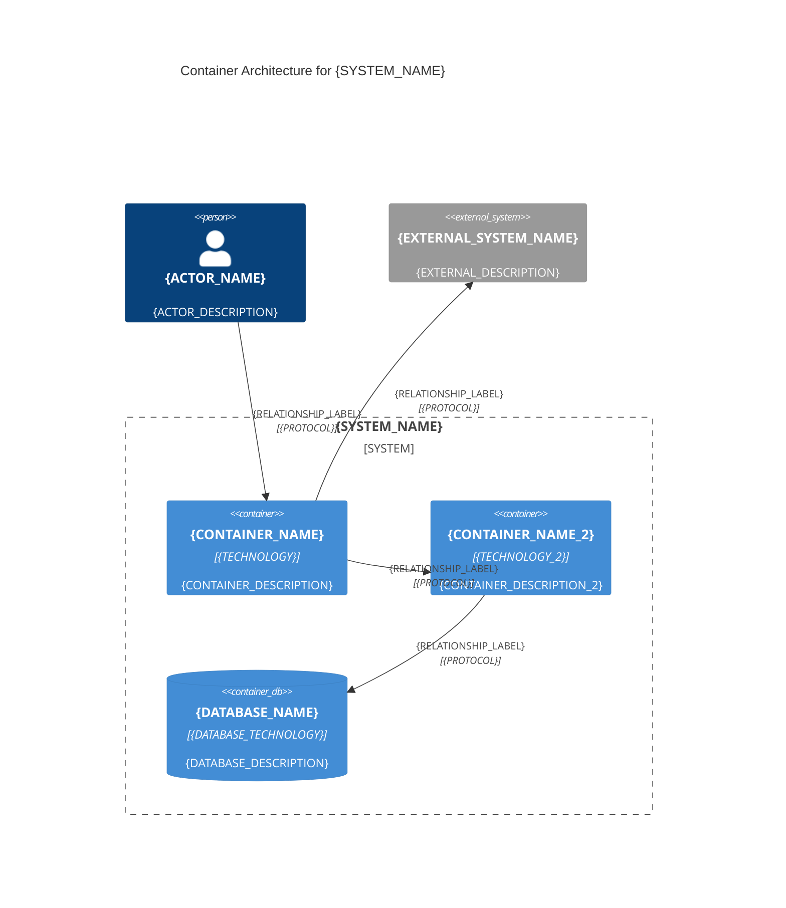
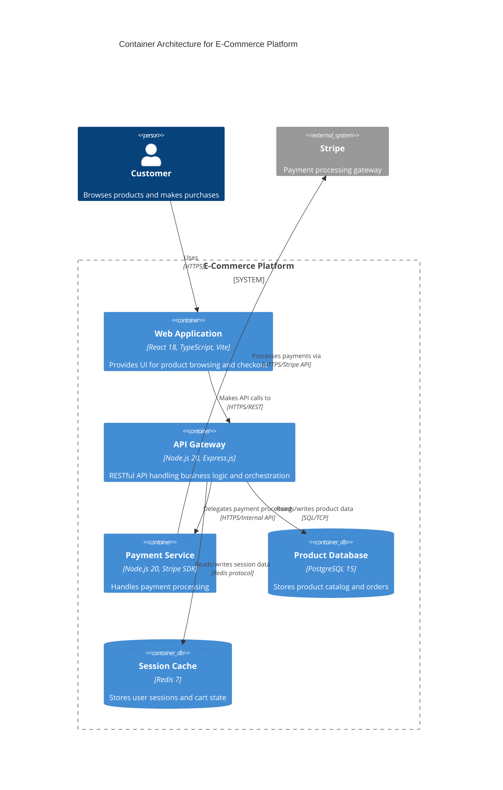
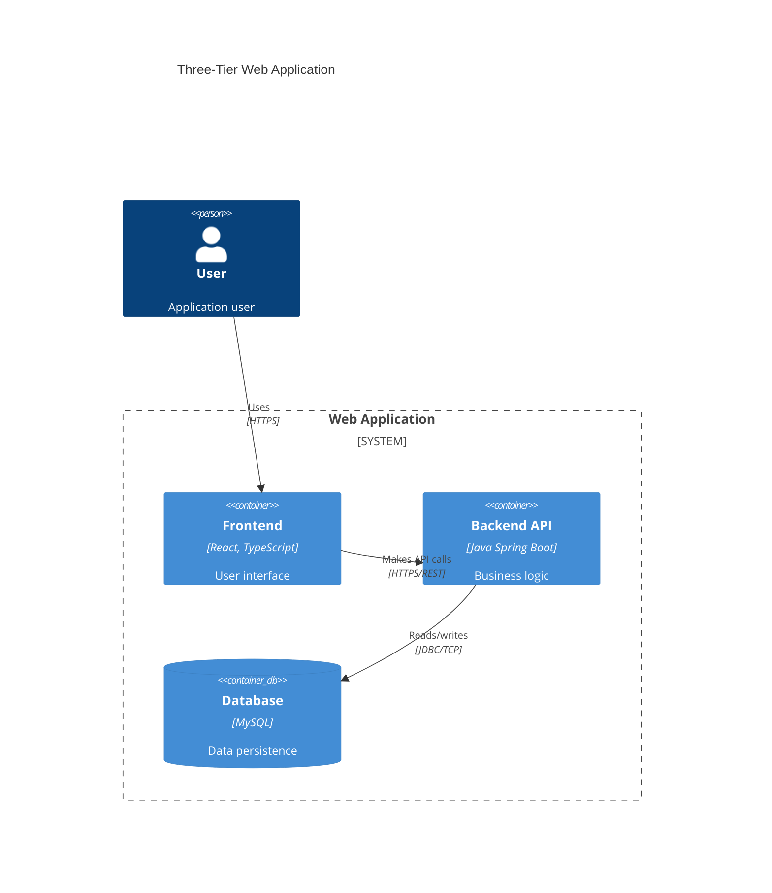
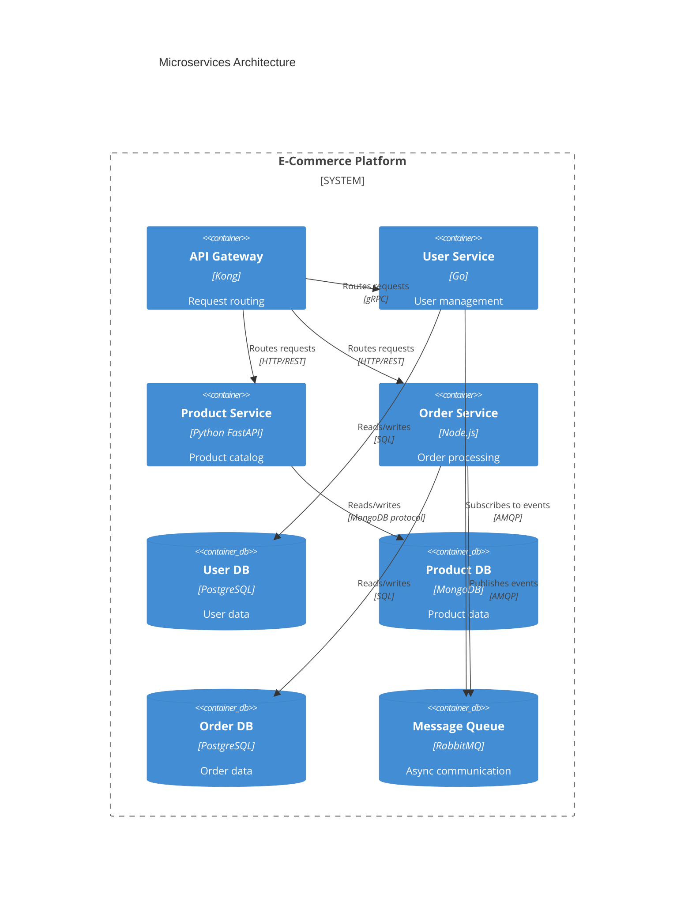

# C4 Container Diagram Template

## Purpose

The C4 Container diagram shows the deployable units that make up your system and how they interact. It visualizes:
- Containers: Applications, services, databases, file systems (runtime execution units)
- Technology stack used by each container
- Communication between containers
- External systems the containers integrate with

**Use this template when**: Documenting the high-level technology choices, deployment architecture, and runtime relationships within your system.

**Note**: "Container" in C4 means a deployable/runnable unit (web app, API, database), NOT Docker containers specifically.

## Input Requirements

**Required Data** (extract from architectural specification):

- **System**: Name of the system (same as C4 Context)
- **Containers**: Deployable application units
  - Name, technology/platform, description, type (app vs database)
- **Technology Stack**: Specific technologies for each container
  - Web framework, API framework, database type, programming language
- **Container Relationships**: How containers communicate
  - From container, to container, protocol/mechanism, purpose
- **External Systems**: Same as C4 Context (for reference)

**Source Locations** (typical):
- Containers: Architecture spec deployment section, component breakdown
- Technology stack: Technology decisions document, architecture spec
- Relationships: Component interaction diagrams, API specifications
- Protocols: Integration design, API contracts

## Mermaid Template



## Placeholders Guide

| Placeholder | Example Value | Description | Source |
|-------------|---------------|-------------|--------|
| `{SYSTEM_NAME}` | "E-Commerce Platform" | System name (from C4 Context) | Architecture spec title |
| `{ACTOR_ALIAS}` | `customer` | Actor identifier (from C4 Context) | Context diagram |
| `{CONTAINER_ALIAS}` | `webApp` | Short identifier for container | Derived from container name |
| `{CONTAINER_NAME}` | "Web Application" | Display name for container | Architecture spec |
| `{TECHNOLOGY}` | "React, TypeScript" | Technology stack for container | Technology decisions doc |
| `{CONTAINER_DESCRIPTION}` | "Provides user interface for browsing products" | What the container does | Component descriptions |
| `{DATABASE_ALIAS}` | `mainDb` | Database identifier | Derived from database name |
| `{DATABASE_NAME}` | "Product Database" | Database display name | Data architecture spec |
| `{DATABASE_TECHNOLOGY}` | "PostgreSQL" | Database type | Technology decisions |
| `{DATABASE_DESCRIPTION}` | "Stores product catalog and inventory" | Database purpose | Schema documentation |
| `{PROTOCOL}` | "HTTPS/REST", "SQL/TCP", "GraphQL" | Communication protocol | API specifications |

**Container Types**:
- `Container()`: Standard deployable unit (web app, API, worker, CLI)
- `ContainerDb()`: Data store (database, cache, message queue)
- `ContainerQueue()`: Message queue (optional, use ContainerDb if not available)

**Technology Format**:
- Be specific: "React 18, TypeScript" not just "JavaScript"
- Include version if significant: "PostgreSQL 15", "Node.js 20"
- List key technologies: "Express.js, Node.js, JWT"

## Example Transformation

### Input (from architecture specification)

```markdown
## System: E-Commerce Platform

### Container Architecture

**Containers**:

1. **Web Application**
   - Technology: React 18, TypeScript, Vite
   - Description: Single-page application providing user interface for browsing products, managing cart, and checkout
   - Deployment: Static hosting (S3 + CloudFront)

2. **API Gateway**
   - Technology: Node.js 20, Express.js, TypeScript
   - Description: RESTful API handling business logic, authentication, and orchestration
   - Deployment: Docker containers on ECS

3. **Payment Service**
   - Technology: Node.js 20, Stripe SDK
   - Description: Microservice handling payment processing and PCI compliance
   - Deployment: Lambda functions

4. **Product Database**
   - Technology: PostgreSQL 15
   - Description: Primary data store for product catalog, inventory, and orders
   - Deployment: RDS managed instance

5. **Session Cache**
   - Technology: Redis 7
   - Description: Stores user sessions and shopping cart state
   - Deployment: ElastiCache

### Container Interactions

- Customer accesses Web Application via HTTPS
- Web Application calls API Gateway via HTTPS REST API
- API Gateway authenticates requests using JWT tokens stored in Session Cache
- API Gateway reads/writes product data to Product Database via SQL
- API Gateway delegates payment processing to Payment Service via internal HTTPS API
- Payment Service integrates with Stripe external API via HTTPS
- API Gateway stores session data in Session Cache via Redis protocol
```

### Output (Generated Mermaid)



## Validation Checklist

After generating the diagram, verify:

- [ ] **Title**: Contains descriptive system name
- [ ] **System boundary**: All internal containers wrapped in `System_Boundary()`
- [ ] **Container types**: Application containers use `Container()`, databases use `ContainerDb()`
- [ ] **Technology stack**: Each container specifies concrete technologies
- [ ] **Technology accuracy**: Technologies match architecture specification
- [ ] **All containers defined**: Every deployable unit from spec is represented
- [ ] **Relationships complete**: All container interactions documented
- [ ] **Protocols specified**: Communication protocols included in relationships
- [ ] **External systems**: External integrations shown as `System_Ext()`
- [ ] **Syntax valid**: Renders without errors in Mermaid Live Editor

## Common Mistakes

**Mistake 1: Missing System_Boundary wrapper**
```mermaid
Container(webApp, "Web App", "React", "...")
Container(api, "API", "Node.js", "...")
# WRONG: Containers not grouped
```
**Fix**: Wrap all system containers in boundary
```mermaid
System_Boundary(c1, "My System") {
  Container(webApp, "Web App", "React", "...")
  Container(api, "API", "Node.js", "...")
}
```

**Mistake 2: Using Container() for databases**
```mermaid
Container(database, "Database", "PostgreSQL", "...")  # WRONG
```
**Fix**: Use ContainerDb() for data stores
```mermaid
ContainerDb(database, "Database", "PostgreSQL", "...")  # CORRECT
```

**Mistake 3: Vague technology descriptions**
```mermaid
Container(api, "API", "Backend", "...")  # TOO VAGUE
```
**Fix**: Specify concrete technologies
```mermaid
Container(api, "API", "Node.js, Express.js, TypeScript", "...")  # SPECIFIC
```

**Mistake 4: Missing protocol in relationships**
```mermaid
Rel(webApp, api, "Calls")  # Missing protocol
```
**Fix**: Include protocol/mechanism
```mermaid
Rel(webApp, api, "Calls", "HTTPS/REST")  # CORRECT
```

**Mistake 5: External system inside boundary**
```mermaid
System_Boundary(c1, "My System") {
  Container(api, "API", "Node.js", "...")
  System_Ext(stripe, "Stripe", "...")  # WRONG: External system inside boundary
}
```
**Fix**: Place external systems outside boundary
```mermaid
System_Boundary(c1, "My System") {
  Container(api, "API", "Node.js", "...")
}
System_Ext(stripe, "Stripe", "...")  # CORRECT: Outside boundary
```

## Customization Guidance

**Three-tier architecture example**:


**Microservices architecture**:


**Caching layer**:
```mermaid
System_Boundary(c1, "Application") {
  Container(api, "API", "Node.js", "Application logic")
  ContainerDb(cache, "Cache", "Redis", "Performance optimization")
  ContainerDb(database, "Database", "PostgreSQL", "Primary data store")
}

Rel(api, cache, "Checks cache first", "Redis protocol")
Rel(api, database, "Fallback for cache miss", "SQL/TCP")
```

## Technology Stack Patterns

**Common Technology Combinations**:

| Stack | Frontend | Backend | Database | Common Use |
|-------|----------|---------|----------|------------|
| **MERN** | React | Node.js, Express | MongoDB | Full-stack JavaScript apps |
| **JAMstack** | React/Next.js | Serverless (Lambda) | DynamoDB | Static sites with dynamic features |
| **Enterprise Java** | Angular | Java Spring Boot | PostgreSQL/Oracle | Large-scale business apps |
| **Python** | Vue.js | Django/FastAPI | PostgreSQL | Data-driven applications |
| **Serverless** | React | AWS Lambda | DynamoDB | Event-driven, auto-scaling |

## Next Steps

After creating C4 Container diagram:
1. Validate syntax in Mermaid Live Editor
2. Verify technology choices match architecture decisions document
3. Embed in architecture documentation
4. Document detailed API flows between containers (see `sequence-diagram-mermaid.md`)
5. Document database schema (see `er-diagram-mermaid.md`)

## References

- C4 Model container diagram: https://c4model.com/#ContainerDiagram
- Mermaid C4 syntax: https://mermaid.js.org/syntax/c4.html
- Complete Mermaid syntax: See `references/mermaid-syntax-guide.md`
- Validation guidance: See `references/validation-guide.md`
