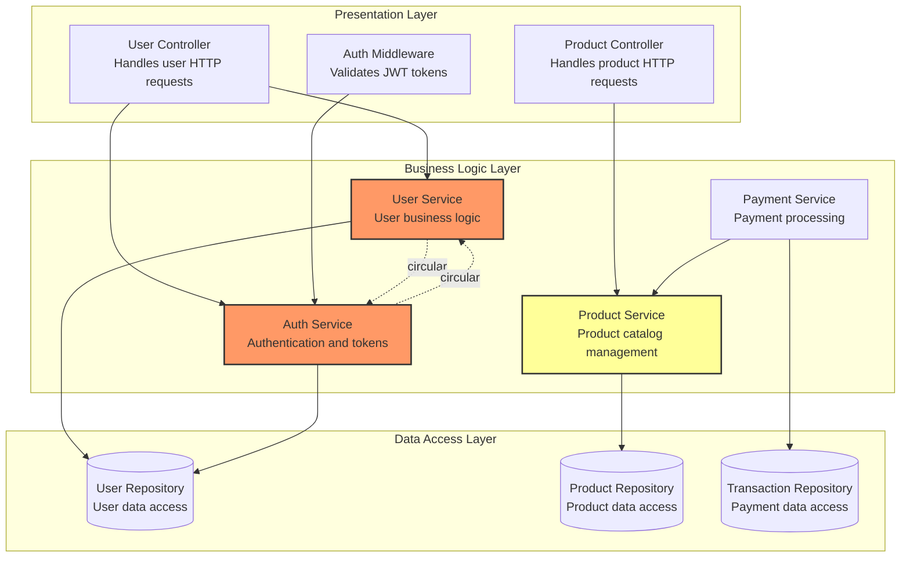
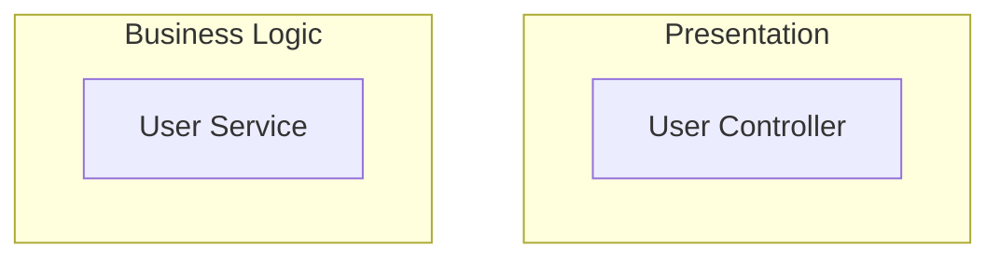
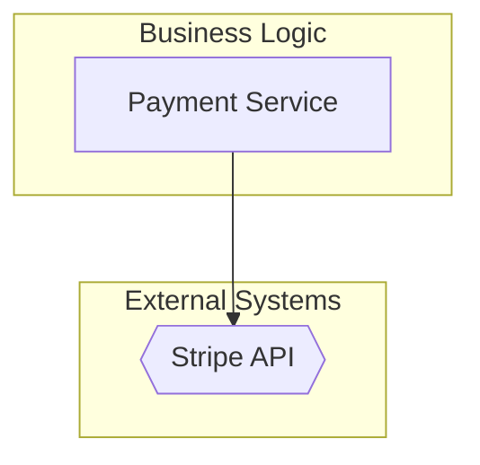
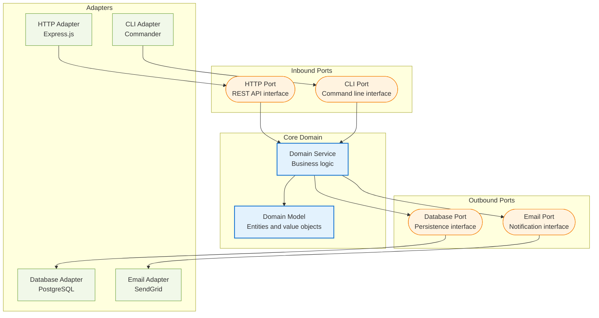
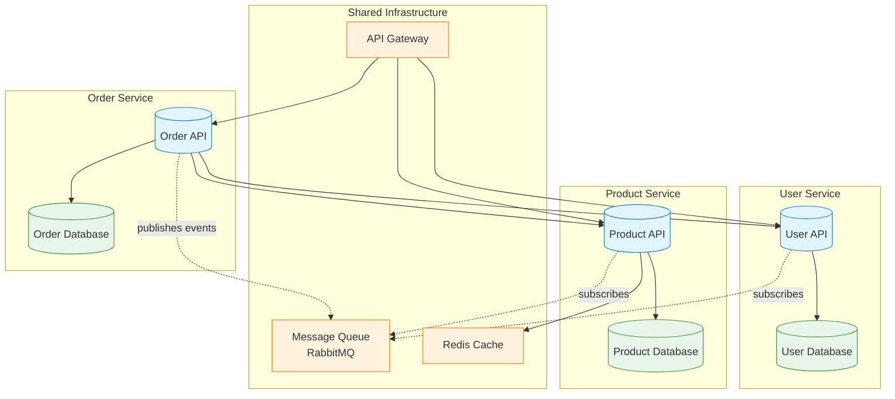

# Component Dependency Graph Template

## Purpose

Component dependency graphs visualize the internal structure of a system and dependencies between components. They show:
- Individual components or modules within the system
- Dependency relationships between components (who depends on whom)
- Layered architecture organization (presentation, business logic, data access)
- Circular dependencies and high coupling issues
- Component grouping by module, feature, or architectural layer

**Use this template when**: Documenting internal system architecture, identifying circular dependencies, planning refactoring, or visualizing component coupling and cohesion.

## Input Requirements

**Required Data** (extract from architectural specification):

- **Components**: Individual modules, classes, or services within the system
  - Component name, description, type/layer
- **Dependencies**: Which components depend on which others
  - From component (dependent), to component (dependency)
  - Optional: dependency type (imports, extends, calls, uses)
- **Layers/Modules**: Grouping of related components
  - Layer name (e.g., "Presentation", "Business Logic", "Data Access")
  - Components belonging to each layer
- **Problem Areas**: Circular dependencies or high coupling (optional)
  - Components involved in circular dependencies
  - Components with excessive dependencies (coupling issues)

**Source Locations** (typical):
- Components: C4 Component diagram, code structure documentation
- Dependencies: Import statements, dependency injection configuration
- Layers: Architecture documentation, package structure
- Problem areas: Code analysis tools, architectural review notes

## Mermaid Template

```mermaid
graph TD
  subgraph {LAYER_1_NAME}
    {COMPONENT_A}["{COMPONENT_A_NAME}<br/>{COMPONENT_A_DESCRIPTION}"]
    {COMPONENT_B}["{COMPONENT_B_NAME}<br/>{COMPONENT_B_DESCRIPTION}"]
  end

  subgraph {LAYER_2_NAME}
    {COMPONENT_C}["{COMPONENT_C_NAME}<br/>{COMPONENT_C_DESCRIPTION}"]
    {COMPONENT_D}["{COMPONENT_D_NAME}<br/>{COMPONENT_D_DESCRIPTION}"]
  end

  subgraph {LAYER_3_NAME}
    {COMPONENT_E}["{COMPONENT_E_NAME}<br/>{COMPONENT_E_DESCRIPTION}"]
  end

  {COMPONENT_A} --> {COMPONENT_C}
  {COMPONENT_B} --> {COMPONENT_C}
  {COMPONENT_C} --> {COMPONENT_E}
  {COMPONENT_D} --> {COMPONENT_E}

  %% Highlight problematic dependencies
  {COMPONENT_X} -.->|"circular"| {COMPONENT_Y}
  {COMPONENT_Y} -.->|"circular"| {COMPONENT_X}

  %% Styling
  classDef problematic fill:#f96,stroke:#333,stroke-width:2px
  class {COMPONENT_X},{COMPONENT_Y} problematic
```

## Placeholders Guide

| Placeholder | Example Value | Description | Source |
|-------------|---------------|-------------|--------|
| `{LAYER_1_NAME}` | "Presentation Layer" | Architectural layer or module name | Architecture documentation |
| `{COMPONENT_A}` | `userController` | Component identifier (camelCase, no spaces) | Code structure, component list |
| `{COMPONENT_A_NAME}` | "User Controller" | Human-readable component name | Component documentation |
| `{COMPONENT_A_DESCRIPTION}` | "Handles user HTTP requests" | Brief component responsibility | Component documentation |
| `{COMPONENT_C}` | `userService` | Dependency component identifier | Dependency analysis |
| `problematic` | CSS class name | Style class for highlighting issues | Standard naming |

**Arrow Types**:
- `-->`: Standard dependency (solid arrow)
- `-.->`: Problematic dependency (dashed arrow with label)
- `==>`: Strong dependency (thick arrow, optional)

**Graph Direction**:
- `graph TD`: Top-down (default for layered architecture)
- `graph LR`: Left-right (alternative for horizontal flow)
- `graph BT`: Bottom-up (data flow diagrams)

**Node Shapes**:
- `[Component]`: Rectangle (default for components)
- `([Component])`: Stadium (for services/APIs)
- `[(Component)]`: Cylinder (for databases/repositories)
- `{{Component}}`: Hexagon (for external dependencies)

## Example Transformation

### Input (from architecture specification)

```markdown
## Component Architecture

### Presentation Layer
- **UserController**: Handles HTTP requests for user operations (GET, POST, PUT, DELETE)
- **ProductController**: Handles HTTP requests for product catalog operations
- **AuthMiddleware**: Validates JWT tokens for protected routes

### Business Logic Layer
- **UserService**: Implements user business logic (registration, profile updates, validation)
- **ProductService**: Manages product catalog (search, filtering, inventory checks)
- **AuthService**: Handles authentication and token generation
- **PaymentService**: Processes payment transactions via external gateway

### Data Access Layer
- **UserRepository**: Database access for User entity (CRUD operations)
- **ProductRepository**: Database access for Product entity
- **TransactionRepository**: Database access for payment transactions

### Dependencies

**Presentation → Business Logic**:
- UserController → UserService
- UserController → AuthService
- ProductController → ProductService
- AuthMiddleware → AuthService

**Business Logic → Data Access**:
- UserService → UserRepository
- ProductService → ProductRepository
- PaymentService → TransactionRepository
- AuthService → UserRepository (for credential lookup)

**Business Logic → Business Logic**:
- PaymentService → ProductService (to verify product availability before charge)

### Architectural Issues

**Circular Dependency**:
- UserService ⇄ AuthService (User creation triggers auth token generation, auth validation queries user data)
  - **Impact**: High coupling, difficult to test in isolation
  - **Recommendation**: Extract shared logic to separate component

**High Coupling**:
- ProductService has 5 dependencies (ProductRepository, UserRepository, PaymentService, InventoryCache, SearchIndex)
  - **Impact**: Changes to ProductService require changes to many components
  - **Recommendation**: Consider splitting into smaller services
```

### Output (Generated Mermaid)



## Validation Checklist

After generating the diagram, verify:

- [ ] **All components defined**: Every component from spec is represented
- [ ] **Component names descriptive**: Clear, human-readable names
- [ ] **Layers/subgraphs**: Components grouped logically by layer or module
- [ ] **Dependencies accurate**: All dependency arrows match specification
- [ ] **Dependency direction**: Arrows point from dependent to dependency (A → B means "A depends on B")
- [ ] **Circular dependencies highlighted**: Problematic cycles use dashed arrows with labels
- [ ] **Styling applied**: CSS classes for problem areas (circular deps, high coupling)
- [ ] **Graph direction**: TD (top-down) for layered architecture, LR for horizontal flow
- [ ] **Node shapes**: Appropriate shapes for component types (rectangles for components, cylinders for repositories)
- [ ] **Syntax valid**: Renders without errors in Mermaid Live Editor

## Common Mistakes

**Mistake 1: Backward dependency direction**
```mermaid
userSvc --> userRepo  # CORRECT: Service depends on Repository
userRepo --> userSvc  # WRONG: Repository shouldn't depend on Service
```
**Fix**: Ensure arrows point from dependent to dependency (higher layer → lower layer)

**Mistake 2: Missing subgraph for layers**
```mermaid
graph TD
  userCtrl["User Controller"]
  userSvc["User Service"]
  # WRONG: No layer grouping
```
**Fix**: Use subgraphs to group components by layer


**Mistake 3: Inconsistent node identifiers**
```mermaid
userController["User Controller"]  # camelCase
product_service["Product Service"]  # snake_case
AuthMiddleware["Auth Middleware"]   # PascalCase
# WRONG: Inconsistent naming
```
**Fix**: Use consistent identifier convention (prefer camelCase)
```mermaid
userController["User Controller"]
productService["Product Service"]
authMiddleware["Auth Middleware"]
```

**Mistake 4: Unlabeled problematic dependencies**
```mermaid
userSvc -.-> authSvc  # WRONG: No label explaining the issue
```
**Fix**: Label problematic dependencies
```mermaid
userSvc -.->|"circular"| authSvc
```

**Mistake 5: Unclosed subgraph**
```mermaid
subgraph "Presentation Layer"
  userCtrl["User Controller"]
# ERROR: Missing 'end'
```
**Fix**: Close all subgraphs
```mermaid
subgraph "Presentation Layer"
  userCtrl["User Controller"]
end
```

**Mistake 6: Wrong dependency direction for circular dependencies**
```mermaid
%% Circular dependency A ⇄ B
A --> B
A --> B  # WRONG: Duplicate, missing reverse dependency
```
**Fix**: Show both directions with dashed arrows
```mermaid
A -.->|"circular"| B
B -.->|"circular"| A
```

## Customization Guidance

**External dependencies**:


**Optional dependencies** (runtime only):
```mermaid
userSvc -.->|"optional"| cacheService
```

**Multiple dependency types**:
```mermaid
productSvc -->|"queries"| productRepo
productSvc -->|"caches"| redisCache
productSvc -->|"indexes"| elasticSearch
```

**Highlighting by layer**:
```mermaid
classDef presentation fill:#e1f5ff,stroke:#1976d2
classDef business fill:#f3e5f5,stroke:#7b1fa2
classDef data fill:#e8f5e9,stroke:#388e3c

class userCtrl,productCtrl presentation
class userSvc,productSvc business
class userRepo,productRepo data
```

**Simplify large diagrams** (>15 components):
```mermaid
%% Option 1: Create multiple diagrams by layer
graph TD
  subgraph "Presentation Layer Details"
    %% Show only presentation layer internals
  end

%% Option 2: Abstract groups of components
graph TD
  presentationLayer["Presentation Layer<br/>(5 controllers)"]
  businessLayer["Business Logic<br/>(8 services)"]
  dataLayer["Data Access<br/>(6 repositories)"]

  presentationLayer --> businessLayer
  businessLayer --> dataLayer
```

## Advanced Patterns

### Hexagonal Architecture (Ports and Adapters)



### Microservices Dependencies



### Plugin Architecture

```mermaid
graph TD
  subgraph "Core System"
    core["Core Engine<br/>Plugin orchestration"]
    pluginRegistry["Plugin Registry<br/>Manages plugins"]
  end

  subgraph "Plugin Interface"
    pluginAPI(["Plugin API<br/>Extension points"])
  end

  subgraph "Plugins"
    authPlugin["Auth Plugin<br/>OAuth integration"]
    loggingPlugin["Logging Plugin<br/>Winston logger"]
    cachePlugin["Cache Plugin<br/>Redis caching"]
  end

  core --> pluginRegistry
  pluginRegistry --> pluginAPI

  authPlugin --> pluginAPI
  loggingPlugin --> pluginAPI
  cachePlugin --> pluginAPI

  classDef core fill:#e3f2fd,stroke:#1976d2,stroke-width:2px
  classDef plugin fill:#f3e5f5,stroke:#7b1fa2

  class core,pluginRegistry core
  class authPlugin,loggingPlugin,cachePlugin plugin
```

## Dependency Analysis Insights

**Identify Architectural Violations**:

1. **Layering violations**: Dependencies pointing upward (data layer → business logic)
2. **Circular dependencies**: Cycles in the graph (A → B → C → A)
3. **High fan-in**: Component with many incoming arrows (shared utility, god object)
4. **High fan-out**: Component with many outgoing arrows (high coupling)
5. **Orphaned components**: No incoming or outgoing dependencies (dead code?)

**Refactoring Opportunities**:

```mermaid
graph TD
  %% Before: Circular dependency
  subgraph "Before Refactoring"
    A1["Service A"] -.->|"circular"| B1["Service B"]
    B1 -.->|"circular"| A1
  end

  %% After: Extract shared logic
  subgraph "After Refactoring"
    A2["Service A"] --> Shared["Shared Logic"]
    B2["Service B"] --> Shared
  end

  classDef before fill:#f96,stroke:#333
  classDef after fill:#9f6,stroke:#333

  class A1,B1 before
  class A2,B2,Shared after
```

## Next Steps

After creating component dependency graph:
1. Validate syntax in Mermaid Live Editor
2. Identify circular dependencies and high coupling areas
3. Plan refactoring to reduce complexity
4. Document architectural decisions (why dependencies exist)
5. Create C4 Component diagram for detailed component descriptions (see `c4-container-mermaid.md`)
6. Consider creating sequence diagrams for component interactions (see `sequence-diagram-mermaid.md`)

## References

- Mermaid flowchart/graph syntax: https://mermaid.js.org/syntax/flowchart.html
- Complete Mermaid syntax: See `references/mermaid-syntax-guide.md`
- Validation guidance: See `references/validation-guide.md`
- C4 Model patterns: See `references/c4-mermaid-patterns.md`
