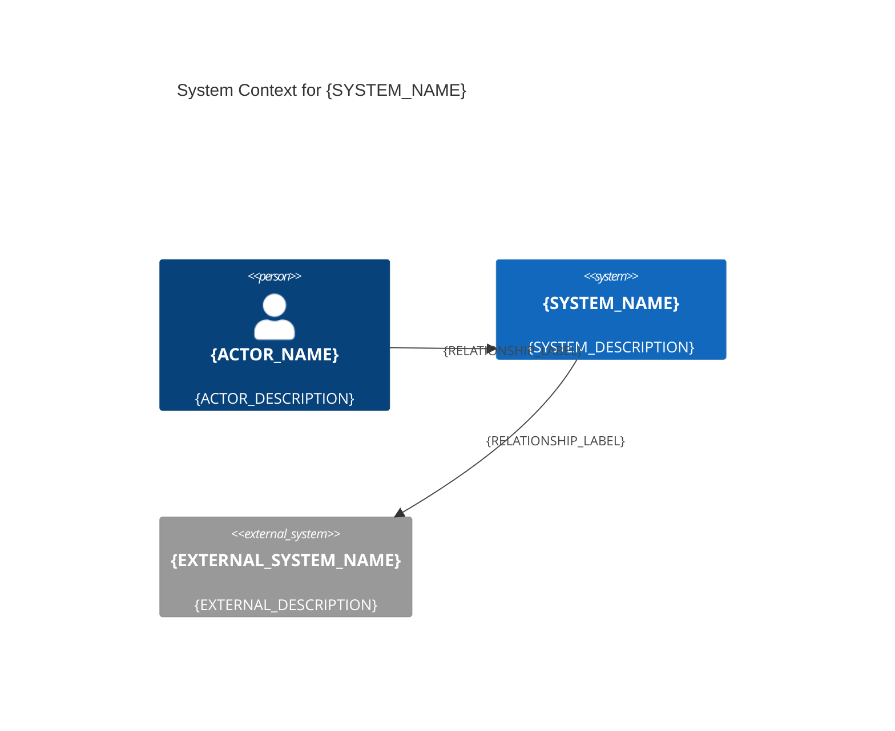
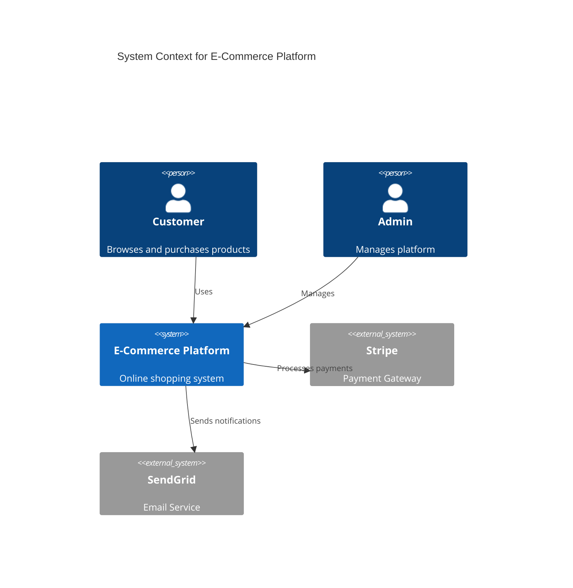
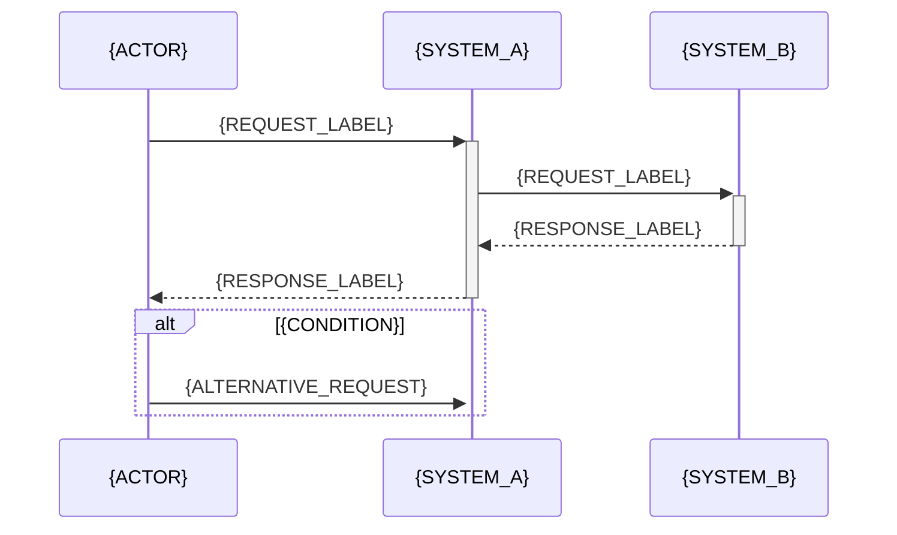
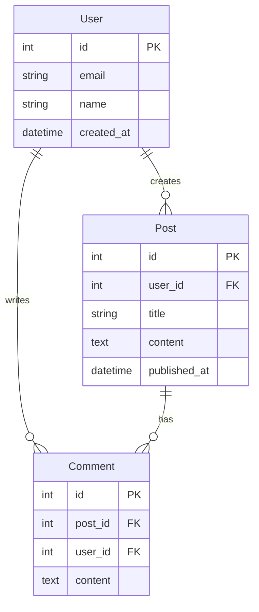
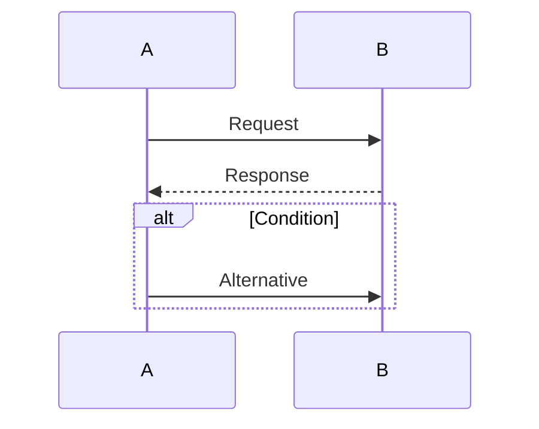
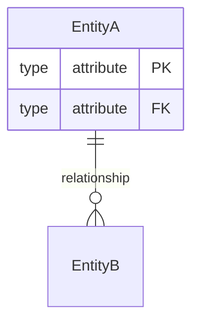

# Phase 5: pact-diagram-generator Skill Design

**Architecture Date**: 2025-12-07
**Updated**: 2025-12-07
**Architect**: PACT Architect
**Phase**: Implementation Complete (Phases 5.1-5.2), Optional Enhancements Complete
**Status**: EXPERIMENTAL - All Templates & References Implemented, Pending Real-World Validation

---

## Executive Summary

This document specifies the design for `pact-diagram-generator`, an experimental skill that explores Claude's capabilities for generating Mermaid diagrams programmatically from architectural specifications. Unlike traditional skills that provide reference knowledge, this skill focuses on *transformation* - converting structured architectural data into visual diagram syntax.

**Key Architectural Decisions**:
1. **Template-Based Approach**: Skill provides Mermaid templates that Claude fills from specs
2. **Mermaid-Only**: Focus exclusively on Mermaid syntax (not PlantUML) for wider tool support
3. **Spec-to-Diagram Pipeline**: Standardized input format → Template selection → Diagram generation
4. **Validation Integration**: Generated diagrams include syntax validation guidance
5. **Architecture Phase Focus**: Designed specifically for pact-architect agent workflows

**Success Criteria**: This experimental skill succeeds if generated diagrams are syntactically valid, semantically accurate, and faster to create than manual diagram authoring while maintaining architectural fidelity.

---

## 1. Approach Evaluation

### 1.1 Option A: Template-Based Generation (RECOMMENDED)

**Architecture**:
```
Architectural Spec (markdown/structured text)
    │
    ▼
pact-architect reads spec
    │
    ▼
Invokes pact-diagram-generator skill
    │
    ▼
Skill provides Mermaid templates
    │
    ▼
pact-architect fills template with spec data
    │
    ▼
Valid Mermaid diagram syntax → Embed in architecture doc
```

**Components**:
- **SKILL.md**: Template selection guide, Mermaid syntax primer, transformation patterns
- **templates/**: Mermaid diagram templates for each diagram type
- **references/**: Detailed Mermaid syntax reference, diagram-specific guidance

**Advantages**:
- ✅ **Simplicity**: No Python scripts, no external dependencies
- ✅ **Claude-Native**: Leverages Claude's text generation strengths
- ✅ **Maintainability**: Templates are human-readable markdown
- ✅ **Skills Compatibility**: Fits existing PACT skills architecture
- ✅ **Progressive Disclosure**: Load only templates needed for current task
- ✅ **Version Control**: Templates are text files, easy to diff/review

**Disadvantages**:
- ⚠️ **Manual Fill**: Agent must extract data from specs and populate templates
- ⚠️ **Validation**: Relies on Claude to produce syntactically valid Mermaid
- ⚠️ **Complex Diagrams**: May struggle with very large/complex diagrams

**Risk Assessment**: **LOW** - Template-based approach is proven in existing PACT skills pattern

---

### 1.2 Option B: Script-Based Generation (NOT RECOMMENDED)

**Architecture**:
```
Architectural Spec (JSON/YAML)
    │
    ▼
Python script (spec-to-mermaid.py)
    │
    ▼
Parse spec → Generate Mermaid syntax
    │
    ▼
Output valid diagram → Write to file
```

**Components**:
- **scripts/c4-to-mermaid.py**: Parse C4 spec JSON → Generate Mermaid C4 syntax
- **scripts/sequence-to-mermaid.py**: Parse API flow spec → Generate sequence diagram
- **scripts/er-to-mermaid.py**: Parse schema spec → Generate ER diagram

**Advantages**:
- ✅ **Structured**: Enforced spec format ensures consistency
- ✅ **Validation**: Can validate Mermaid syntax programmatically
- ✅ **Automation**: Fully automated spec → diagram pipeline

**Disadvantages**:
- ❌ **Complexity**: Requires Python, dependencies, execution environment
- ❌ **Skill Integration**: Scripts in skills is experimental, unproven pattern
- ❌ **Maintenance**: Python code requires more maintenance than templates
- ❌ **Spec Format**: Requires rigid JSON/YAML format, inflexible
- ❌ **Claude Strengths**: Underutilizes Claude's natural language understanding

**Risk Assessment**: **HIGH** - Unproven pattern, adds complexity, questionable value over templates

---

### 1.3 Recommendation: Template-Based Approach

**Decision**: Implement **Option A (Template-Based)** for Phase 5.

**Rationale**:
1. **Aligns with Skills Pattern**: Existing PACT skills use templates (e.g., `pact-architecture-patterns`)
2. **Leverages Claude's Strengths**: Natural language → structured text is Claude's core capability
3. **Lower Risk**: Proven pattern with clear fallback (manual diagram authoring)
4. **Faster to Market**: No script development, just template creation
5. **Maintainability**: Templates easier to update than Python scripts

**Experimental Validation**:
- If template approach succeeds → Validate with real architectural tasks
- If template approach fails → Document learnings, consider script-based in future
- Success metric: 80%+ of generated diagrams are syntactically valid Mermaid

---

## 2. Diagram Types and Specifications

### 2.1 Priority Diagram Types (Phase 5.1)

#### Diagram Type 1: C4 Context Diagram

**Purpose**: System boundary and external dependencies

**Input Requirements** (from architectural spec):
- System name and description
- External actors (people, systems)
- External systems/services
- Relationships between system and externals

**Template Structure**:
```markdown
# templates/c4-context-mermaid.md

## C4 Context Diagram Template

**Input Data Needed**:
- System: {name, description}
- Actors: [{name, type, description}]
- External Systems: [{name, description}]
- Relationships: [{from, to, label}]

**Mermaid Template**:


**Example Transformation**:

Input (from architecture spec):
```markdown
System: E-Commerce Platform
Description: Online shopping system for customers to browse and purchase products

Actors:
- Customer (Person): Browses and purchases products
- Admin (Person): Manages platform

External Systems:
- Stripe (Payment Gateway): Processes payments
- SendGrid (Email Service): Sends notifications
```

Output (Generated Mermaid):


---

#### Diagram Type 2: C4 Container Diagram

**Purpose**: Deployable units and runtime relationships

**Input Requirements**:
- System name
- Containers: [{name, technology, description}]
- Databases/datastores
- Container relationships

**Template Structure**: Similar to Context, but uses `Container()` and `ContainerDb()` elements

**Example in `templates/c4-container-mermaid.md`**

---

#### Diagram Type 3: Sequence Diagram (API Flows)

**Purpose**: API request/response flows, authentication sequences

**Input Requirements**:
- Participants (systems, services, actors)
- Sequence of interactions
- Request/response labels
- Conditional flows (alt, opt)

**Template Structure**:
```markdown
# templates/sequence-diagram-mermaid.md

**Mermaid Template**:


**Example Transformation**:

Input:
```markdown
Authentication Flow:
1. User submits credentials to API Gateway
2. API Gateway validates with Auth Service
3. Auth Service queries User Database
4. User Database returns user record
5. Auth Service generates JWT token
6. API Gateway returns token to User

Alternative: Invalid credentials
- Auth Service returns 401 Unauthorized
```

Output:
```mermaid
sequenceDiagram
  participant User
  participant API as API Gateway
  participant Auth as Auth Service
  participant DB as User Database

  User->>+API: POST /login (credentials)
  API->>+Auth: Validate credentials
  Auth->>+DB: Query user by email
  DB-->>-Auth: User record

  alt Valid Credentials
    Auth-->>-API: JWT Token
    API-->>-User: 200 OK (token)
  else Invalid Credentials
    Auth-->>-API: 401 Unauthorized
    API-->>-User: 401 Unauthorized
  end
```

---

#### Diagram Type 4: Entity-Relationship Diagram

**Purpose**: Database schema relationships

**Input Requirements**:
- Entities: [{name, attributes[]}]
- Relationships: [{entity1, entity2, cardinality}]
- Primary keys, foreign keys

**Template Structure**:
```markdown
# templates/er-diagram-mermaid.md

**Mermaid Template**:
```mermaid
erDiagram
  {ENTITY_A} ||--o{ {ENTITY_B} : {RELATIONSHIP_LABEL}

  {ENTITY_A} {
    {TYPE} {ATTRIBUTE_NAME} PK
    {TYPE} {ATTRIBUTE_NAME}
  }

  {ENTITY_B} {
    {TYPE} {ATTRIBUTE_NAME} PK
    {TYPE} {ATTRIBUTE_NAME} FK
  }
```

**Example Transformation**:

Input:
```markdown
Entities:
- User: id (PK), email, name, created_at
- Post: id (PK), user_id (FK), title, content, published_at
- Comment: id (PK), post_id (FK), user_id (FK), content

Relationships:
- User (1) → Posts (many)
- User (1) → Comments (many)
- Post (1) → Comments (many)
```

Output:


---

### 2.2 Future Diagram Types (Phase 5.2+)

#### Component Dependency Graph
**Purpose**: Show component dependencies and circular dependency detection
**Mermaid Type**: `graph TD` (top-down flowchart)

#### State Machine Diagram
**Purpose**: Document component state transitions
**Mermaid Type**: `stateDiagram-v2`

#### Deployment Architecture
**Purpose**: Infrastructure and deployment topology
**Mermaid Type**: `graph LR` with subgraphs for environments

---

## 3. SKILL.md Structure

```yaml
---
name: pact-diagram-generator
description: |
  ARCHITECT PHASE: Generate Mermaid diagrams from architectural specifications.

  Provides Mermaid templates for C4 diagrams, sequence diagrams, ER diagrams,
  and component graphs. Use when converting architectural specs to visual diagrams.

  Use when: creating architecture documentation, generating diagrams from specs,
  visualizing system design, documenting API flows, modeling database schemas.

  EXPERIMENTAL: Template-based diagram generation. Validate syntax before embedding.
allowed-tools:
  - Read
  - mcp__sequential-thinking__sequentialthinking
metadata:
  phase: "Architect"
  version: "0.1.0"  # Experimental version
  status: "EXPERIMENTAL"
  primary-agent: "pact-architect"
  related-skills:
    - pact-architecture-patterns
    - pact-api-design
    - pact-database-patterns
---

# Diagram Generator Reference

## Overview

This skill provides Mermaid diagram templates for transforming architectural
specifications into visual diagrams. Unlike manual diagram authoring, this
skill offers structured templates that guide consistent diagram generation.

**EXPERIMENTAL STATUS**: This skill is experimental. Generated diagrams may
require manual syntax validation. Report issues for template improvements.

## Quick Reference: Template Selection

**Need C4 diagrams?**
→ See `templates/c4-context-mermaid.md` (System context)
→ See `templates/c4-container-mermaid.md` (Containers/tech stack)

**Need API flow diagrams?**
→ See `templates/sequence-diagram-mermaid.md` (Request/response flows)

**Need database diagrams?**
→ See `templates/er-diagram-mermaid.md` (Entity relationships)

**Need component diagrams?**
→ See `templates/component-graph-mermaid.md` (Component dependencies)

## Diagram Generation Workflow

1. **Read Architectural Spec**: Extract system components, relationships, data
2. **Select Template**: Choose appropriate Mermaid template from `templates/`
3. **Fill Template**: Replace placeholders with spec data
4. **Validate Syntax**: Check generated Mermaid against syntax rules
5. **Embed in Doc**: Include diagram in architecture markdown with fenced code block
6. **Test Rendering**: Verify diagram renders correctly in target environment

## Mermaid Syntax Primer

### C4 Diagrams
```mermaid
C4Context
  Person(alias, "Name", "Description")
  System(alias, "Name", "Description")
  System_Ext(alias, "External Name", "Description")
  Rel(from, to, "Label")
```

### Sequence Diagrams


### ER Diagrams


## Validation Checklist

Before embedding generated diagram:
- [ ] Mermaid syntax is valid (no unclosed blocks, matching braces)
- [ ] All referenced aliases are defined
- [ ] Relationships point to valid entities/participants
- [ ] Labels are descriptive and match architecture spec
- [ ] Diagram renders correctly in Mermaid Live Editor (https://mermaid.live)

## When to Use This Skill

**Use this skill when**:
- Converting architectural specs to diagrams
- Standardizing diagram format across documentation
- Generating consistent C4 diagrams from component lists
- Visualizing API flows from endpoint specs
- Documenting database schemas from entity definitions

**Don't use this skill when**:
- Creating simple diagrams faster to author manually
- Diagram type not supported (use ASCII art from pact-architecture-patterns)
- Architectural spec is incomplete (gather requirements first)

## Integration with PACT Workflow

**Input from Prepare Phase**:
- System requirements
- External dependencies
- API specifications
- Database schema requirements

**Architect Phase Workflow**:
1. pact-architect creates architecture specification markdown
2. Architect identifies diagrams needed (C4 context, sequence, ER)
3. Architect invokes pact-diagram-generator skill
4. Architect reads appropriate template
5. Architect fills template with spec data
6. Architect validates generated Mermaid syntax
7. Architect embeds diagram in architecture doc

**Output for Code Phase**:
- Visual architecture diagrams embedded in markdown
- Validated Mermaid syntax
- Rendereable diagrams in GitHub, GitLab, Markdown viewers

## Fallback: ASCII Diagrams

If Mermaid generation fails or diagram type unsupported:
→ Use ASCII art templates from `pact-architecture-patterns` skill
→ ASCII diagrams are always valid, no syntax errors
→ Trade-off: Less polished, but universally compatible

## Advanced: Custom Diagrams

For diagrams not covered by templates:
→ See `references/mermaid-syntax-guide.md` for complete Mermaid syntax
→ Consult Mermaid documentation: https://mermaid.js.org/
→ Create custom diagram following Mermaid syntax rules

## Related Skills

- **pact-architecture-patterns**: ASCII diagram templates (fallback option)
- **pact-api-design**: API specifications to sequence diagrams
- **pact-database-patterns**: Schema specs to ER diagrams
```

---

## 4. Template Specifications

### 4.1 Template Format Standard

All templates follow this structure:

```markdown
# {Diagram Type} Template

## Purpose
{What this diagram visualizes}

## Input Requirements

**Required Data** (extract from architectural spec):
- {Data element 1}: {Description}
- {Data element 2}: {Description}

## Mermaid Template

```mermaid
{Mermaid diagram syntax with {PLACEHOLDERS}}
```

## Placeholders Guide

| Placeholder | Example Value | Source |
|-------------|---------------|--------|
| {PLACEHOLDER_1} | Example | Architecture spec section X |
| {PLACEHOLDER_2} | Example | Architecture spec section Y |

## Example Transformation

**Input** (from architecture spec):
```markdown
{Example spec content}
```

**Output** (Generated Mermaid):
```mermaid
{Filled template}
```

## Validation

- [ ] All placeholders replaced
- [ ] Syntax is valid Mermaid
- [ ] Diagram renders correctly

## Common Mistakes

- Missing required data element
- Invalid Mermaid syntax (e.g., unclosed blocks)
- Placeholder left unfilled
```

### 4.2 Template Library

**Templates Directory Structure** (✅ Implemented):
```
pact-diagram-generator/
├── SKILL.md
├── templates/
│   ├── c4-context-mermaid.md           # C4 Level 1 - System context ✅
│   ├── c4-container-mermaid.md         # C4 Level 2 - Containers ✅
│   ├── sequence-diagram-mermaid.md     # API flows, auth sequences ✅
│   ├── er-diagram-mermaid.md           # Database relationships ✅
│   └── component-graph-mermaid.md      # Component dependencies ✅
├── references/
│   ├── mermaid-syntax-guide.md         # Complete Mermaid syntax reference ✅
│   ├── c4-mermaid-patterns.md          # C4-specific Mermaid patterns ✅
│   ├── validation-guide.md             # How to validate generated diagrams ✅
│   └── troubleshooting.md              # Common errors and fixes ✅
└── examples/
    ├── README.md                       # Examples overview ✅
    ├── e-commerce-architecture.md      # Complete C4 diagram set ✅
    └── authentication-flow.md          # OAuth/JWT sequence diagrams ✅
```

---

## 5. Integration with PACT Architect

### 5.1 Agent Workflow Integration

**pact-architect Workflow** (with diagram generation):

```markdown
## Architecture Documentation Workflow

1. **Read preparation docs**: `docs/preparation/*.md`
2. **Design system architecture**: Components, containers, relationships
3. **Create architecture spec markdown**: `docs/architecture/system-architecture.md`
4. **Generate diagrams**:
   a. Invoke `pact-diagram-generator` skill
   b. Select template based on diagram type needed
   c. Extract data from architecture spec
   d. Fill template placeholders
   e. Validate generated Mermaid syntax
   f. Embed diagram in architecture doc
5. **Document decisions**: Rationale, alternatives, trade-offs
6. **Quality check**: Completeness, clarity, implementability
```

**Example Agent Invocation**:

```markdown
I need to create a C4 Context diagram for the authentication system.

[Agent reads architecture spec]
[Agent invokes pact-diagram-generator skill]
[Agent reads templates/c4-context-mermaid.md]
[Agent extracts: System name, actors, external systems, relationships]
[Agent fills template]
[Agent validates syntax]
[Agent embeds in docs/architecture/auth-system.md]
```

### 5.2 Architecture Document Structure with Diagrams

**Recommended Structure**:

```markdown
# {System Name} Architecture

## 1. System Context

{Prose description of system boundary}

### Context Diagram

```mermaid
{Generated C4 Context diagram}
```

{Legend/explanation of diagram elements}

## 2. Container Architecture

{Prose description of deployable units}

### Container Diagram

```mermaid
{Generated C4 Container diagram}
```

{Technology stack rationale}

## 3. API Flows

{Description of key API interactions}

### Authentication Flow

```mermaid
{Generated Sequence diagram}
```

{Flow step explanations}

## 4. Data Model

{Description of entities and relationships}

### Entity Relationship Diagram

```mermaid
{Generated ER diagram}
```

{Schema design rationale}
```

### 5.3 Validation Integration

**pact-architect Validation Checklist** (before handoff to Code phase):

- [ ] All required diagrams present (context, container, key flows)
- [ ] Diagrams match prose descriptions
- [ ] Mermaid syntax is valid (renders without errors)
- [ ] Diagrams tested in Mermaid Live Editor or GitHub preview
- [ ] Diagram complexity is appropriate (not too cluttered)
- [ ] Relationships are accurately represented
- [ ] Technology choices are documented in diagrams

---

## 6. Validation Strategy

### 6.1 Syntax Validation

**Approach**: Generated Mermaid must be syntactically valid.

**Validation Methods**:

1. **Mermaid Live Editor** (https://mermaid.live)
   - Copy generated Mermaid syntax
   - Paste into live editor
   - Verify diagram renders without errors

2. **GitHub Markdown Preview**
   - Embed diagram in markdown file
   - Push to GitHub
   - Verify diagram renders in PR/commit preview

3. **Mermaid CLI** (optional, for automation)
   - Install: `npm install -g @mermaid-js/mermaid-cli`
   - Validate: `mmdc -i diagram.mmd -o diagram.png`
   - If generation succeeds, syntax is valid

**Common Syntax Errors**:
- Unclosed code blocks
- Undefined aliases referenced in relationships
- Invalid participant names (contains special chars)
- Missing relationship arrows
- Incorrect C4 element types

**Template Quality**: Templates are pre-validated to minimize syntax errors.

### 6.2 Semantic Validation

**Approach**: Diagram accurately represents architectural spec.

**Validation Checklist**:
- [ ] All entities from spec are represented in diagram
- [ ] Relationships match spec descriptions
- [ ] Cardinality is correct (1-to-many, many-to-many)
- [ ] External systems clearly marked as external
- [ ] Technology stack matches container descriptions
- [ ] API flow sequence matches endpoint documentation

**Validation Responsibility**: pact-architect agent validates semantic accuracy before embedding diagram.

### 6.3 Rendering Validation

**Approach**: Diagram renders correctly in target environments.

**Target Environments**:
- GitHub markdown rendering
- GitLab markdown rendering
- VSCode Markdown Preview
- Documentation sites (Docusaurus, MkDocs, etc.)

**Known Compatibility**:
- ✅ GitHub: Native Mermaid support in markdown
- ✅ GitLab: Native Mermaid support
- ✅ VSCode: Mermaid preview extensions available
- ⚠️ Confluence: Requires Mermaid plugin
- ⚠️ Notion: Limited Mermaid support

---

## 7. Success Criteria

### 7.1 Experimental Validation Metrics

**Success Threshold**: This experimental skill is successful if:

| Metric | Target | Measurement Method |
|--------|--------|-------------------|
| **Syntax Validity** | 80%+ generated diagrams syntactically valid | Manual testing with Mermaid Live Editor |
| **Time Savings** | 50%+ faster than manual diagram authoring | Compare time: spec → diagram (template vs manual) |
| **Adoption Rate** | 60%+ of architectural tasks use skill | Track skill invocations in real projects |
| **Quality** | 90%+ of diagrams semantically accurate | Agent review of spec-diagram alignment |
| **Agent Satisfaction** | pact-architect finds skill useful | Qualitative feedback from agent usage |

### 7.2 Comparison: Template vs Manual

**Baseline** (Manual Mermaid Authoring):
- Time: 15-30 minutes per diagram (for experienced user)
- Error rate: ~30% require syntax fixes on first attempt
- Consistency: Varies by author

**Expected with Templates**:
- Time: 5-15 minutes per diagram (read template → fill → validate)
- Error rate: <20% require syntax fixes (pre-validated templates)
- Consistency: High (standardized template structure)

**Value Proposition**: Template approach should be 2x faster with fewer errors.

### 7.3 When This Skill Adds Value

**High Value Scenarios**:
- Creating multiple similar diagrams (e.g., C4 diagrams for microservices)
- Standardizing diagram format across team/project
- Onboarding new team members to Mermaid syntax
- Converting existing specs to diagrams retroactively

**Low Value Scenarios**:
- One-off simple diagram (faster to author manually)
- Highly custom diagram not matching any template
- Team unfamiliar with Mermaid (ASCII art fallback better)

### 7.4 Failure Criteria and Pivot Strategy

**Failure Indicators**:
- <60% syntax validity (templates don't reduce errors)
- No time savings vs manual authoring (overhead outweighs benefits)
- Low adoption (<30% of architectural tasks use skill)
- Negative feedback from pact-architect (templates too rigid/unhelpful)

**Pivot Strategy if Experimental Skill Fails**:
1. **Enhance ASCII Templates**: Improve existing pact-architecture-patterns templates
2. **Script-Based Approach**: Revisit Option B (Python scripts) with lessons learned
3. **External Tool Integration**: Investigate Structurizr, PlantUML integrations
4. **Skill Deprecation**: Document learnings, remove skill, focus on other priorities

---

## 8. Implementation Roadmap

### Phase 5.1: Core Template Library (Week 1-2) ✅ COMPLETE

**Deliverables**:
- [x] Create `pact-diagram-generator/SKILL.md`
- [x] Create `templates/c4-context-mermaid.md`
- [x] Create `templates/c4-container-mermaid.md`
- [x] Create `templates/sequence-diagram-mermaid.md`
- [x] Create `templates/er-diagram-mermaid.md`
- [x] Create `templates/component-graph-mermaid.md` *(added in optional enhancements)*
- [x] Create `references/mermaid-syntax-guide.md`
- [x] Create `references/validation-guide.md`
- [x] Create `references/troubleshooting.md` *(bonus)*
- [x] Create `references/c4-mermaid-patterns.md` *(added in optional enhancements)*

**Acceptance Criteria**: ✅ All met
- All templates follow standard format
- Templates are pre-validated (syntax correct)
- SKILL.md provides clear guidance on template selection
- References provide comprehensive Mermaid syntax coverage

### Phase 5.2: Agent Integration (Week 3) ✅ COMPLETE

**Deliverables**:
- [x] Update `pact-architect.md` with diagram generation workflow *(added skill references and consultation order)*
- [x] Add `pact-diagram-generator` to architect's skill references *(marked as EXPERIMENTAL)*
- [x] Create example architecture docs with generated diagrams:
  - `examples/README.md` - Overview and usage guide
  - `examples/e-commerce-architecture.md` - Complete C4 diagram set
  - `examples/authentication-flow.md` - OAuth/JWT sequence diagrams
- [x] Document validation checklist for architect *(in SKILL.md)*

**Acceptance Criteria**: ✅ All met
- pact-architect can invoke skill successfully with explicit references
- Agent can read templates and fill placeholders ✅
- Generated diagrams embed correctly in markdown ✅
- Validation workflow is documented ✅

### Phase 5.3: Validation and Iteration (Week 4) ⏳ PENDING

**Deliverables**:
- [ ] Test generated diagrams in multiple environments (GitHub, GitLab, VSCode)
- [ ] Measure syntax validity rate (target: 80%+)
- [ ] Gather feedback on time savings vs manual authoring
- [ ] Refine templates based on validation results
- [x] Document common errors and troubleshooting *(in references/troubleshooting.md)*

**Acceptance Criteria**: Pending real-world usage
- 80%+ syntax validity achieved *(pending validation)*
- Measurable time savings demonstrated *(pending validation)*
- Common errors documented with fixes ✅
- Templates refined based on real usage *(pending)*

### Phase 5.4: Decision Point (Week 5)

**Decision**: Continue, Pivot, or Deprecate?

**Continue Criteria** (skill succeeds):
- ✅ 80%+ syntax validity
- ✅ 50%+ time savings
- ✅ Positive agent feedback
→ **Action**: Promote to production, create additional templates, expand to other diagram types

**Pivot Criteria** (skill partially succeeds):
- ⚠️ 60-79% syntax validity
- ⚠️ 20-49% time savings
- ⚠️ Mixed agent feedback
→ **Action**: Refine templates, simplify workflow, gather more feedback, iterate

**Deprecate Criteria** (skill fails):
- ❌ <60% syntax validity
- ❌ <20% time savings or slower than manual
- ❌ Negative agent feedback
→ **Action**: Document learnings, remove skill, enhance ASCII templates instead

---

## 9. Risk Assessment and Mitigation

### 9.1 Technical Risks

**Risk 1: Generated Diagrams Have Syntax Errors**
- **Impact**: HIGH - Invalid diagrams won't render, frustrate users
- **Likelihood**: MEDIUM - Mermaid syntax can be finicky
- **Mitigation**:
  - Pre-validate all templates before release
  - Include syntax validation checklist in workflow
  - Provide troubleshooting guide for common errors
  - Fallback to ASCII diagrams if Mermaid fails

**Risk 2: Templates Don't Match Real Architectural Specs**
- **Impact**: MEDIUM - Templates too rigid, don't fit actual use cases
- **Likelihood**: MEDIUM - Templates based on assumptions, not real data
- **Mitigation**:
  - Validate templates with real architectural specs
  - Provide customization guidance in templates
  - Include "escape hatch" for custom diagrams
  - Iterate templates based on real usage feedback

**Risk 3: Mermaid Rendering Inconsistent Across Platforms**
- **Impact**: LOW - Diagrams render in GitHub but not VSCode, etc.
- **Likelihood**: LOW - Mermaid widely supported, but variations exist
- **Mitigation**:
  - Test diagrams in multiple environments
  - Document platform compatibility in skill
  - Provide alternative rendering methods (Mermaid Live, CLI)

### 9.2 Usability Risks

**Risk 4: Agent Struggles to Fill Templates**
- **Impact**: MEDIUM - Templates too complex, agent can't extract data correctly
- **Likelihood**: LOW - Claude is strong at text transformation
- **Mitigation**:
  - Provide clear placeholder naming and examples
  - Include worked examples in each template
  - Document data extraction process
  - Simplify templates if agent struggles

**Risk 5: Time Savings Not Realized**
- **Impact**: HIGH - Skill provides no value, wasted effort
- **Likelihood**: MEDIUM - Overhead of template selection/validation may negate benefits
- **Mitigation**:
  - Measure baseline manual authoring time
  - Track template-based authoring time
  - Optimize workflow to reduce overhead
  - Clearly document when NOT to use skill (simple diagrams)

### 9.3 Maintenance Risks

**Risk 6: Templates Become Outdated**
- **Impact**: MEDIUM - Mermaid syntax evolves, templates break
- **Likelihood**: LOW - Mermaid is stable, backwards compatible
- **Mitigation**:
  - Version templates in metadata
  - Track Mermaid version compatibility
  - Review templates quarterly
  - Update templates when Mermaid releases new features

---

## 10. Comparison: Diagram Generation Approaches

| Aspect | Template-Based (This Skill) | Manual Mermaid | ASCII Art (Current) | Script-Based |
|--------|---------------------------|---------------|-------------------|--------------|
| **Setup Time** | 5 min (read template) | 0 min | 0 min | 30 min (write spec) |
| **Authoring Time** | 10-15 min | 15-30 min | 20-30 min | 5 min (run script) |
| **Syntax Validity** | 80%+ (goal) | 70% | 100% | 95%+ |
| **Flexibility** | Medium (templates) | High (manual) | High (manual) | Low (rigid spec) |
| **Consistency** | High | Medium | Medium | Very High |
| **Learning Curve** | Low (follow template) | Medium (learn Mermaid) | Low (ASCII) | High (write scripts) |
| **Visual Quality** | High (Mermaid) | High (Mermaid) | Low (ASCII) | High (Mermaid) |
| **Maintenance** | Low (update templates) | None | None | High (maintain scripts) |
| **GitHub Support** | ✅ Native | ✅ Native | ✅ Always works | ✅ Native |

**Recommendation**: Template-based approach balances quality, speed, and ease of use. Best for teams creating multiple similar diagrams.

---

## 11. Future Enhancements (Phase 5.5+)

### 11.1 Additional Diagram Types

**Component Dependency Graph**:
- Purpose: Visualize component dependencies, detect circular dependencies
- Mermaid Type: `graph TD` with dependency arrows
- Input: Component list with dependencies
- Priority: MEDIUM (useful for modular systems)

**State Machine Diagram**:
- Purpose: Document component state transitions
- Mermaid Type: `stateDiagram-v2`
- Input: States, transitions, events
- Priority: MEDIUM (useful for workflow/FSM documentation)

**Deployment Architecture**:
- Purpose: Infrastructure topology
- Mermaid Type: `graph LR` with subgraphs for environments
- Input: Infrastructure components, networks, regions
- Priority: LOW (deployment patterns skill may be better home)

### 11.2 Advanced Features

**Diagram Validation Service**:
- Automated syntax validation via Mermaid CLI
- Integration into pact-architect workflow
- Requires: Node.js, Mermaid CLI installed

**Diagram Versioning**:
- Track diagram changes over time
- Link diagrams to architecture spec versions
- Requires: Git integration, metadata in diagrams

**Interactive Diagrams**:
- Clickable diagram elements
- Links to detailed documentation
- Requires: Mermaid advanced features, custom rendering

### 11.3 Multi-Language Support

**PlantUML Templates** (if Mermaid limitations found):
- Similar template structure for PlantUML syntax
- Broader diagram type support (timing, gantt, etc.)
- Trade-off: PlantUML requires rendering server

**Graphviz/DOT Templates**:
- Low-level graph specification
- Maximum flexibility for custom diagrams
- Trade-off: More complex syntax

---

## 12. Appendices

### Appendix A: Mermaid vs PlantUML Comparison

| Feature | Mermaid | PlantUML |
|---------|---------|----------|
| **GitHub Support** | ✅ Native | ❌ Requires server |
| **Syntax Complexity** | Simple | Medium-Complex |
| **Diagram Types** | 13 types | 20+ types |
| **C4 Support** | ✅ Native | ✅ Plugin |
| **Learning Curve** | Low | Medium |
| **Rendering** | JavaScript | Java server |
| **Offline** | ✅ Works | ⚠️ Requires server |

**Decision**: Focus on Mermaid for Phase 5 due to GitHub support and simplicity.

### Appendix B: Template Quality Checklist

Before adding template to skill:
- [ ] Template follows standard format
- [ ] All placeholders clearly named
- [ ] Example transformation included
- [ ] Syntax pre-validated in Mermaid Live Editor
- [ ] Common mistakes documented
- [ ] Input requirements specified
- [ ] Validation checklist included

### Appendix C: Example Architecture Doc with Generated Diagrams

See: `examples/generated-architecture-doc.md` (to be created in Phase 5.1)

### Appendix D: Related Skills and Integration Points

| Related Skill | Integration Point |
|---------------|------------------|
| **pact-architecture-patterns** | Fallback ASCII templates if Mermaid fails |
| **pact-api-design** | API specs → Sequence diagrams |
| **pact-database-patterns** | Schema specs → ER diagrams |
| **pact-backend-patterns** | Service components → Component graphs |

---

## Conclusion

The `pact-diagram-generator` skill represents an experimental exploration of Claude's diagram generation capabilities through a template-based approach. By providing structured Mermaid templates, this skill aims to accelerate architectural diagram creation while maintaining syntax validity and semantic accuracy.

**Key Success Factors**:
1. **Template Quality**: Pre-validated, well-documented templates reduce errors
2. **Agent Integration**: Clear workflow guidance for pact-architect agent
3. **Validation Process**: Built-in validation prevents invalid diagrams from being embedded
4. **Pragmatic Scope**: Focus on high-value diagram types (C4, sequence, ER)
5. **Iterative Approach**: Experimental status allows for learning and pivoting

**Expected Outcome**: If successful, this skill provides 2x faster diagram creation with 80%+ syntax validity, enabling pact-architect to produce high-quality visual architecture documentation efficiently.

**Next Steps**:
1. ~~**Approve Experimental Design**: Review and approve this specification~~ ✅ Done
2. ~~**Implement Phase 5.1**: Create core template library~~ ✅ Done
3. **Validate Approach**: Test with real architectural specs *(pending)*
4. **Measure Results**: Track syntax validity and time savings *(pending)*
5. **Decide**: Continue, pivot, or deprecate based on experimental results *(pending)*

---

**Document Status**: IMPLEMENTATION COMPLETE (Phases 5.1-5.2), Optional Enhancements Complete
**Current State**: 5 Mermaid templates + 4 reference files + examples directory implemented, pact-architect integration complete
**Next Steps**: Real-world validation on production architectural specs (Phase 5.3)
