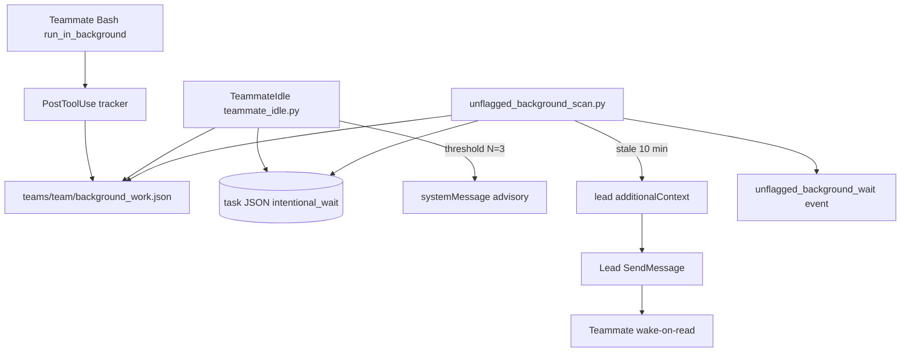
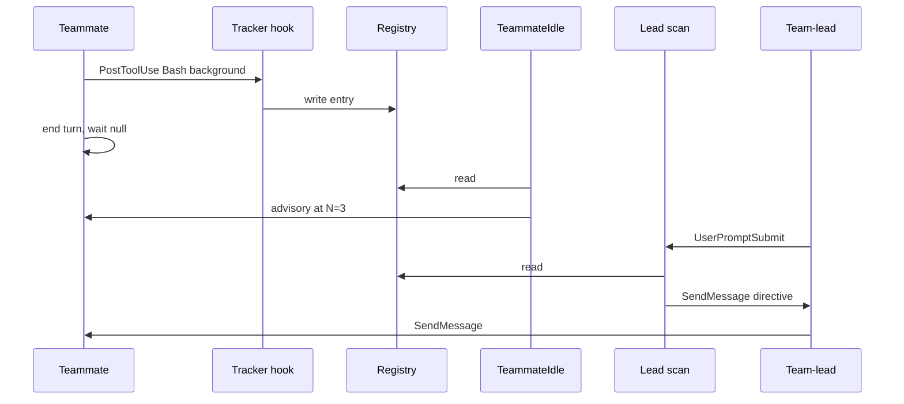
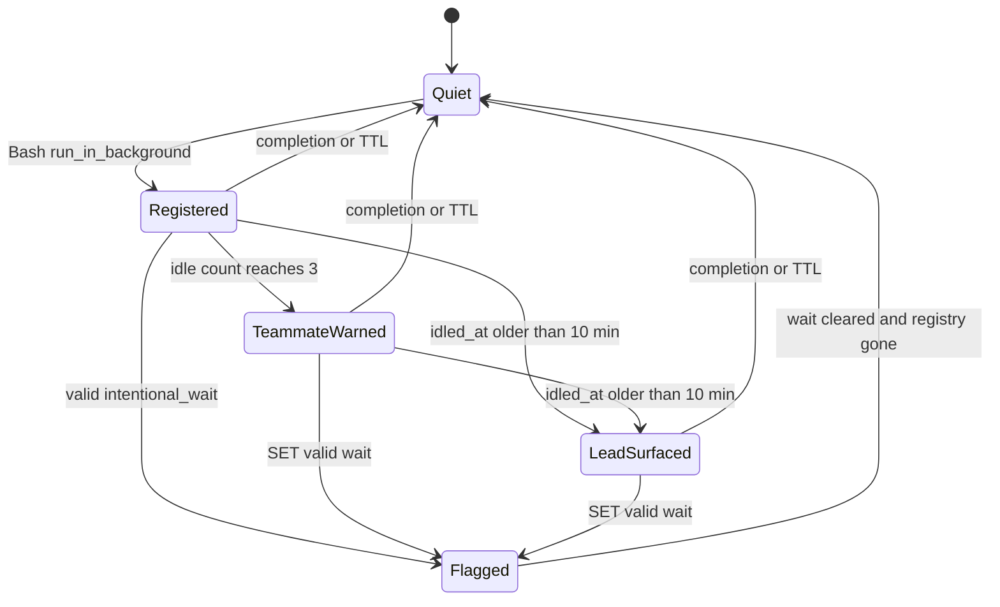

# Unflagged Background Wait Enforcement - Plan

## Goal Capsule

- Objective: Close the #1625 unflagged gap on the next lead turn. A teammate who backgrounds harness work and ends the turn without a valid `intentional_wait` is recorded, and a later lead `UserPromptSubmit` or `SessionStart` receives a `SendMessage` directive. Unattended silence with no lead or human turn stays out of scope.
- Authority: This plan. Product behavior lives on R-IDs. Mechanism lives on KTD-IDs. Issue #1625 is origin context, not an override.
- Execution profile: Test-first for predicates and hook I/O. Capture a live PostToolUse frame for `Bash` + `run_in_background` before the tracker encodes field names.
- Stop conditions: Stop if TeammateIdle cannot stay livelock-safe, if detection would fire on mid-arc `in_progress` with no registry evidence, if lead recovery would reuse the `missed_wake` / `awaiting_lead_completion` diagnosis, or if a live PostToolUse frame cannot uniquely identify the launching teammate among same-`agentType` siblings.
- Tail ownership: The caller owns ship after this plan is implementation-ready.

---

## Product Contract

Product Contract authored by ce-plan-bootstrap. No upstream brainstorm.

### Summary

Add a mechanical floor for Wait Discipline Layer 2. Record teammate harness-background Bash launches. When that work is still outstanding and `intentional_wait` is missing, null, or invalid, warn the idle teammate and tell the lead to `SendMessage` them. The lead message is the wake.

### Problem Frame

PR #1621 shipped Wait Discipline teaching in `skills/pact-agent-teams/SKILL.md`. Plugin 4.7.16 already contained that prose. In session-9621fed9, two reviewers each backgrounded pytest, sent an interim report, and ended the turn with `intentional_wait: null` on disk. Teammate background notifications are wake-on-read (#1620). Nothing woke them. Both sat silent about 50 minutes after the suite finished. A lead `SendMessage` unblocked both immediately.

`wait_filler_gate` only denies bare `true` / `sleep`. `missed_wake_scan` only surfaces stale `awaiting_lead_completion`. `teammate_idle.py` only escalates completed-task zombies and does not consume `intentional_wait`. No hook tracks `run_in_background`.

### Requirements

**Detection**

- R1. The plugin records each teammate Bash launch that uses the harness `run_in_background` parameter, with enough identity to match the owning teammate and in-progress task.
- R2. A teammate who idles while that recorded work is outstanding and `intentional_wait` is missing, null, or invalid receives a threshold-gated advisory to SET a well-formed wait or transfer the watch to the lead per Layer 3.
- R3. Mid-arc teammates who are `in_progress` with no recorded outstanding self-started work do not receive this advisory. Durable-process launches (dev server, start, serve, watch) are not recorded as outstanding self-started work.

**Lead recovery**

- R4. On the lead's `UserPromptSubmit` and `SessionStart`, the plugin surfaces each `in_progress` task that still has recorded outstanding self-started work, has ended the turn (an `idled_at` exists), and has no valid `intentional_wait`.
- R5. That surface tells the lead to `SendMessage` the teammate. The message is the wake. Hooks do not send the message themselves.
- R6. The unflagged-background surface persists while the condition holds and clears when the wait is valid or the registry entry is gone. A valid Layer 2 flag is the success of this alarm. Flagged-but-unwatched waits stay with #1301 and #1620, not this scan.

**Honesty and safety**

- R7. Forensic records for this alarm use a new journal event type. They record the task's real wait absence or malformed class. They never stamp `awaiting_lead_completion` or reuse the `missed_wake` event type.
- R8. Every new hook path fail-opens: exit 0, no deny, no crash on malformed stdin.
- R9. TeammateIdle emissions for this alarm stay threshold-gated. They must not nag every idle tick.
- R10. Both in-process and tmux teammate topologies receive the same teammate-side and lead-side coverage.

### Actors

- A1. Teammate specialist (`pact-*` `agent_type`, in-process or tmux).
- A2. Team-lead (`PACT:pact-orchestrator` or `pact-orchestrator`).
- A3. Plugin hooks (PostToolUse tracker, TeammateIdle, lead sibling scan).

### Key Flows

- F1. Register. Teammate launches Bash with `run_in_background`. Tracker writes a team-scoped registry entry. Covers R1.
- F2. Compliant idle. Teammate SETs a valid `intentional_wait` before ending the turn. TeammateIdle and lead scan stay silent. Covers R3, R6.
- F3. Unflagged idle. Teammate ends the turn with outstanding registry work and no valid wait. After N consecutive idle events, TeammateIdle emits the Layer 2/3 advisory. Covers R2, R9.
- F4. Lead wake. Lead starts a turn while F3 still holds past the idle-staleness window. Sibling scan injects `additionalContext` directing a `SendMessage`. Covers R4, R5, R6.
- F5. Clear. Registry entry is removed on a later completion signal or TTL. Valid wait or completed task also clears the alarms. Covers R6.

### Acceptance Examples

- AE1. Covers R2 / F3. Given a teammate task `in_progress` with a registry entry and `intentional_wait: null`, when TeammateIdle has fired N=3 times, then the hook emits a `systemMessage` that tells the teammate to SET `intentional_wait` or transfer the watch.
- AE2. Covers R3. Given a teammate task `in_progress` with no registry entry and `intentional_wait: null`, when TeammateIdle fires, then the hook emits no unflagged-background advisory.
- AE3. Covers R4 / R5 / F4. Given the AE1 on-disk state with `idled_at` older than 10 minutes, when the lead receives `UserPromptSubmit`, then `additionalContext` names the teammate and directs `SendMessage`.
- AE4. Covers R7. Given AE3, when the forensic event is written, then its type is not `missed_wake` and its reason field is not `awaiting_lead_completion`.
- AE5. Covers R6 / F2. Given AE1 after the teammate SETs a valid wait, when TeammateIdle or the lead scan fires again, then the unflagged-background alarm is absent.

### Success Criteria

- The #1625 measured shape (background pytest, interim report, turn end, `intentional_wait: null`) produces a teammate advisory and, on the next lead `UserPromptSubmit` or `SessionStart` after the idle-staleness window, a `SendMessage` directive.
- Flagged protocol waits (`awaiting_lead_completion`, `awaiting_lead_commit`, `awaiting_amendment_review`) and mid-arc work without a registry entry stay silent.
- `test_dogfood_livelock_invariant.py` and `test_hooks_json.py` stay green, including a conscious SessionStart cardinality update.

### Scope Boundaries

**In scope**

- Mechanical detection and recovery for unflagged teammate harness-background Bash work.
- Naming the new lead hook in teammate and orchestrator prose so teaching and runtime stay aligned.

**Out of scope**

- Changing platform wake-on-read delivery (#1620).
- Widening `missed_wake_scan` to all lead-resolved reasons (#1301).
- Replacing Wait Discipline prose. Keep Layer 1–3 teaching. Add the floor under it.
- A composite "run-and-wait" tool.
- Re-registering `Stop`.
- Agent-tool `run_in_background` and shell `&` backgrounding.

### Deferred to Follow-Up Work

- #1301 honest-and-monitored reason census. Adjacent vocabulary work. Do not fold it into this scan.
- Unattended recovery with no lead turn and no human `UserPromptSubmit`.
- Platform push delivery of teammate background notifications.

---

## Planning Contract

### Key Technical Decisions

- KTD1. Ship both layers. TeammateIdle is the prevent-repeat floor. The lead sibling scan is the recovery that produces a wake. Chosen over teammate-only (unattended teammate stays silent if the advisory is wake-on-read) and lead-only (the #1625 pair would still end the turn unflagged). Governs R2, R4, R5.
- KTD2. Detection requires a registry of outstanding non-durable self-started Bash work plus `in_progress` plus no valid `intentional_wait`. Chosen over `in_progress` + null wait alone: that is also a mid-arc teammate waiting for the next inbound message. Durable-process launches (`dev`, `start`, `serve`, `watch` in the command) are not recorded. Governs R1, R3.
- KTD3. TeammateIdle is advisory-only (`systemMessage`). The lead scan is `additionalContext` that tells the lead to `SendMessage`. Chosen over PreToolUse deny: #1625 is a missing `TaskUpdate` at turn end, not a present filler call. Hooks cannot call `SendMessage`. Governs R2, R5, R8.
- KTD4. Put the lead scan in a new hook module on `UserPromptSubmit` + `SessionStart`. Do not widen `missed_wake_scan.py`'s `_MISSED_WAKE_REASON` filter. Chosen over extending that filter: #1301 documents the single-reason scope as a decision, and the forensic event currently stamps the constant. Governs R4, R7.
- KTD5. Persist outstanding work in team-scoped JSON under `{CLAUDE_CONFIG_DIR}/teams/{team_name}/background_work.json`. Resolve `{team_name}` with `pact_context.get_team_name()` after `init()`, the identity-aligned team `teammate_idle.py` and `get_task_list()` already use. Do not use a raw stdin team field or an unaligned persisted teammate context. If a live capture shows the teammate writer and the lead reader resolve different directories, stop and report. Chosen over session-tracking JSON: tmux teammates do not share the lead session file. Chosen over a new task-metadata field: that still depends on the teammate writing it. Governs R1, R10.
- KTD6. Register journal type `unflagged_background_wait` in `hooks/shared/session_journal.py`. Dedup by journal read on `(task_id, registered_at)`. Chosen over reusing `missed_wake`. Governs R7.
- KTD7. TeammateIdle first advisory at consecutive idle count N=3, stored in a file other than `idle_counts.json`. That file's `in_progress` branch pops the whole teammate key and would reset this counter. Lead scan surfaces after 10 minutes from `idled_at` (first TeammateIdle observation of a U1 fire-predicate task), not from `registered_at`. A teammate still writing an interim report must not be a SendMessage target. Chosen over N=1 (reintroduces #538 per-tick nag) and over the 30-minute `wait_stale` horizon. Governs R2, R4, R9.
- KTD8. v1 records only Bash `run_in_background`. Exclude shell `&` and Agent `run_in_background`. Governs R1.
- KTD9. Keep `teammate_idle.py` as the sole TeammateIdle occupant. Extend it. Do not add a second TeammateIdle script. Governs R9.
- KTD10. Role-gate on `agent_type` via `is_lead()`. Tracker writes only in teammate processes. Lead scan runs only in the lead process. Governs R10.

### High-Level Technical Design

Component topology and the directed reads/writes:

Turn-end and recovery sequence:

Alarm state machine:

### Assumptions

These are unvalidated planning bets from headless scope, not user-confirmed decisions.

- A-INF1. Issue #1625's "Both" direction is the right product split. Recorded as KTD1.
- A-INF2. TeammateIdle `systemMessage` may itself be wake-on-read. Lead `SendMessage` remains the recovery that #1625 measured. Recorded as KTD3.
- A-INF3. PostToolUse stdin exposes `tool_input.run_in_background` and a harness task id in `tool_response`. Exact keys are an implementation-time capture. The same capture must uniquely identify the launching teammate when two same-`agentType` siblings run. Recorded as U2 execution note.
- A-INF4. N=3 and 10-minute lead staleness from `idled_at` are the right first numbers. Tune only if tests or a live probe show cry-wolf or late recovery. Recorded as KTD7.

### Implementation Constraints

- `hooks/shared/HOOK_STDIN_DISCRIMINATORS.md` is the role-field authority.
- `Stop` stays unregistered (`tests/test_hooks_json.py::test_stop_event_not_registered`).
- `SubagentStop` is not the primary teammate carrier. Tmux teammates fire Stop/SessionEnd in their own process, not lead-process `SubagentStop`.
- `get_task_list()` stays the task-list seam. Integration tests must not mock it.
- `validate_wait()` remains the well-formed wait predicate. Do not fork `wait_stale()` for this alarm.
- New TeammateIdle `systemMessage` paths need a `# livelock-safe:` docstring update and must pass `tests/test_dogfood_livelock_invariant.py`.
- SessionStart cardinality is pinned at two hooks. Adding the sibling scan is a conscious pin update with an ordering rationale.

### Sequencing

U1 shared store and predicates. U2 tracker writes the store (after stdin and identity capture). U3 and U4 unit tests can use fixture registries after U1. Integration for U3 and U4 waits on U2. U5 pins and runbook last, after hook names stabilize.

---

## Implementation Units

### U1. Shared registry and unflagged-background predicate

**Goal:** Pure helpers for outstanding-work records and the fire/no-fire predicate, with no hook I/O.

**Requirements:** R1, R3, R7, R8

**Dependencies:** None

**Files:**
- `pact-plugin/hooks/shared/background_work.py` (create)
- `pact-plugin/tests/test_background_work.py` (create)
- `pact-plugin/hooks/shared/intentional_wait.py` (modify only if a tiny `has_valid_wait(task)` helper is cleaner than repeating `validate_wait` at call sites)

**Approach:**
1. Define a registry record: teammate identity (`resolve_agent_name`, `session_id`), task id, harness task id when known, command summary, `registered_at`, optional `idled_at`.
2. Team path: `{CLAUDE_CONFIG_DIR}/teams/{team_name}/background_work.json`. Resolve `{team_name}` with `pact_context.get_team_name()` after `init()`, same alignment as `teammate_idle.py`.
3. Predicate: fire when the task is `in_progress`, a matching outstanding non-expired record exists, and `validate_wait(intentional_wait)` is false.
4. Classify the wait as `missing`, `null`, or `malformed` for advisory and journal text.
5. Read-time TTL: drop records whose `registered_at` is older than 24h from outstanding state.
6. Fail-open loaders: missing file, bad JSON, and lock errors return empty state.

**Patterns to follow:** `hooks/shared/intentional_wait.py` (pure, never raise). `teammate_idle.py` flocked team JSON.

**Test scenarios:**
- Happy path: `in_progress` + record + null wait → fire, class `null`.
- Happy path: `in_progress` + record + valid wait → no fire.
- Edge: no record + null wait → no fire.
- Edge: completed task + record → no fire.
- Edge: malformed wait (naive `since`) + record → fire, class `malformed`.
- Error: corrupt registry file → empty list, no exception.
- Error: missing team name → empty list, no exception.
- Edge: record with `registered_at` older than 24h is excluded and does not raise.

**Verification:** `python3 -m pytest tests/test_background_work.py -q` from `pact-plugin`.

---

### U2. PostToolUse Bash tracker

**Goal:** Record and clear teammate harness-background Bash work in the U1 registry.

**Requirements:** R1, R8, R10

**Dependencies:** U1

**Files:**
- `pact-plugin/hooks/background_work_tracker.py` (create)
- `pact-plugin/hooks/hooks.json` (modify: PostToolUse Bash matcher)
- `pact-plugin/tests/test_background_work_tracker.py` (create)
- `pact-plugin/tests/fixtures/role_frames.py` (modify: captured or documented fixture)
- `pact-plugin/tests/test_hooks_json.py` (modify: registration pin)

**Approach:**
1. Capture a live PostToolUse `Bash` frame with `run_in_background` before encoding keys. Follow `tests/runbooks/1620-teammate-background-wake-probe.md` for launch shape. The same capture must uniquely identify the launching teammate when two same-`agentType` siblings run. Commit the fixture or a comment that names the observed keys.
2. On teammate PostToolUse, if the frame is a harness-background Bash launch and the command is not a durable-process denylist hit (`dev`, `start`, `serve`, `watch`), append a U1 record.
3. Bind the record with `resolve_agent_name` (Step 3.5 under tmux) plus `session_id`, then attach the matching `in_progress` task id via `iter_team_task_jsons` on the aligned team. Do not type-strip `agent_type` as the owner. On a registry miss or an ambiguous same-type sibling frame, fail-open with no write and stop-and-report if identity cannot be unique.
4. On a later frame that shows that harness task completed, remove the record. If completion is not visible in stdin, keep the record and rely on U1's 24h TTL at read time.
5. Lead and plain sessions no-op. Fail-open. Exit 0. Prefer `suppressOutput`.
6. Do not write the canonical session journal from a teammate process.

**Execution note:** Start by capturing the PostToolUse stdin/`tool_response` shape and the identity fields in both topologies. Do not guess field names from training data. Stop and report if the frame cannot uniquely name the launcher.

**Patterns to follow:** `hooks/track_files.py` PostToolUse Bash matcher and fail-open. `HOOK_STDIN_DISCRIMINATORS.md` for `agent_type`.

**Test scenarios:**
- Happy path: teammate Bash frame with `run_in_background` true and a harness id → registry contains one record.
- Happy path: lead Bash background frame → registry unchanged.
- Edge: teammate foreground Bash → registry unchanged.
- Edge: shell `&` in the command with `run_in_background` false → registry unchanged.
- Edge: teammate Bash `npm run dev` with `run_in_background` true → registry unchanged.
- Error: two same-`agentType` siblings with a collapsed identity frame → no write.
- Error: missing `tool_input` → exit 0, no write.
- Integration: tracker then U1 predicate returns fire for that teammate's `in_progress` task with null wait.

**Verification:** `python3 -m pytest tests/test_background_work_tracker.py tests/test_hooks_json.py -q` from `pact-plugin`.

---

### U3. TeammateIdle unflagged-background advisory

**Goal:** Threshold-gated Layer 2/3 advisory on the existing TeammateIdle hook when U1 says fire.

**Requirements:** R2, R3, R8, R9, R10

**Dependencies:** U1, U2

**Files:**
- `pact-plugin/hooks/teammate_idle.py` (modify)
- `pact-plugin/tests/test_teammate_idle.py` (modify)
- `pact-plugin/tests/test_idle_preamble.py` (modify if preamble/output contract changes)
- `pact-plugin/tests/test_dogfood_livelock_invariant.py` (modify only if the livelock comment contract needs an extra attested path)

**Approach:**
1. After the existing completed-task cleanup path, evaluate the U1 predicate for the idle teammate's in-progress task.
2. Store consecutive idle events for this alarm in `{CLAUDE_CONFIG_DIR}/teams/{team_name}/unflagged_background_idle.json`. Do not nest under `idle_counts.json`. `check_idle_cleanup` pops the whole `teammate_name` entry on every `in_progress` tick.
3. On the first fire-predicate idle, stamp `idled_at` on the matching U1 record if it is empty.
4. Emit `systemMessage` only at N=3. Do not re-emit on later ticks. Do not copy the zombie-path `IDLE_FORCE_THRESHOLD` per-tick advisory.
5. Advisory text: SET a well-formed `intentional_wait`, or transfer the watch with `expected_resolver=lead` and a free-form reason that is not `awaiting_lead_completion`.
6. Keep the documented `IDLE_PREAMBLE` behavior for the zombie path. Do not use that "no response needed" preamble on this advisory.
7. Update the `# livelock-safe:` header so it covers both emission classes.

**Patterns to follow:** N=3 first-emit and a separate counter file. Post-#538 silence for `in_progress` when the new predicate is false. Do not copy zombie-path per-tick re-emit after N=5.

**Test scenarios:**
- Happy path: Covers AE1. Three idle events with registry + null wait → advisory on the third.
- Happy path: Covers AE2. `in_progress` + null wait + empty registry → `suppressOutput` for this alarm.
- Happy path: Covers AE5. Valid wait + registry → no advisory.
- Edge: idle counts 1 and 2 with a fire predicate → `suppressOutput`.
- Edge: completed-task zombie path still fires at 3/5 and does not share this counter.
- Integration: three `in_progress` fire-predicate ticks still reach N=3 after `check_idle_cleanup` pops `idle_counts`.
- Error: `get_task_list` empty → exit 0.
- Integration: livelock AST / 10× fire matrix still accepts `teammate_idle.py`.

**Verification:** `python3 -m pytest tests/test_teammate_idle.py tests/test_idle_preamble.py tests/test_dogfood_livelock_invariant.py -q` from `pact-plugin`.

---

### U4. Lead sibling scan and journal event

**Goal:** Lead-turn surfacer for unflagged outstanding background work, with an honest forensic event.

**Requirements:** R4, R5, R6, R7, R8, R10

**Dependencies:** U1, U2

**Files:**
- `pact-plugin/hooks/unflagged_background_scan.py` (create)
- `pact-plugin/hooks/hooks.json` (modify: UserPromptSubmit + SessionStart)
- `pact-plugin/hooks/shared/session_journal.py` (modify: `unflagged_background_wait` schema)
- `pact-plugin/hooks/shared/hook_infra_classifier.py` (modify if the new hook is seam-dependent)
- `pact-plugin/tests/test_unflagged_background_scan.py` (create)
- `pact-plugin/tests/test_unflagged_background_scan_integration.py` (create)
- `pact-plugin/tests/test_session_journal.py` (modify: required-fields pin)
- `pact-plugin/tests/test_hooks_json.py` (modify: SessionStart cardinality and UserPromptSubmit pin)

**Approach:**
1. Gate on `is_lead()`. Teammate and plain frames `suppressOutput`.
2. Scan live `get_task_list()` plus the U1 registry. Include a task only when the U1 predicate fires, `idled_at` is present, and `idled_at` is older than 10 minutes.
3. `build_surface()` names teammate, task, and wait class. It directs `SendMessage`. It must not mention a forgotten completion wake or `awaiting_lead_completion`.
4. Persistent-while-condition: re-scan every lead fire. No filesystem surface marker.
5. Forensic emit once per `(task_id, registered_at)` via journal read, type `unflagged_background_wait`. Write only from the lead process (journal-resolvable).
6. Register after `missed_wake_scan.py` on SessionStart. Update `TestSessionStartCardinality` with the same sequential-process / no-starvation rationale used for #903.
7. Do not register `Stop`.

**Patterns to follow:** `hooks/missed_wake_scan.py` surface + journal-read dedup + `# livelock-safe`. `tests/test_missed_wake_scan_integration.py` anti-mock `get_task_list` and `Path.home` redirect.

**Test scenarios:**
- Happy path: Covers AE3. Lead `UserPromptSubmit` with stale registry + null wait → `additionalContext` contains SendMessage direction.
- Happy path: Covers AE4. Forensic event type is `unflagged_background_wait` and reason class is `null` or `missing`.
- Happy path: Covers AE5. Valid wait → suppressOutput and no new journal event.
- Edge: `idled_at` younger than 10 minutes, or `idled_at` missing → suppressOutput.
- Edge: teammate-frame invocation → suppressOutput, no journal write.
- Edge: borrowed `awaiting_lead_completion` on a different task does not produce this event, and this event never writes that reason.
- Error: journal path empty → surface still works, forensic skipped.
- Integration: real task JSON files via the home redirect; `get_task_list` is not mocked.

**Verification:** `python3 -m pytest tests/test_unflagged_background_scan.py tests/test_unflagged_background_scan_integration.py tests/test_session_journal.py tests/test_hooks_json.py -q` from `pact-plugin`.

---

### U5. Teaching alignment and live-probe runbook

**Goal:** Name the new floor in Wait Discipline prose and give a re-runnable #1625 probe.

**Requirements:** R2, R5, R10

**Dependencies:** U3, U4

**Files:**
- `pact-plugin/skills/pact-agent-teams/SKILL.md` (modify: Wait Discipline names the new hooks)
- `pact-plugin/agents/pact-orchestrator.md` (modify: lead recovery names the sibling scan)
- `pact-plugin/tests/test_wait_discipline_layers_pinned.py` (modify: new phrase pins)
- `pact-plugin/tests/test_wait_discipline_pins.py` (modify if orchestrator pins change)
- `pact-plugin/tests/runbooks/1625-unflagged-background-wait-probe.md` (create)

**Approach:**
1. Keep Layer 1–3 teaching. Add one short mechanical-floor paragraph that names `background_work_tracker`, the TeammateIdle advisory, and `unflagged_background_scan`.
2. Pin the new phrases with fence-exclusion, same style as `tests/test_wait_discipline_layers_pinned.py`.
3. Runbook: teammate backgrounds a short sleep without a flag → idle advisory at N → lead `UserPromptSubmit` surface → lead `SendMessage` wakes the teammate. Record both topologies.
4. Do not claim pytest can pin the wake channel.

**Patterns to follow:** `tests/runbooks/1620-teammate-background-wake-probe.md`. Existing wait-discipline pin modules.

**Test scenarios:**
- Happy path: SKILL.md names all three new runtime pieces outside fences.
- Happy path: orchestrator text names the sibling scan as a lead consumer distinct from `missed_wake_scan`.
- Edge: existing Layer 1–3 pins still pass after the edit.
- Test expectation for the runbook: none as pytest. The runbook is the live-probe artifact.

**Verification:** `python3 -m pytest tests/test_wait_discipline_layers_pinned.py tests/test_wait_discipline_pins.py -q` from `pact-plugin`.

---

## Verification Contract

| Gate | Command | Proves |
|---|---|---|
| Shared predicate | `cd pact-plugin && python3 -m pytest tests/test_background_work.py -q` | U1 fire/no-fire matrix |
| Tracker | `cd pact-plugin && python3 -m pytest tests/test_background_work_tracker.py -q` | U2 register / no-op / fail-open |
| TeammateIdle | `cd pact-plugin && python3 -m pytest tests/test_teammate_idle.py tests/test_idle_preamble.py tests/test_dogfood_livelock_invariant.py -q` | U3 advisory + #538 contract |
| Lead scan | `cd pact-plugin && python3 -m pytest tests/test_unflagged_background_scan.py tests/test_unflagged_background_scan_integration.py tests/test_session_journal.py -q` | U4 surface, journal honesty, unmocked task list |
| Registration | `cd pact-plugin && python3 -m pytest tests/test_hooks_json.py -q` | U2/U4 hook pins, no Stop |
| Teaching pins | `cd pact-plugin && python3 -m pytest tests/test_wait_discipline_layers_pinned.py tests/test_wait_discipline_pins.py -q` | U5 |
| Full plugin suite | `cd pact-plugin && python3 -m pytest -q` | no collateral hook/skill breakage |
| Live probe | `pact-plugin/tests/runbooks/1625-unflagged-background-wait-probe.md` | wake-channel recovery pytest cannot pin |

---

## Definition of Done

- R1–R10 are implemented and cited from U1–U5.
- AE1–AE5 have automated coverage except the live wake, which the runbook owns.
- `intentional_wait: null` plus outstanding Bash background work is visible to the teammate (advisory) and the lead (`SendMessage` directive).
- Mid-arc `in_progress` without a registry entry stays silent.
- `missed_wake_scan` behavior and `awaiting_lead_completion` forensics are unchanged.
- Abandoned capture scripts and debug sidecars are not left in the tree.
- Full `pact-plugin` pytest suite is green.

---

## System-Wide Impact

TeammateIdle becomes a consumer of `intentional_wait` for this alarm only. Completed-task zombie cleanup stays the other path. Lead turn-start context grows by one additionalContext family. SessionStart gains a third hook. Journal schema gains one production type. Wait Discipline teaching names runtime enforcement for the first time.

---

## Risks & Dependencies

| Risk | Mitigation |
|---|---|
| PostToolUse does not expose `run_in_background` or a harness id | U2 capture-first. If the frame cannot identify a launch, stop and report rather than guess. |
| Stale registry after the suite finishes | TTL plus best-effort clear. Lead text says "recorded outstanding work", not "still running". |
| TeammateIdle advisory is itself wake-on-read | KTD3: lead `SendMessage` is the measured wake. |
| SessionStart cardinality / additionalContext budget | Third hook is a conscious pin update. Match `missed_wake_scan`: both `UserPromptSubmit` and `SessionStart` may emit `additionalContext` when the condition holds. `TestSessionStartCardinality` comments that describe a journal-only SessionStart backstop are stale relative to current `missed_wake_scan` code. |
| Cry-wolf at N=3 or 10 minutes | Separate counter file. Negative tests for mid-arc, durable-process launches, and fresh `idled_at`. |
| Same-type sibling identity collapse | U2 capture-first stop. Do not write an ambiguous row. |

---

## Sources & Research

- GitHub issue #1625 (measured double violation on plugin 4.7.16).
- `pact-plugin/tests/runbooks/1620-teammate-background-wake-probe.md` (wake-on-read ledger).
- `pact-plugin/skills/pact-agent-teams/SKILL.md` Wait Discipline for Self-Started Work.
- `pact-plugin/hooks/wait_filler_gate.py` (mechanical floor precedent; wrong deny shape for this gap).
- `pact-plugin/hooks/missed_wake_scan.py` and `pact-plugin/tests/test_missed_wake_scan_integration.py`.
- `pact-plugin/hooks/teammate_idle.py` and `pact-plugin/tests/test_dogfood_livelock_invariant.py` (#538).
- `pact-plugin/hooks/shared/HOOK_STDIN_DISCRIMINATORS.md`.
- GitHub issue #1301 (do not widen `_MISSED_WAKE_REASON`).
- No `docs/solutions/` corpus exists in this repo.

External research was skipped. Local hook and pin patterns are the implementation authority.
