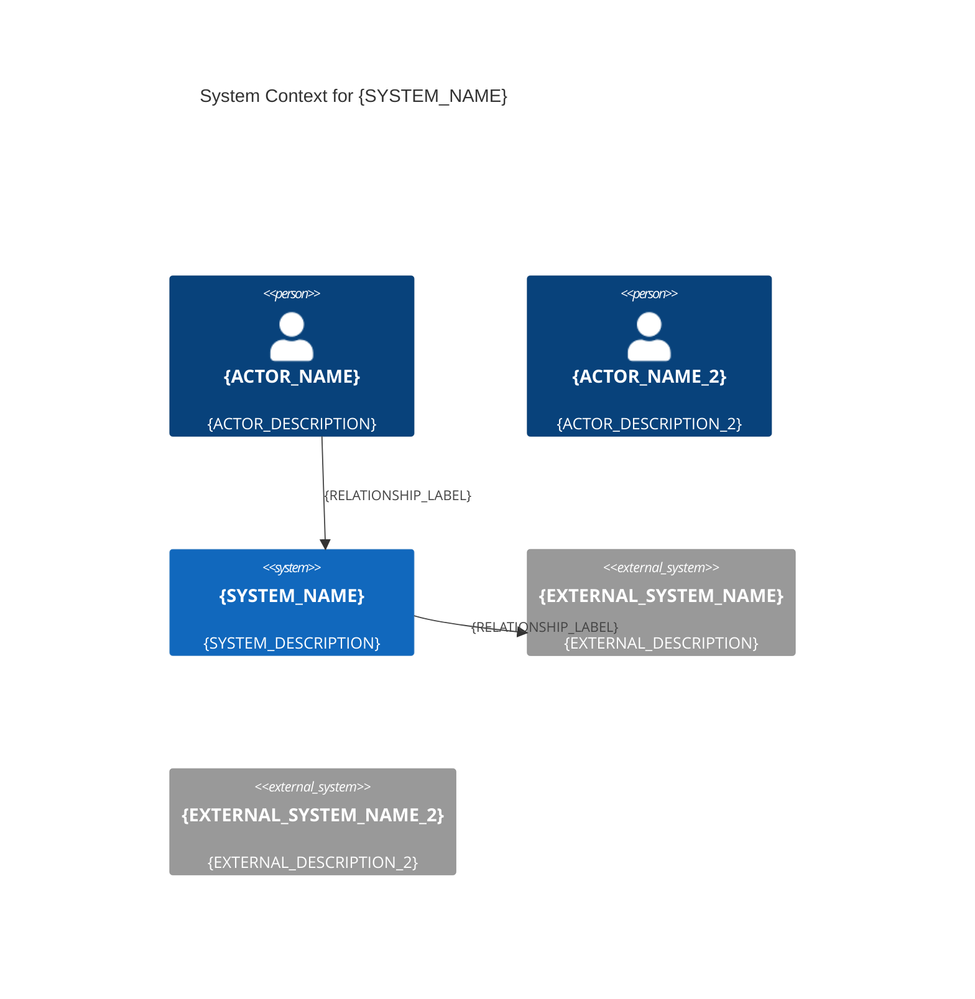
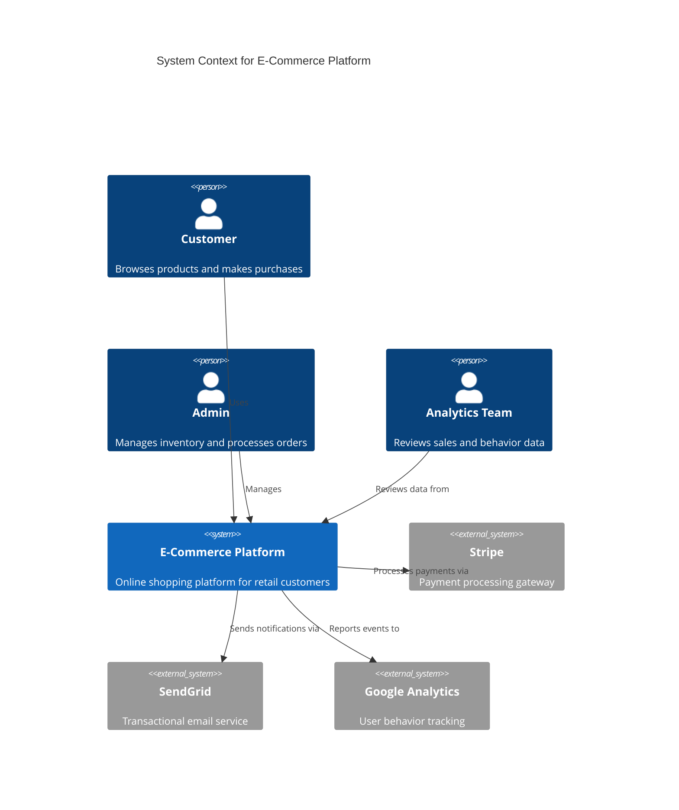

# C4 Context Diagram Template

## Purpose

The C4 Context diagram shows the system boundary and its external dependencies. It visualizes:
- The system you're building (central element)
- People/actors who interact with the system
- External systems and services the system integrates with
- High-level relationships between these elements

**Use this template when**: Documenting system scope, external dependencies, and stakeholder interactions at the highest level of abstraction.

## Input Requirements

**Required Data** (extract from architectural specification):

- **System**: Name and description of the system being documented
- **Actors**: People or user roles who interact with the system
  - Name, type (Person, PersonExt for external users), description
- **External Systems**: Third-party services, legacy systems, external APIs
  - Name, description, integration purpose
- **Relationships**: How actors and external systems interact with your system
  - From entity, to entity, relationship label (verb phrase)

**Source Locations** (typical):
- System name/description: Architecture spec introduction
- Actors: Requirements doc, user stories, stakeholder analysis
- External systems: Integration requirements, dependency list
- Relationships: Use case descriptions, integration flows

## Mermaid Template



## Placeholders Guide

| Placeholder | Example Value | Description | Source |
|-------------|---------------|-------------|--------|
| `{SYSTEM_NAME}` | "E-Commerce Platform" | Name of the system being documented | Architecture spec title |
| `{SYSTEM_ALIAS}` | `ecommerce` | Short identifier for system (lowercase, no spaces) | Derived from system name |
| `{SYSTEM_DESCRIPTION}` | "Online shopping platform for retail customers" | Brief description of system purpose | Architecture spec summary |
| `{ACTOR_ALIAS}` | `customer` | Short identifier for actor (lowercase) | Derived from actor name |
| `{ACTOR_NAME}` | "Customer" | Display name for actor | Requirements, use cases |
| `{ACTOR_DESCRIPTION}` | "Browses products and makes purchases" | What the actor does with the system | Use case descriptions |
| `{EXTERNAL_ALIAS}` | `stripe` | Short identifier for external system | Derived from system name |
| `{EXTERNAL_SYSTEM_NAME}` | "Stripe" | External system display name | Integration requirements |
| `{EXTERNAL_DESCRIPTION}` | "Payment processing gateway" | What the external system provides | Integration documentation |
| `{RELATIONSHIP_LABEL}` | "Uses", "Processes payments via", "Sends notifications via" | Verb phrase describing interaction | Use case flows |

**Naming Conventions**:
- Aliases: lowercase, no spaces, descriptive (e.g., `paymentGateway`, `emailService`)
- Names: Title case, human-readable (e.g., "Payment Gateway", "Email Service")
- Descriptions: Brief phrase explaining purpose or role
- Relationship labels: Verb phrases in present tense (e.g., "Uses", "Manages", "Processes via")

## Example Transformation

### Input (from architecture specification)

```markdown
## System Overview

**System**: E-Commerce Platform
**Description**: Online shopping platform that allows retail customers to browse products, manage shopping carts, and complete purchases securely.

## Stakeholders

**Actors**:
- Customer (Person): Browses product catalog, adds items to cart, completes purchases
- Admin (Person): Manages product inventory, processes orders, handles customer support
- Analytics Team (Person): Reviews sales data and customer behavior

## External Integrations

**External Systems**:
- Stripe (Payment Gateway): Processes credit card payments and handles PCI compliance
- SendGrid (Email Service): Sends transactional emails (order confirmations, shipping updates)
- Google Analytics (Analytics Platform): Tracks user behavior and conversion metrics

## Integration Flows

- Customers use the platform to browse and purchase products
- Admins manage the platform configuration and inventory
- Analytics Team reviews data collected by the platform
- Platform processes payments through Stripe
- Platform sends email notifications via SendGrid
- Platform reports user events to Google Analytics
```

### Output (Generated Mermaid)



## Validation Checklist

After generating the diagram, verify:

- [ ] **Title**: Contains descriptive system name
- [ ] **System element**: Exactly one `System()` element defined (your system)
- [ ] **Actors**: All user roles represented as `Person()` elements
- [ ] **External systems**: All integrations represented as `System_Ext()` elements
- [ ] **Aliases unique**: No duplicate alias names across all elements
- [ ] **Aliases defined before use**: All `Rel()` statements reference defined aliases
- [ ] **Descriptions complete**: Every element has meaningful description
- [ ] **Relationships accurate**: All integration flows from spec are represented
- [ ] **Labels descriptive**: Relationship labels use clear verb phrases
- [ ] **Syntax valid**: Renders without errors in Mermaid Live Editor

## Common Mistakes

**Mistake 1: Undefined alias in relationship**
```mermaid
Rel(user, system, "Uses")  # ERROR: 'user' not defined
```
**Fix**: Define all participants before using in relationships
```mermaid
Person(user, "User", "...")
System(system, "System", "...")
Rel(user, system, "Uses")  # OK
```

**Mistake 2: Using System() for external systems**
```mermaid
System(stripe, "Stripe", "Payment gateway")  # WRONG: Stripe is external
```
**Fix**: Use System_Ext() for external systems
```mermaid
System_Ext(stripe, "Stripe", "Payment gateway")  # CORRECT
```

**Mistake 3: Duplicate aliases**
```mermaid
Person(admin, "Admin", "Manages system")
System_Ext(admin, "Admin Panel", "...")  # ERROR: 'admin' already used
```
**Fix**: Use unique aliases for each element
```mermaid
Person(adminUser, "Admin", "Manages system")
System_Ext(adminPanel, "Admin Panel", "...")
```

**Mistake 4: Missing relationship direction**
```mermaid
Rel(system, , "Uses")  # ERROR: Missing 'to' parameter
```
**Fix**: Always specify from → to
```mermaid
Rel(user, system, "Uses")  # CORRECT
```

**Mistake 5: Unclosed code block**
```markdown
```mermaid
C4Context
  title System Context
# Missing closing ```
```
**Fix**: Always close code blocks
```markdown
```mermaid
C4Context
  title System Context
```  # CORRECT
```

## Customization Guidance

**Adding bidirectional relationships**:
```mermaid
Rel(user, system, "Requests data from")
Rel(system, user, "Returns data to")
```

**Grouping related external systems** (use comments):
```mermaid
# Payment Processing
System_Ext(stripe, "Stripe", "Credit card payments")
System_Ext(paypal, "PayPal", "Alternative payment method")

# Notifications
System_Ext(sendgrid, "SendGrid", "Email delivery")
System_Ext(twilio, "Twilio", "SMS notifications")
```

**Adding relationship descriptions** (for complex flows):
```mermaid
Rel(system, stripe, "Processes payments via", "HTTPS API, OAuth 2.0")
```

**Large diagrams** (>10 elements):
- Group related actors together
- Group external systems by category
- Consider creating separate container diagram for internal details

## Next Steps

After creating C4 Context diagram:
1. Validate syntax in Mermaid Live Editor
2. Embed in architecture documentation
3. Consider creating C4 Container diagram (see `c4-container-mermaid.md`)
4. Document detailed API flows (see `sequence-diagram-mermaid.md`)

## References

- C4 Model specification: https://c4model.com/
- Mermaid C4 diagram syntax: https://mermaid.js.org/syntax/c4.html
- Complete Mermaid syntax: See `references/mermaid-syntax-guide.md`
- Validation guidance: See `references/validation-guide.md`
