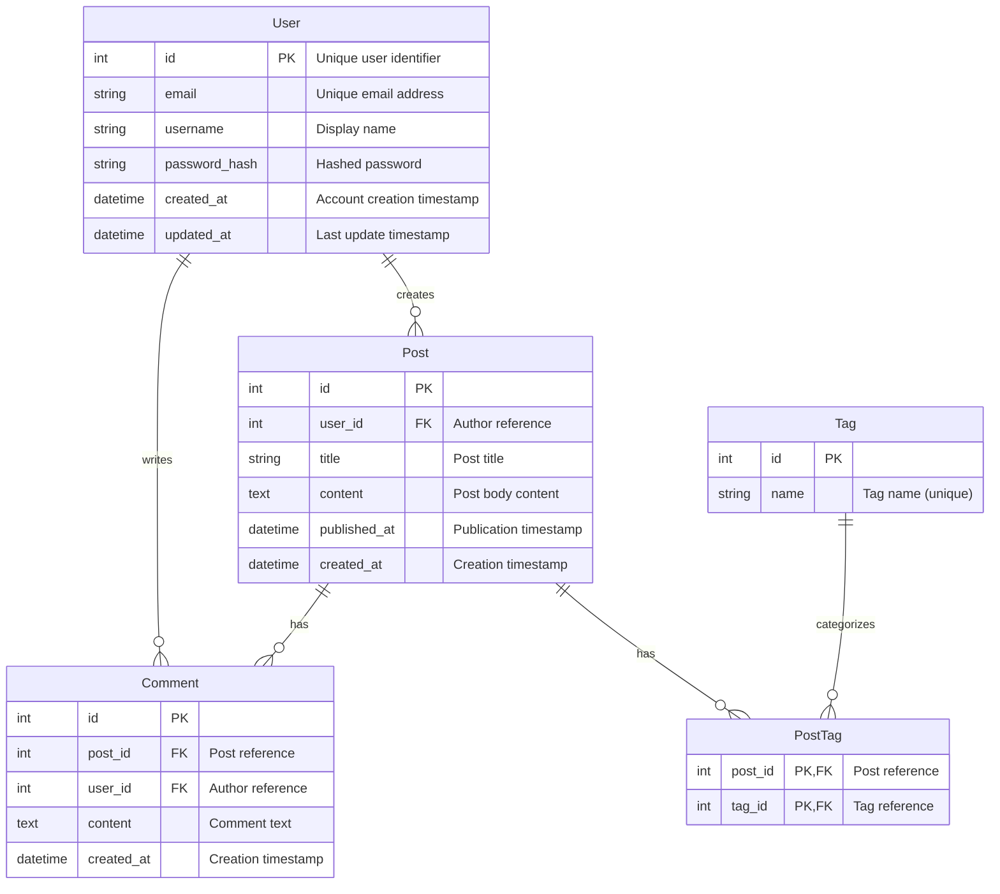

# Entity-Relationship Diagram Template

## Purpose

Entity-Relationship (ER) diagrams show the structure of a database schema and relationships between entities. They visualize:
- Database entities (tables)
- Entity attributes (columns) with types
- Primary keys and foreign keys
- Relationships between entities with cardinality

**Use this template when**: Documenting database schemas, data models, entity relationships, or planning database migrations.

## Input Requirements

**Required Data** (extract from architectural specification):

- **Entities**: Database tables/domain objects
  - Entity name (singular form preferred)
  - Description of what the entity represents
- **Attributes**: Columns/fields for each entity
  - Attribute name, data type, constraints
  - Primary key (PK), foreign key (FK) designation
- **Relationships**: How entities relate to each other
  - From entity, to entity, relationship description
  - Cardinality: one-to-one, one-to-many, many-to-many
- **Constraints**: Unique constraints, not null, etc. (optional)

**Source Locations** (typical):
- Entities: Database schema documentation, domain model
- Attributes: Schema DDL, data dictionary, migration files
- Relationships: Foreign key constraints, data model documentation
- Cardinality: Business requirements, use cases

## Mermaid Template

```mermaid
erDiagram
  {ENTITY_A} ||--o{ {ENTITY_B} : "{RELATIONSHIP_LABEL}"
  {ENTITY_B} ||--|| {ENTITY_C} : "{RELATIONSHIP_LABEL}"
  {ENTITY_A} }o--o{ {ENTITY_C} : "{RELATIONSHIP_LABEL}"

  {ENTITY_A} {
    {DATA_TYPE} {ATTRIBUTE_NAME} PK "{COMMENT}"
    {DATA_TYPE} {ATTRIBUTE_NAME} "{COMMENT}"
    {DATA_TYPE} {ATTRIBUTE_NAME} "{COMMENT}"
  }

  {ENTITY_B} {
    {DATA_TYPE} {ATTRIBUTE_NAME} PK
    {DATA_TYPE} {ATTRIBUTE_NAME} FK
    {DATA_TYPE} {ATTRIBUTE_NAME}
  }

  {ENTITY_C} {
    {DATA_TYPE} {ATTRIBUTE_NAME} PK
    {DATA_TYPE} {ATTRIBUTE_NAME}
  }
```

## Placeholders Guide

| Placeholder | Example Value | Description | Source |
|-------------|---------------|-------------|--------|
| `{ENTITY_A}` | `User` | Entity/table name (singular, PascalCase) | Schema documentation |
| `{ENTITY_B}` | `Post` | Related entity name | Schema documentation |
| `{RELATIONSHIP_LABEL}` | "creates", "has", "belongs to" | Verb phrase describing relationship | Data model docs |
| `{DATA_TYPE}` | `int`, `string`, `datetime`, `boolean` | SQL or generic data type | Schema DDL |
| `{ATTRIBUTE_NAME}` | `user_id`, `email`, `created_at` | Column/field name | Schema definition |
| `PK` | Primary key designation | Marks attribute as primary key | Primary key constraints |
| `FK` | Foreign key designation | Marks attribute as foreign key | Foreign key constraints |
| `{COMMENT}` | "Unique email address" | Optional attribute description | Data dictionary |

**Cardinality Notation**:
- `||--||`: One to exactly one (one-to-one)
- `||--o{`: One to zero or more (one-to-many)
- `}o--o{`: Zero or more to zero or more (many-to-many)
- `||--|{`: One to one or more
- `}|--|{`: One or more to one or more

**Cardinality Components**:
- `||`: Exactly one
- `|{`: One or more
- `}o`: Zero or more
- `}|`: One or more
- `o{`: Zero or more

**Data Types** (use consistent conventions):
- Generic: `int`, `string`, `text`, `datetime`, `boolean`, `decimal`, `uuid`
- PostgreSQL: `integer`, `varchar`, `text`, `timestamp`, `boolean`, `numeric`, `uuid`
- MySQL: `INT`, `VARCHAR`, `TEXT`, `DATETIME`, `BOOLEAN`, `DECIMAL`, `CHAR`

## Example Transformation

### Input (from architecture specification)

```markdown
## Database Schema

### Entities

**User**
- `id` (integer, primary key): Unique user identifier
- `email` (varchar, unique, not null): User email address for authentication
- `username` (varchar, unique, not null): Display name
- `password_hash` (varchar, not null): Hashed password
- `created_at` (timestamp): Account creation timestamp
- `updated_at` (timestamp): Last update timestamp

**Post**
- `id` (integer, primary key): Unique post identifier
- `user_id` (integer, foreign key → User.id): Author of the post
- `title` (varchar, not null): Post title
- `content` (text): Post body content
- `published_at` (timestamp): Publication timestamp
- `created_at` (timestamp): Post creation timestamp

**Comment**
- `id` (integer, primary key): Unique comment identifier
- `post_id` (integer, foreign key → Post.id): Post being commented on
- `user_id` (integer, foreign key → User.id): Comment author
- `content` (text, not null): Comment text
- `created_at` (timestamp): Comment creation timestamp

**Tag**
- `id` (integer, primary key): Unique tag identifier
- `name` (varchar, unique, not null): Tag name

**PostTag** (junction table)
- `post_id` (integer, foreign key → Post.id, primary key composite)
- `tag_id` (integer, foreign key → Tag.id, primary key composite)

### Relationships

- User (1) → Posts (many): A user can create multiple posts
- User (1) → Comments (many): A user can write multiple comments
- Post (1) → Comments (many): A post can have multiple comments
- Post (many) ↔ Tag (many): Posts can have multiple tags, tags can belong to multiple posts (many-to-many via PostTag)
```

### Output (Generated Mermaid)



## Validation Checklist

After generating the diagram, verify:

- [ ] **Entity names**: Singular form, PascalCase (e.g., `User` not `users`)
- [ ] **All entities defined**: Every table from schema is represented
- [ ] **Attribute types**: Data types match schema definition
- [ ] **Primary keys**: All entities have `PK` designation
- [ ] **Foreign keys**: All `FK` designations present for relationships
- [ ] **Relationship cardinality**: Matches business rules (one-to-many, etc.)
- [ ] **Relationship labels**: Descriptive verb phrases
- [ ] **Junction tables**: Many-to-many relationships use junction entities
- [ ] **Attribute order**: Logical ordering (PK first, FK next, then regular attributes)
- [ ] **Syntax valid**: Renders without errors in Mermaid Live Editor

## Common Mistakes

**Mistake 1: Plural entity names**
```mermaid
Users {  # WRONG: Should be singular
  int id PK
}
```
**Fix**: Use singular entity names
```mermaid
User {  # CORRECT
  int id PK
}
```

**Mistake 2: Missing primary key**
```mermaid
User {
  int id      # WRONG: Missing PK designation
  string email
}
```
**Fix**: Designate primary key
```mermaid
User {
  int id PK   # CORRECT
  string email
}
```

**Mistake 3: Foreign key without relationship**
```mermaid
Post {
  int id PK
  int user_id FK
}
# WRONG: No relationship line to User entity
```
**Fix**: Add relationship line
```mermaid
User ||--o{ Post : "creates"
Post {
  int id PK
  int user_id FK
}
```

**Mistake 4: Incorrect cardinality for many-to-many**
```mermaid
Post ||--o{ Tag : "has"  # WRONG: Direct many-to-many
```
**Fix**: Use junction table
```mermaid
Post ||--o{ PostTag : "has"
Tag ||--o{ PostTag : "categorizes"

PostTag {
  int post_id PK,FK
  int tag_id PK,FK
}
```

**Mistake 5: Undefined entity in relationship**
```mermaid
User ||--o{ Post : "creates"
# ERROR: 'User' and 'Post' entities not defined
```
**Fix**: Define all entities
```mermaid
User ||--o{ Post : "creates"

User {
  int id PK
}

Post {
  int id PK
  int user_id FK
}
```

## Customization Guidance

**Composite primary keys**:
```mermaid
OrderItem {
  int order_id PK,FK
  int product_id PK,FK
  int quantity
  decimal unit_price
}
```

**Self-referencing relationships** (e.g., user referrals, organizational hierarchy):
```mermaid
User ||--o{ User : "refers"

User {
  int id PK
  int referred_by_user_id FK "Self-reference to User.id"
  string email
}
```

**Optional vs required relationships**:
```mermaid
# Optional relationship (zero or more)
User ||--o{ Post : "creates"

# Required relationship (one or more)
Post ||--|{ Comment : "has"
```

**Additional constraints in comments**:
```mermaid
User {
  int id PK
  string email "UNIQUE, NOT NULL"
  string username "UNIQUE, NOT NULL, MIN LENGTH 3"
  datetime created_at "DEFAULT NOW()"
}
```

**Audit fields pattern**:
```mermaid
User {
  int id PK
  string email
  datetime created_at "Audit: creation timestamp"
  datetime updated_at "Audit: last modification"
  int created_by FK "Audit: creating user"
  int updated_by FK "Audit: last modifying user"
}
```

## Database Schema Patterns

**Soft delete pattern**:
```mermaid
User {
  int id PK
  string email
  datetime deleted_at "NULL for active records"
}
```

**Polymorphic associations**:
```mermaid
Comment {
  int id PK
  int user_id FK
  string commentable_type "Entity type (Post, Photo, etc)"
  int commentable_id "Entity ID"
  text content
}
```

**Denormalization for performance**:
```mermaid
Post {
  int id PK
  int user_id FK
  string title
  text content
  int comment_count "Denormalized: COUNT(comments)"
  datetime last_comment_at "Denormalized: MAX(comments.created_at)"
}
```

**Multi-tenant schema**:
```mermaid
Tenant {
  int id PK
  string name
}

User {
  int id PK
  int tenant_id FK "Multi-tenancy partition key"
  string email
}

Post {
  int id PK
  int tenant_id FK "Multi-tenancy partition key"
  int user_id FK
  string title
}

Tenant ||--o{ User : "has"
Tenant ||--o{ Post : "contains"
User ||--o{ Post : "creates"
```

**Versioning/history pattern**:
```mermaid
Document {
  int id PK
  string title
  int current_version_id FK
}

DocumentVersion {
  int id PK
  int document_id FK
  int version_number
  text content
  datetime created_at
}

Document ||--o{ DocumentVersion : "has versions"
Document ||--|| DocumentVersion : "current version"
```

## Complex Example: E-Commerce Schema

```mermaid
erDiagram
  User ||--o{ Order : "places"
  Order ||--o{ OrderItem : "contains"
  Product ||--o{ OrderItem : "ordered in"
  Category ||--o{ Product : "contains"
  User ||--o{ Review : "writes"
  Product ||--o{ Review : "has"

  User {
    int id PK
    string email "UNIQUE"
    string password_hash
    string first_name
    string last_name
    datetime created_at
  }

  Category {
    int id PK
    string name
    int parent_category_id FK "Self-reference for hierarchy"
  }

  Product {
    int id PK
    int category_id FK
    string name
    text description
    decimal price
    int stock_quantity
    datetime created_at
  }

  Order {
    int id PK
    int user_id FK
    string status "pending, paid, shipped, delivered"
    decimal total_amount
    datetime order_date
    datetime shipped_date
  }

  OrderItem {
    int id PK
    int order_id FK
    int product_id FK
    int quantity
    decimal unit_price "Price at time of order"
    decimal subtotal "quantity * unit_price"
  }

  Review {
    int id PK
    int user_id FK
    int product_id FK
    int rating "1-5 stars"
    text comment
    datetime created_at
  }
```

## Next Steps

After creating ER diagram:
1. Validate syntax in Mermaid Live Editor
2. Verify relationships match database constraints
3. Ensure all foreign keys are represented
4. Cross-reference with migration files or DDL
5. Embed in architecture documentation
6. Consider creating sequence diagrams for data access patterns (see `sequence-diagram-mermaid.md`)

## References

- Mermaid ER diagram syntax: https://mermaid.js.org/syntax/entityRelationshipDiagram.html
- Complete Mermaid syntax: See `references/mermaid-syntax-guide.md`
- Validation guidance: See `references/validation-guide.md`
- Database patterns: See skill `pact-database-patterns`
