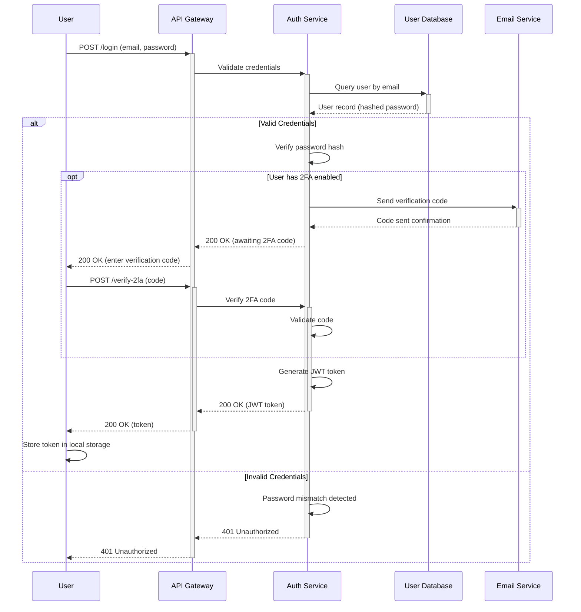
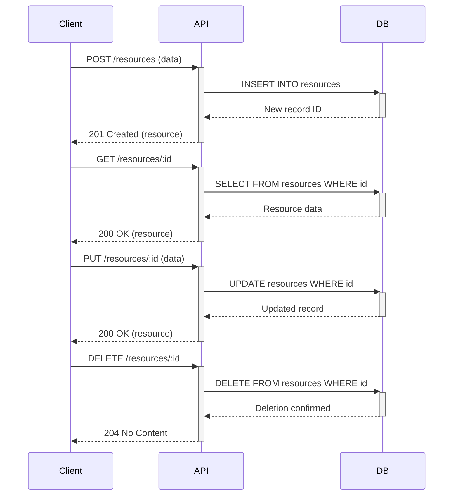
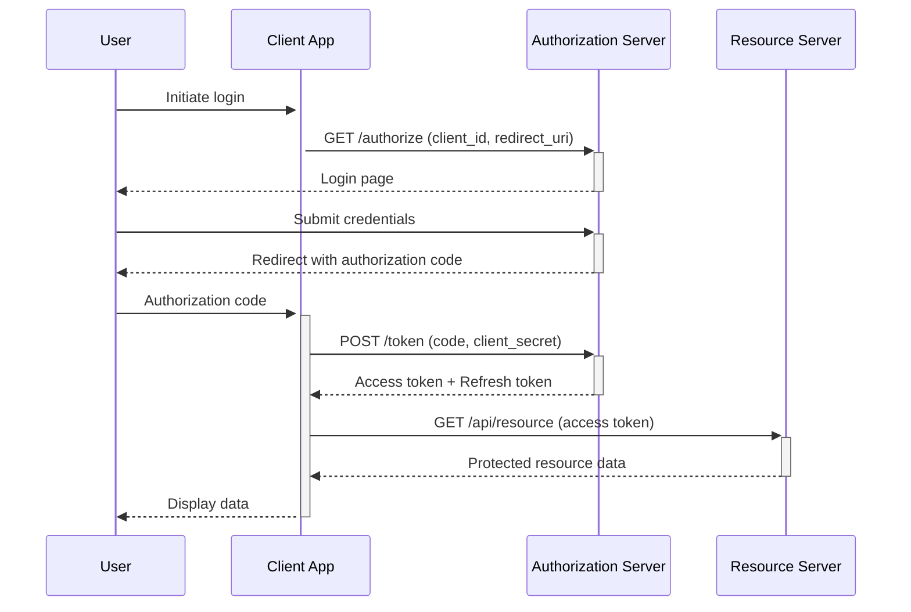
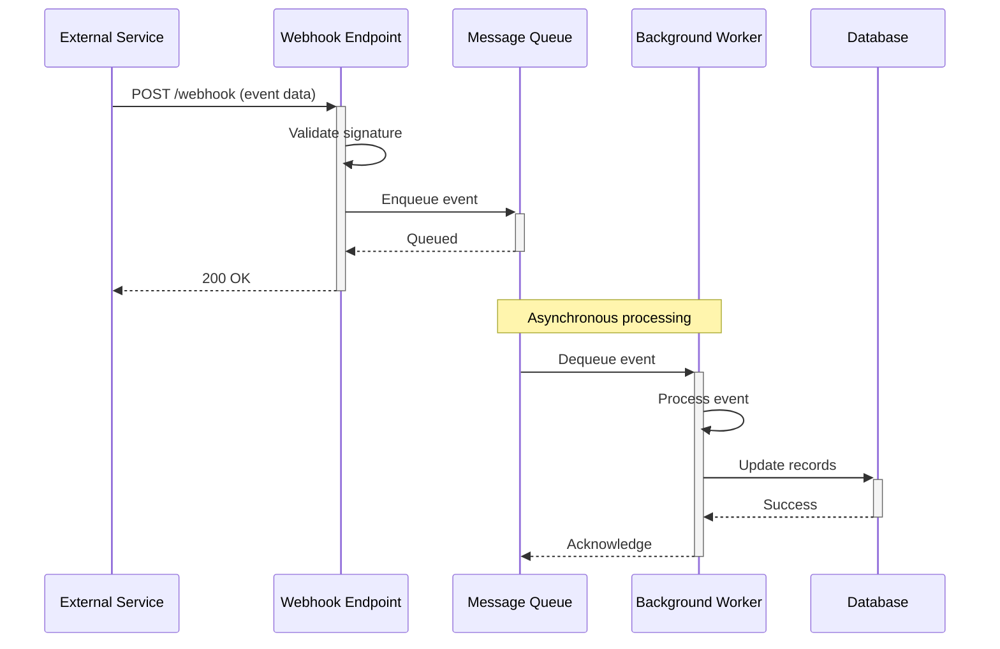

# Sequence Diagram Template

## Purpose

Sequence diagrams show the order of interactions between actors and systems over time. They visualize:
- API request/response flows
- Authentication and authorization sequences
- Multi-system integration workflows
- Conditional logic flows (success vs error cases)
- Temporal ordering of operations

**Use this template when**: Documenting API flows, authentication mechanisms, error handling sequences, or any time-ordered interaction between systems.

## Input Requirements

**Required Data** (extract from architectural specification):

- **Participants**: Actors, systems, services involved in the interaction
  - Name, type (actor, internal system, external system)
- **Sequence of Steps**: Ordered list of interactions
  - From participant, to participant, message/action description
  - Request vs response indication
- **Conditional Flows**: Alternative paths based on conditions
  - Condition description (e.g., "valid credentials", "payment succeeds")
  - Alternative steps for each condition
- **Activation/Deactivation**: Which participants are active during interactions
  - Optional but improves readability

**Source Locations** (typical):
- Participants: C4 Container diagram, API specification
- Sequence steps: API documentation, use case flows, integration specs
- Conditional logic: Error handling documentation, business rules
- Message content: API contracts, endpoint documentation

## Mermaid Template

```mermaid
sequenceDiagram
  participant {ACTOR_ALIAS} as {ACTOR_NAME}
  participant {SYSTEM_A_ALIAS} as {SYSTEM_A_NAME}
  participant {SYSTEM_B_ALIAS} as {SYSTEM_B_NAME}

  {ACTOR_ALIAS}->>+{SYSTEM_A_ALIAS}: {REQUEST_MESSAGE}
  {SYSTEM_A_ALIAS}->>+{SYSTEM_B_ALIAS}: {REQUEST_MESSAGE}
  {SYSTEM_B_ALIAS}-->>-{SYSTEM_A_ALIAS}: {RESPONSE_MESSAGE}
  {SYSTEM_A_ALIAS}-->>-{ACTOR_ALIAS}: {RESPONSE_MESSAGE}

  alt {CONDITION_DESCRIPTION}
    {ACTOR_ALIAS}->>+{SYSTEM_A_ALIAS}: {ALTERNATIVE_REQUEST}
    {SYSTEM_A_ALIAS}-->>-{ACTOR_ALIAS}: {ALTERNATIVE_RESPONSE}
  else {ELSE_CONDITION_DESCRIPTION}
    {SYSTEM_A_ALIAS}-->>-{ACTOR_ALIAS}: {ELSE_RESPONSE}
  end

  opt {OPTIONAL_CONDITION}
    {SYSTEM_A_ALIAS}->>+{SYSTEM_B_ALIAS}: {OPTIONAL_REQUEST}
    {SYSTEM_B_ALIAS}-->>-{SYSTEM_A_ALIAS}: {OPTIONAL_RESPONSE}
  end
```

## Placeholders Guide

| Placeholder | Example Value | Description | Source |
|-------------|---------------|-------------|--------|
| `{ACTOR_ALIAS}` | `User` | Short participant identifier | Derived from actor name |
| `{ACTOR_NAME}` | "End User" | Display name for participant | C4 Context, use cases |
| `{SYSTEM_A_ALIAS}` | `API` | Short system identifier | Derived from system name |
| `{SYSTEM_A_NAME}` | "API Gateway" | Full system display name | C4 Container diagram |
| `{REQUEST_MESSAGE}` | "POST /login (credentials)" | Description of request action | API documentation |
| `{RESPONSE_MESSAGE}` | "200 OK (JWT token)" | Description of response | API documentation |
| `{CONDITION_DESCRIPTION}` | "Valid Credentials" | Condition for alternative path | Business logic, error handling |
| `{OPTIONAL_CONDITION}` | "User has 2FA enabled" | Condition for optional flow | Feature specifications |

**Arrow Types**:
- `->>`: Solid arrow (synchronous request)
- `-->>`: Dashed arrow (response)
- `->>+`: Request with activation (participant becomes active)
- `-->>-`: Response with deactivation (participant becomes inactive)

**Control Flow Keywords**:
- `alt ... else ... end`: Alternative paths (if/else logic)
- `opt ... end`: Optional flow (may or may not execute)
- `loop ... end`: Repeated actions
- `par ... and ... end`: Parallel execution

## Example Transformation

### Input (from architecture specification)

```markdown
## Authentication Flow

### Successful Login

1. User submits credentials (email, password) to API Gateway
2. API Gateway validates request format
3. API Gateway forwards credentials to Auth Service
4. Auth Service queries User Database for user record by email
5. User Database returns user record with hashed password
6. Auth Service verifies password hash matches
7. Auth Service generates JWT token with user claims
8. Auth Service returns token to API Gateway
9. API Gateway returns 200 OK with token to User
10. User stores token in local storage

### Failed Login (Invalid Credentials)

1. Steps 1-6 same as successful login
2. Auth Service detects password mismatch
3. Auth Service returns 401 Unauthorized to API Gateway
4. API Gateway returns 401 Unauthorized to User

### Optional: Two-Factor Authentication

- If user has 2FA enabled:
  1. After password verification, Auth Service sends verification code via Email Service
  2. User submits verification code
  3. Auth Service validates code
  4. If valid, proceed with token generation
```

### Output (Generated Mermaid)



## Validation Checklist

After generating the diagram, verify:

- [ ] **Participants defined**: All systems/actors declared at top
- [ ] **Participant aliases**: Short, descriptive, consistent
- [ ] **Arrow directions**: Requests use `->>`, responses use `-->>`
- [ ] **Activation boxes**: Optional `+`/`-` indicators match correctly
- [ ] **Message descriptions**: Clear, specific actions (not generic "send data")
- [ ] **Conditional blocks**: All `alt`, `opt`, `loop` blocks properly closed with `end`
- [ ] **Flow matches spec**: Sequence matches documented API flow
- [ ] **Error paths**: Alternative flows for error cases included
- [ ] **Temporal order**: Steps in chronological order
- [ ] **Syntax valid**: Renders without errors in Mermaid Live Editor

## Common Mistakes

**Mistake 1: Undefined participant**
```mermaid
User->>API: Request
# ERROR: 'User' and 'API' not defined
```
**Fix**: Declare all participants
```mermaid
participant User
participant API
User->>API: Request
```

**Mistake 2: Mismatched activation/deactivation**
```mermaid
User->>+API: Request
API-->>User: Response  # WRONG: Missing '-' to deactivate
```
**Fix**: Match activation with deactivation
```mermaid
User->>+API: Request
API-->>-User: Response  # CORRECT
```

**Mistake 3: Unclosed control flow blocks**
```mermaid
alt Success
  API-->>User: 200 OK
# ERROR: Missing 'end'
```
**Fix**: Close all control flow blocks
```mermaid
alt Success
  API-->>User: 200 OK
end
```

**Mistake 4: Wrong arrow direction for responses**
```mermaid
User->>API: Request
API->>User: Response  # WRONG: Should use dashed arrow
```
**Fix**: Use dashed arrows for responses
```mermaid
User->>API: Request
API-->>User: Response  # CORRECT
```

**Mistake 5: Vague message descriptions**
```mermaid
User->>API: Send data  # TOO VAGUE
```
**Fix**: Be specific about the action
```mermaid
User->>API: POST /users (name, email)  # SPECIFIC
```

## Customization Guidance

**Synchronous vs Asynchronous**:
```mermaid
# Synchronous (wait for response)
User->>+API: Request
API-->>-User: Response

# Asynchronous (fire and forget)
User->>API: Send event
Note right of API: Processes asynchronously
```

**Parallel requests**:
```mermaid
par Fetch user data
  API->>+UserDB: Get user
  UserDB-->>-API: User data
and Fetch product data
  API->>+ProductDB: Get products
  ProductDB-->>-API: Product list
end
API-->>User: Combined response
```

**Loops (repeated actions)**:
```mermaid
loop For each item in cart
  API->>+Inventory: Check stock for item
  Inventory-->>-API: Stock level
end
API-->>User: Stock check complete
```

**Notes and comments**:
```mermaid
User->>API: Request
Note right of API: Validates JWT token
API->>Auth: Verify token
Note over User,Auth: Authentication process
```

**Background processing**:
```mermaid
User->>+API: Upload file
API->>+Queue: Enqueue processing job
Queue-->>-API: Job ID
API-->>-User: 202 Accepted (job ID)

Note over Queue,Worker: Asynchronous processing
Queue->>+Worker: Process file
Worker->>+Storage: Save processed file
Storage-->>-Worker: File URL
Worker-->>-Queue: Job complete
```

## API Flow Patterns

**REST API CRUD Operations**:


**OAuth 2.0 Authorization Code Flow**:


**Webhook Event Flow**:


## Next Steps

After creating sequence diagram:
1. Validate syntax in Mermaid Live Editor
2. Verify sequence matches API documentation
3. Ensure error paths are documented
4. Embed in architecture documentation
5. Consider creating C4 diagrams for system context (see `c4-context-mermaid.md`)

## References

- Mermaid sequence diagram syntax: https://mermaid.js.org/syntax/sequenceDiagram.html
- Complete Mermaid syntax: See `references/mermaid-syntax-guide.md`
- Validation guidance: See `references/validation-guide.md`
- API design patterns: See skill `pact-api-design`
